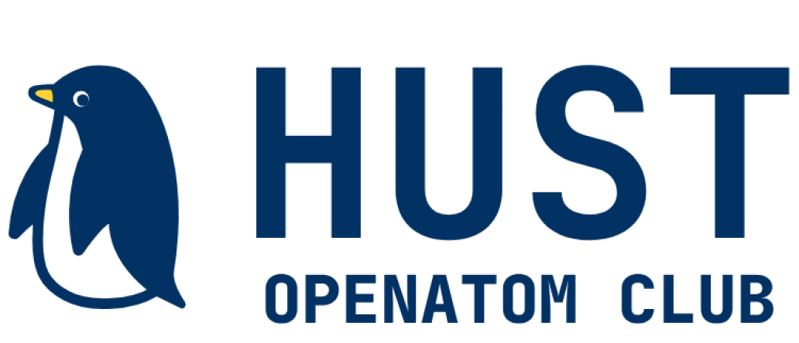

<div align="center">

<!-- Logo / Banner -->


# :earth_asia: 开源软件通识课程

**以开源方式建设开源课程** · 带你从零开始畅游开源世界

[](https://github.com/hust-open-atom-club/intro2oss/actions)
[](https://opensource.org/licenses/MIT)
[](https://squidfunk.github.io/mkdocs-material/)
[](https://github.com/hust-open-atom-club/intro2oss/graphs/contributors)

[:rocket: 在线预览](https://oss.openatom.club/) · [:books: 课程文档](https://oss.openatom.club/) · [:handshake: 参与贡献](https://github.com/hust-open-atom-club/intro2oss/blob/main/CONTRIBUTING.md)

</div>

---

## :sparkles: 这是什么？

本项目是由 [**华中科技大学开放原子开源俱乐部**](https://hust.openatom.club/) 主导编写的《开源软件通识课程》开源教程。

我们秉持 **"以开源方式来建设开源课程"** 的理念，将课程内容完全开源在 GitHub 上，希望为高校开源教育贡献一份力量，帮助更多同学从"开源消费者"成长为"开源贡献者"。

> :bulb: **核心理念**
> 
> 开源不仅是代码的开放，更是一种协作制度、一种知识共享的文化、一种影响现代技术世界的组织方式。

---

## :dart: 你将收获什么？

本课程将带领你经历从 **无意识使用** 到 **领导开源社区** 的五个阶段：

| 阶段 | 状态 | 目标 | 关键词 |
|:---:|:---:|:---|:---|
| **S0** | :white_check_mark: | 认识到开源已融入生活，了解日常使用的开源软件 | `感知` `发现` |
| **S1** | :white_check_mark: | 理解开源的概念、历史、许可证及安全影响 | `认知` `理论` |
| **S2** | :white_check_mark: | 开始使用开源软件，了解开源项目的协作模式 | `实践` `协作` |
| **S3** | :white_check_mark: | 掌握 Git 等基础技能，通过代码或文档贡献开源 | `贡献` `技能` |
| **S4** | :construction: | 成为开源项目领导者，掌握社区治理与合规能力 | `领导` `治理` |

---

## :books: 课程大纲

<details>
<summary><b>:seedling: S0 · 无意识使用阶段</b> — 发现身边的开源</summary>

- 开源无处不在：Android、浏览器、开发工具等
- 开源如何成为现代技术的基石
- **任务**：列举日常使用的开源软件，调研一个开源项目的背景

</details>

<details>
<summary><b>:herb: S1 · 了解开源阶段</b> — 建立系统认知</summary>

- **开源是什么？** 软件类型、开发方式、创新模式、产业生态
- **开源历史**：Unix → GNU → Linux → Git → GitHub
- **开源许可证**：Copyleft (GPL) vs Permissive (MIT/Apache/BSD)
- **开源安全**：供应链安全、漏洞传播机制、最佳实践
- **任务**：创建 GitHub 项目并选择合适的开源许可证

</details>

<details>
<summary><b>:deciduous_tree: S2 · 拥抱开源阶段</b> — 参与协作实践</summary>

- **协作模式**：Issue、Pull Request、Code Review
- **开源替代方案**：Linux、LibreOffice、GIMP、VLC
- **发行版选择**：Ubuntu、Deepin、openEuler、CentOS Stream
- **社区活动**：Linux 101、openEuler 社区活动
- **任务**：用开源软件替换一个闭源工具并撰写博客

</details>

<details>
<summary><b>:evergreen_tree: S3 · 贡献开源阶段</b> — 掌握硬核技能</summary>

- **Git 训练营**：clone/commit/push/merge/rebase、Patch 提交
- **代码托管平台**：GitHub/GitLab/Gitee 使用技巧
- **文档与表达**：Commit Message 规范、Markdown、跨文化交流
- **计算机基础**：The Missing Semester of Your CS Education
- **多方向实践**：Linux Kernel、QEMU、Docker、Web 开发、AI
- **任务**：完成一次 Fork → PR 流程，提交第一个贡献

</details>

<details>
<summary><b>:crown: S4 · 领导开源阶段</b> — 引领社区发展</summary>

- **社区管理**：Code of Conduct、贡献者指南、吸引多样性贡献
- **安全治理**：CVE 报告处理、恶意代码防护
- **合规审计**：知识产权管理、许可证合规
- **任务**：创建并维护自己的开源项目

</details>

---

## :rocket: 快速开始

### 在线阅读

直接访问课程网站，无需安装任何东西：

```bash
https://oss.openatom.club/
```

### 本地预览

```bash
# 1. 克隆仓库
git clone https://github.com/hust-open-atom-club/intro2oss.git
cd intro2oss

# 2. 安装依赖
pip install -r requirements.txt

# 3. 启动本地服务
mkdocs serve

# 4. 浏览器打开 http://127.0.0.1:8000
```

---

## :hammer_and_wrench: 技术栈

- **[MkDocs](https://www.mkdocs.org/)** — 静态站点生成器
- **[Material for MkDocs](https://squidfunk.github.io/mkdocs-material/)** — 主题与 UI 组件
- **[Mermaid](https://mermaid.js.org/)** — 图表绘制
- **[PyMdown Extensions](https://facelessuser.github.io/pymdown-extensions/)** — Markdown 语法扩展

---

## :handshake: 参与贡献

我们欢迎任何形式的贡献！

- :memo: 修正 typo 或内容错误
- :books: 补充章节内容或案例
- :globe_with_meridians: 翻译工作
- :bug: 提交 Issue 反馈问题

详细贡献指南请查看 [`CONTRIBUTING.md`](CONTRIBUTING.md)。

> :warning: **Commit 提示**
> 
> - commit message 中尽量不要出现中文
> - 相同的 commit 可以合并成一个
> - 如遇 Markdown 格式问题，可在对应 Action Run 中下载 artifact 查看 log 和 autofix

---

## :busts_in_silhouette: 贡献者

感谢所有为本课程付出努力的朋友们！

<a href="https://github.com/hust-open-atom-club/intro2oss/graphs/contributors">
  
</a>

---

## :scroll: 许可证

本教程内容采用 [**MIT License**](https://opensource.org/licenses/MIT) 开源。

你可以自由使用、修改和再分发本教程的内容，只需在衍生作品中保留原始版权声明即可。

---

<div align="center">

Made with :heart: by <a href="https://hust.openatom.club/">HUST Open Atom Club</a>

</div>
