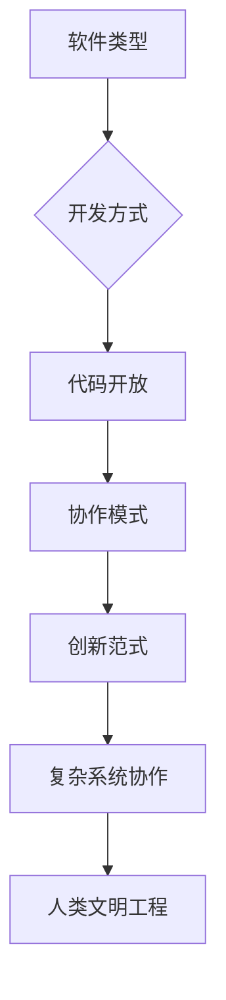
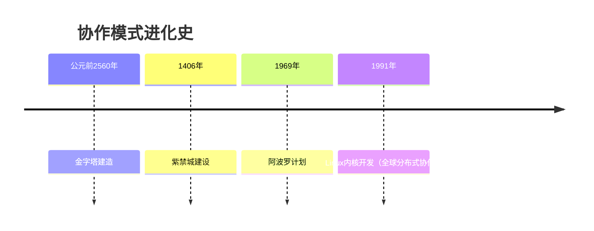
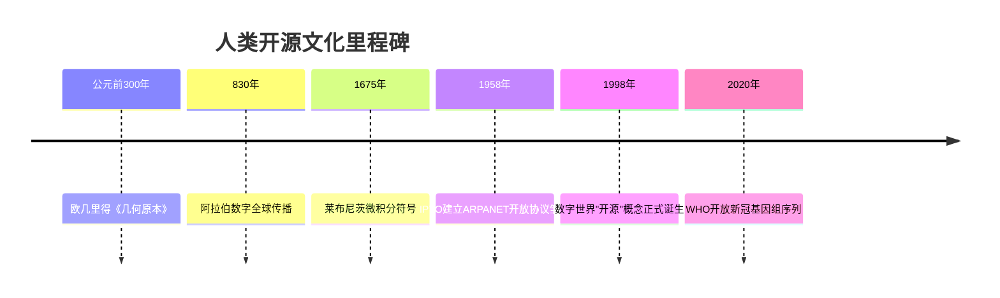

# 什么是开源？（What）

## 课程目标
1. 理解开源的多元定义（技术、模式、文化）  
2. 通过真实案例感知开源的影响力  
3. 激发参与开源的兴趣  

## 一、教学设计
1. **互动投票**  
   - 工具：使用在线工具让学生投票选择日常使用的软件：Chrome、安卓手机、VS Code、Firefox等，揭晓答案均为开源或基于开源。
   - 可以进行提几个与开源有关的问题：如最几年最火热的开源软件有什么？，最后一个问题以同学认为这个世界的软件开发以什么为主导，占了多大的比例为结尾，问题答案通过数据冲击：展示“全球97%的软件开发依赖开源代码”等统计数据。
2. **沉浸式故事**  
   - **视频片段**：插入[Linux诞生纪录片](视频链接)
  
## 二、开源的形式

### 1.开源作为一种软件类型（OSI定义）
---

## 🔍 **官方定义：OSI的黄金标准**
**开放源代码促进会（OSI）**对开源软件的明确定义：  
> "开源软件是指其**源代码可被自由查阅、修改和分发**的软件，且必须满足以下所有条件——"

---

## 📜 **OSD核心条款（简化版）**
Open Source Definition（OSD）的十大原则可浓缩为四大核心：

| 核心原则               | 关键要求                                                                 | 反例警示⚠️                |
|------------------------|--------------------------------------------------------------------------|--------------------------|
| **自由再分发**         | 允许任意形式的分发（包括商业销售）                                       | 禁止转售的软件           |
| **源代码公开**         | 必须提供源代码，且禁止混淆或刻意设置编译障碍                             | 只提供二进制文件的软件   |
| **允许衍生作品**       | 允许修改源代码并发布修改后的版本（可附加合理限制）                       | 禁止二次开发的许可证     |
| **无歧视性限制**       | 不得针对特定人群/领域/技术进行限制（如"不得用于军事用途"条款无效）       | 限制用户职业的软件协议   |

---
    从课堂导入我们不难发现，从计算机的诞生，到如今的互联网时代，或者说以后的数字世界，
    开源的软件架构充斥这个万物互联的世界发方方面面，它们可能就像数字世界的大基建的一种方式，
    但同样在这个数字世界的大开发时代还有另外一种基建方式-闭源。

### 核心概念
```diff
+ 开源软件 = 源代码开放 + 允许自由使用/修改/分发（OSI定义）
- 闭源软件 = "黑箱"操作 + 使用受限
```
### 互联网早期的开源与闭源格局：分层解析

---

#### 🌍 **基础设施层：开放协议主导**
1. **TCP/IP协议栈**（1970s）  
   - 由DARPA资助开发，**协议标准完全开放**，允许任何机构自由实现
   - 关键作用：奠定互联网互联互通的基石
   - 典型案例：BSD UNIX对TCP/IP协议栈的开源实现（1980s）

2. **电子邮件系统**  
   - SMTP/POP3协议开放，但早期实现混合开源与闭源  
   - 闭源案例：Lotus Notes的邮件系统（1989）  
   - 开源先驱：Sendmail（1983）成为邮件服务器事实标准

---

#### 💻 **操作系统层：闭源商业软件的霸权**
| 系统        | 性质    | 关键事件                      |
|-------------|---------|-----------------------------|
| UNIX        | 初期闭源 | AT&T禁止大学传播源码（1979） |
| DOS/Windows | 完全闭源 | 微软通过闭源绑定IBM PC（1981）|
| VMS         | 闭源     | DEC专用系统，影响早期网络架构|

**例外突破**：BSD UNIX（1977）从AT&T UNIX衍生出开源分支，孕育了FreeBSD/NetBSD

---

#### 🕸️ **应用层：开放与封闭的拉锯战**
- **闭源主导领域**  
  - 浏览器大战：Netscape初期闭源（1994），后开源为Mozilla（1998）  
  - 办公软件：微软Office（1989）完全闭源统治市场

- **开源亮点**  
  - Apache HTTP Server（1995）：快速击败闭源的Netscape Enterprise Server  
  - Perl语言（1987）：开源脚本语言成为早期Web开发支柱

---

#### 🔄 **文化基因：开放协作的暗流**
- **RFC文化**（始于1969）  
  - 互联网工程任务组（IETF）通过**公开征求意见稿**推动技术演进  
  - 典型案例：HTTP/1.0规范以RFC 1945形式发布（1996）

- **黑客伦理**的影响  
  - MIT AI实验室等机构倡导代码共享（如ITS操作系统）  
  - 1983年Richard Stallman发起GNU计划，标志着**现代开源运动的觉醒**

---

#### 📊 关键转折点时间轴
    1969 : ARPANET诞生（开放协议）
    1979 : AT&T收紧UNIX授权
    1983 : GNU宣言发布
    1985 : FSF成立，GPL协议诞生
    1991 : Linux内核首次发布
    1995 : Apache超越闭源服务器
    1998 : "开源"一词正式诞生


####  总结与思考
深度思考：为什么基础设施更早开放？
- 军事科研需求：ARPANET需要跨机构协作，开放协议是刚需
- 商业价值滞后：早期互联网未形成明确盈利模式，企业缺乏闭源动力
- 学术共同体传统：大学与研究机构长期奉行知识共享原则

**总结**：互联网的骨子里流淌着开放血液，但在商业化浪潮中，闭源软件曾一度占据应用层高地。这种基础设施开放+上层应用封闭的二元结构，正是数字时代最根本的技术政治博弈场。


### 2.开源是一种协作与创新模式—— 从代码到文明的协作范式


## 🛠️ 始于软件世界的协作革命：开源开发模式三阶跃迁


## 软件层：开源开发的协作密码
**传统闭源开发**
- 典型特征：
  + 代码仅限内部团队访问
  + 严格的知识产权保护
  - 案例：Windows 95开发时期

**企业内部开源（Inner Source**
+ 核心逻辑：
  ! 对外闭源，但内部采用开源协作方式
  ! 跨团队共享代码库，允许内部PR
  + 案例：
    - 微软：通过"One Engineering System"实现内部开源
    - 沃尔玛：内部开源电商平台代码加速门店系统开发

**完全开源**
+ 黄金标准：
  ! 代码完全公开，接受全球贡献  
  ! 必须符合OSI定义  
  + 案例：Linux内核，Vue.js框架
 
### 💡 认知升级：协作模式的元规则

通过解剖不同协作模式的 "基因序列"，理解开源不是如今世界非黑即白的选择，而是在可持续性与普惠的动态平衡中寻找最优解。

### 不同模式的核心差异点

| 维度     | 传统闭源 | Inner Source | 完全开源 |
| -------- | -------- | ------------ | -------- |
| 透明度   | 黑箱操作 | 组织内透明   | 全网公开 |
| 创新来源 | 内部研发 | 跨部门协同   | 全球智慧 |
| 进化速度 | 线性增长 | 多项式增长   | 指数级增长 |
| 案例代表 | Oracle   | 微软 Azure   | TensorFlow |

## 社会层：开源思维的跨界迁移
🌍 超越代码：人类协作的元模式
### 现实世界中的「开源式协作」
1. **古罗马引水渠建设**  
   - 不同城邦共享水利工程技术  
   - 改进方案刻在公共石碑上（古代版Git Commit）

2. **维基百科编辑**  
   - 任何人可编辑条目（类似Pull Request）  
   - 讨论页记录争议解决过程（人类版Code Review）

3. **新冠疫苗研发**  
   - 全球实验室共享病毒基因序列（生物开源）  
   - 开放论文预印本加速科研进程

# 协作要素对比表

| 工程         | 协作工具             | 知识管理方式     | 质量控制手段       |
| ------------ | -------------------- | ----------------| ------------------ |
| 金字塔建造   | 象形文字图纸         | 师徒口耳相传    | 监工现场测量       |
| Linux 开发   | Git 版本控制         | 代码审查 + 文档 | CI/CD 自动化测试   |
| 新冠疫苗研发 | Slack/Zoom           | 预印本快速共享   | 多中心临床试验     |

### 人类复杂工程协作史



# 🔍 深度对比：金字塔 vs Linux内核

| 维度         | 古埃及金字塔建造               | Linux内核开发                   |
| ------------ | ------------------------------ | ------------------------------ |
| 协作规模     | 10万劳工+数百工程师           | 16000+贡献者                   |
| 知识管理     | 象形文字记录在莎草纸上         | Git提交记录在GitHub             |
| 质量控制     | 监工现场检查石块               | CI/CD自动化测试，社区反馈，人工审查 |
| 传承方式     | 师徒制手把手传授               | 代码审查+开发者文档             |
| 核心动力     | 法老的绝对权威                 | 技术领导力+社区共识             |

"当建造数字巴别塔时，开源不是可选项，而是必选项"

# 💡 认知发散：开源的可能是一种「群体智慧协议」
## 从技术到文化的四层跃迁

| 层级         | 核心要素                                                                 | 现实映射案例                          |
|--------------|--------------------------------------------------------------------------|---------------------------------------|
| **工具层**   | Git/Markdown/CI/CD等技术工具                                             | GitHub工作流、Jupyter Notebook        |
| **方法论层** | Pull Request机制/社区治理规则/许可证体系                                  | Apache投票制度、Linux维护者体系       |
| **生态层**   | 多主体共生的可持续系统（开发者-企业-用户的正向循环）                      | Kubernetes生态、RISC-V指令集联盟      |
| **文明层**   | 开放协作成为解决复杂系统的默认选项                                        | 人类基因组计划、维基百科              |

### 3. 开源作为一种文化理念

开源作为一种文化理念 —— 从数学符号到数字文明的共享基因

---

## 🌌 文化演进史：开源理念的千年血脉


# 人类开源文化里程碑

* **公元前300年**：欧几里得《几何原本》公开证明体系  
  欧几里得的《几何原本》是数学史上的一个里程碑，它公开了一套基于公理和定理的证明体系，为后来的数学研究奠定了基础。

* **830年**：阿拉伯数字通过《代数学》向全球开放传播  
  阿拉伯数学家阿尔-花剌子模的《代数学》将阿拉伯数字引入了欧洲，极大地推动了全球数学和科学的发展。

* **1675年**：莱布尼茨发布微积分符号系统（开源数学语言）  
  莱布尼茨发布的微积分符号系统，为数学分析和科学计算提供了一种通用的语言，促进了现代科学的进步。

* **1958年**：IPTO建立ARPANET开放协议雏形  
  美国国防部高级研究计划局（IPTO）的联合研究项目建立了ARPANET，这是现代互联网的前身，开放的协议设计为网络的广泛传播和应用奠定了基础。

* **1998年**：“开源”概念正式诞生  
  数字世界"开源"概念在1998年正式诞生，标志着软件开发模式的一次重大变革，促进了全球软件开发的合作和创新。

* **2020年**：WHO开放新冠基因组序列  
  世界卫生组织（WHO）开放新冠基因组序列，加速了全球科学家对病毒的研究，推动了疫苗和治疗方法的快速开发。

## 🧮 数学：人类最早的开源实践
### 数学的「开源特性」解剖
+ 符号系统开源：阿拉伯数字、希腊字母全球通用
+ 知识积累开放：定理证明可复现、可验证、可改进
+ 协作网络去中心化：从亚历山大图书馆到arXiv预印本平台


# 历史对照实验：闭源 vs 开源数学

| 案例     | 协作方式 | 成果影响                 |
| -------- | -------- | ------------------------ |
| 牛顿微积分 | 闭源多年 | 引发与莱布尼茨的优先权之争 |
| 布尔代数 | 完全开源发布 | 催生整个计算机科学领域     |
   
## 🌐 开源文化DNA：从数学到数字时代

**共享符号系统**  
   - 数学：∑积分符号 → 编程：{}代码块语法  
   - 案例：LaTeX数学排版系统开源标准

---

## 🧪 互动实验：数学论文 vs 开源项目

### 对照分析表
| 维度         | 数学论文系统              | 现有开源项目系统            |
|--------------|--------------------------|-------------------------|
| **最小协作单元** | 定理证明                 | Pull Request            |
| **版本管理** | 多版本手稿传递           | Git分支管理             |
| **质量检验** | 同行评审                 | Code Review             |
| **知识传承** | 学术谱系                 | Contributor图谱         |
| **争议解决** | 学术辩论                 | Issue讨论               |

---

## 🔮 文化投射：开源理念的现代显化

### 跨领域开源范式
| 领域         | 开源实践                  | 数学渊源                 |
|--------------|--------------------------|-------------------------|
| **区块链**   | 以太坊智能合约开源        | 图灵可计算理论开放验证    |
| **生物技术** | CRISPR基因编辑协议共享    | DNA双螺旋结构开放研究    |
| **航天**     | SpaceX公开火箭设计蓝图    | 开普勒行星定律开源传播    |

### 开源文化主流的特性
1. **可溯源性**：所有创新需标注知识谱系（如数学引用体系）  
2. **可验证性**：过程数据完全开放（如Git历史记录）  
3. **可扩展性**：允许衍生创造（如数学猜想迭代）

---


## 💡 认知思考：我们是否终将开源

> "当罗马工匠将混凝土配方带入坟墓，  
> 当大马士革钢工艺湮灭于战火，  
> 人类文明的基因链就会出现断裂——  
> 直到《几何原本》被译成阿拉伯文，  
> 直到Linux内核向全球开发者敞开，  
> 我们才真正学会用开放对抗时间。"

**通过混凝土的千年轮回，理解开源不是技术选择，而是文明存续的生存策略。**
**从泥板上的楔形数字到GitHub的星标仓库，人类始终在践行同一个真理：共享使知识永生。**
