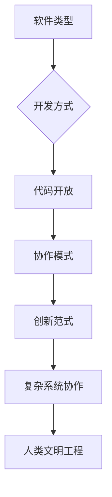

# 什么是开源？（What）

## 课程目标
1. 理解开源的多元定义（技术、模式、文化）  
2. 通过真实案例感知开源的影响力  
3. 激发参与开源的兴趣  

## 一、教学设计
1. **互动投票**  
   - 工具：使用在线工具让学生投票选择日常使用的软件：Chrome、安卓手机、VS Code、Firefox等，揭晓答案均为开源或基于开源。
   - 可以进行提几个与开源有关的问题：如最几年最火热的开源软件有什么？，最后一个问题以同学认为这个世界的软件开发以什么为主导，占了多大的比例为结尾，问题答案通过数据冲击：展示“全球97%的软件开发依赖开源代码”等统计数据。
2. **沉浸式故事**  
   - **视频片段**：插入[Linux诞生纪录片](视频链接)
  
## 二、开源的形式

### 1.开源作为一种软件类型（OSI定义）
---

## 🔍 **官方定义：OSI的黄金标准**
**开放源代码促进会（OSI）**对开源软件的明确定义：  
> "开源软件是指其**源代码可被自由查阅、修改和分发**的软件，且必须满足以下所有条件——"

---

## 📜 **OSD核心条款（简化版）**
Open Source Definition（OSD）的十大原则可浓缩为四大核心：

| 核心原则               | 关键要求                                                                 | 反例警示⚠️                |
|------------------------|--------------------------------------------------------------------------|--------------------------|
| **自由再分发**         | 允许任意形式的分发（包括商业销售）                                       | 禁止转售的软件           |
| **源代码公开**         | 必须提供源代码，且禁止混淆或刻意设置编译障碍                             | 只提供二进制文件的软件   |
| **允许衍生作品**       | 允许修改源代码并发布修改后的版本（可附加合理限制）                       | 禁止二次开发的许可证     |
| **无歧视性限制**       | 不得针对特定人群/领域/技术进行限制（如"不得用于军事用途"条款无效）       | 限制用户职业的软件协议   |

---
    从课堂导入我们不难发现，从计算机的诞生，到如今的互联网时代，或者说以后的数字世界，
    开源的软件架构充斥这个万物互联的世界发方方面面，它们可能就像数字世界的大基建的一种方式，
    但同样在这个数字世界的大开发时代还有另外一种基建方式-闭源。

### 核心概念
```diff
+ 开源软件 = 源代码开放 + 允许自由使用/修改/分发（OSI定义）
- 闭源软件 = "黑箱"操作 + 使用受限
```
### 互联网早期的开源与闭源格局：分层解析

---

#### 🌍 **基础设施层：开放协议主导**
1. **TCP/IP协议栈**（1970s）  
   - 由DARPA资助开发，**协议标准完全开放**，允许任何机构自由实现
   - 关键作用：奠定互联网互联互通的基石
   - 典型案例：BSD UNIX对TCP/IP协议栈的开源实现（1980s）

2. **电子邮件系统**  
   - SMTP/POP3协议开放，但早期实现混合开源与闭源  
   - 闭源案例：Lotus Notes的邮件系统（1989）  
   - 开源先驱：Sendmail（1983）成为邮件服务器事实标准

---

#### 💻 **操作系统层：闭源商业软件的霸权**
| 系统        | 性质    | 关键事件                      |
|-------------|---------|-----------------------------|
| UNIX        | 初期闭源 | AT&T禁止大学传播源码（1979） |
| DOS/Windows | 完全闭源 | 微软通过闭源绑定IBM PC（1981）|
| VMS         | 闭源     | DEC专用系统，影响早期网络架构|

**例外突破**：BSD UNIX（1977）从AT&T UNIX衍生出开源分支，孕育了FreeBSD/NetBSD

---

#### 🕸️ **应用层：开放与封闭的拉锯战**
- **闭源主导领域**  
  - 浏览器大战：Netscape初期闭源（1994），后开源为Mozilla（1998）  
  - 办公软件：微软Office（1989）完全闭源统治市场

- **开源亮点**  
  - Apache HTTP Server（1995）：快速击败闭源的Netscape Enterprise Server  
  - Perl语言（1987）：开源脚本语言成为早期Web开发支柱

---

#### 🔄 **文化基因：开放协作的暗流**
- **RFC文化**（始于1969）  
  - 互联网工程任务组（IETF）通过**公开征求意见稿**推动技术演进  
  - 典型案例：HTTP/1.0规范以RFC 1945形式发布（1996）

- **黑客伦理**的影响  
  - MIT AI实验室等机构倡导代码共享（如ITS操作系统）  
  - 1983年Richard Stallman发起GNU计划，标志着**现代开源运动的觉醒**

---

#### 📊 关键转折点时间轴
    1969 : ARPANET诞生（开放协议）
    1979 : AT&T收紧UNIX授权
    1983 : GNU宣言发布
    1985 : FSF成立，GPL协议诞生
    1991 : Linux内核首次发布
    1995 : Apache超越闭源服务器
    1998 : "开源"一词正式诞生


####  总结与思考
深度思考：为什么基础设施更早开放？
- 军事科研需求：ARPANET需要跨机构协作，开放协议是刚需
- 商业价值滞后：早期互联网未形成明确盈利模式，企业缺乏闭源动力
- 学术共同体传统：大学与研究机构长期奉行知识共享原则

**总结**：互联网的骨子里流淌着开放血液，但在商业化浪潮中，闭源软件曾一度占据应用层高地。这种基础设施开放+上层应用封闭的二元结构，正是数字时代最根本的技术政治博弈场。


### 2.开源是一种协作与创新模式—— 从代码到文明的协作范式


## 🛠️ 始于软件世界的协作革命：开源开发模式三阶跃迁


## 始于软件开发
**传统闭源开发**
- 典型特征：
  + 代码仅限内部团队访问
  + 严格的知识产权保护
  - 案例：Windows 95开发时期

**企业内部开源（Inner Source**
+ 核心逻辑：
  ! 对外闭源，但内部采用开源协作方式
  ! 跨团队共享代码库，允许内部PR
  + 案例：
    - 微软：通过"One Engineering System"实现内部开源
    - 沃尔玛：内部开源电商平台代码加速门店系统开发

**完全开源**
+ 黄金标准：
  ! 代码完全公开，接受全球贡献  
  ! 必须符合OSI定义  
  + 案例：Linux内核，Vue.js框架
 
## 💡 认知升级：协作模式的元规则

通过解剖不同协作模式的 "基因序列"，理解开源不是非黑即白的选择，而是在开放与保护的动态平衡中寻找最优解。

## 不同模式的核心差异点

| 维度     | 传统闭源 | Inner Source | 完全开源 |
| -------- | -------- | ------------ | -------- |
| 透明度   | 黑箱操作 | 组织内透明   | 全网公开 |
| 创新来源 | 内部研发 | 跨部门协同   | 全球智慧 |
| 进化速度 | 线性增长 | 多项式增长   | 指数级增长 |
| 案例代表 | Oracle   | 微软 Azure   | TensorFlow |

4. **开源是一种产业生态** ：深入剖析开源如何推动技术持续演进，以及构建商业生态的过程，可参考红帽的成功范例。

## 二、开源历史

1. **时间线和重要节点** ：梳理从 Unix 到 GNU，再到 Linux、Git 直至 Github 的发展脉络，标注关键转折点。
2. **自由软件运动与 Richard Stallman 的贡献** ：阐述自由软件运动的发起背景、发展历程，以及 Richard Stallman 在其中发挥的关键引领作用。
3. **开源运动的兴起与 Open Source Initiative (OSI)** ：讲述开源运动蓬勃兴起的时代背景，以及 Open Source Initiative (OSI) 在推动开源规范化进程中的重要地位。

## 三、开源许可证

1. **介绍许可证的作用和开源定义（Open Source Definition）** ：系统阐述许可证在开源生态中的核心功能，精准解读开源定义的内涵。
2. **常见开源许可证** 
3. **如何选择许可证** ：结合实际项目案例，讲解依据项目特性、发展规划等需求，恰当选择适配的许可证类型。

## 四、开源安全

1. **开源软件供应链安全** ：以 Log4j 漏洞案例为切入点，深度剖析漏洞在开源软件供应链中的传播原理与路径。
2. **安全最佳实践** ：介绍开源软件的审计和管理策略，例如借助工具 Dependabot 进行有效管控。

## 五、参考任务

1. 创建 Github 帐号，初始化一个简单的项目（如 README 文件）。
2. 为该项目选择一个开源许可证，并撰写一段文字解释选择理由。
