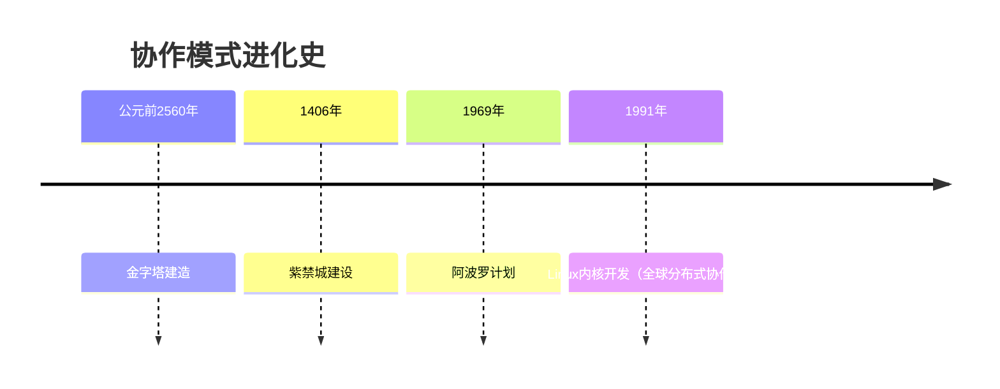
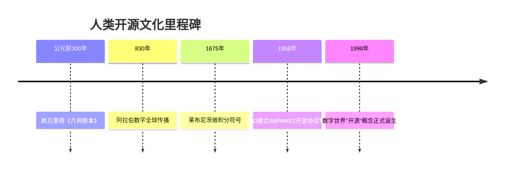

# 什么是开源？（What）

## 课程目标

1. 理解开源的多元定义（技术、模式、文化）。
2. 通过真实案例感知开源的影响力。
3. 激发参与开源的兴趣。

---

## 一、教学设计

1. **互动投票**
   - **工具**：使用在线工具让学生投票选择日常使用的软件：Chrome、安卓手机、VS Code、Firefox 等，揭晓答案均为开源或基于开源。
   - **扩展问题**：提问一些与开源相关的问题，比如“近年来最火热的开源软件有哪些？” (比如：deepseek 开源？) 或“你认为全球软件开发有多大比例依赖开源代码？”（这里加上全球 97% 软件开发依赖开源代码等统计数据），通过这些给学生带来震撼，直观感受到开源并非只是众多程序员手中的小众玩意，更是与生活息息相关。
2. **沉浸式故事**
   - **视频片段**：插入 [Linux 诞生纪录片](视频链接)，通过真实故事让学生感知开源的力量，激发参与的兴趣。

---

## 二、开源的形式

### 1. 开源软件（OSI 定义）

开源不仅仅是一个技术术语，它还承载了文化和模式的多重意义。开源软件的定义由**开放源代码促进会（OSI）** 给出，是至今为止广泛认同的标准，为我们提供了一个清晰的框架，帮助我们区分开源与闭源软件。

> **开源软件**是指其**源代码可被自由查阅、修改和分发**的软件，且必须满足以下所有条件——开放源代码，允许自由使用、修改、分发，且这种自由是无条件的。

#### 📜 **OSD 核心条款（简化版）**

**Open Source Definition（OSD）** 核心条款可以概括为为四大原则，它们在实践中成为了开源软件的重要标志：

| 核心原则               | 关键要求                                                           | 反例警示⚠️           |
| ---------------------- | ------------------------------------------------------------------ | ---------------------- |
| **自由再分发**   | 允许任意形式的分发（包括商业销售）                                 | 禁止转售的软件         |
| **源代码公开**   | 必须提供源代码，且禁止混淆或刻意设置编译障碍                       | 只提供二进制文件的软件 |
| **允许衍生作品** | 允许修改源代码并发布修改后的版本（可附加合理限制）                 | 禁止二次开发的许可证   |
| **无歧视性限制** | 不得针对特定人群/领域/技术进行限制（如"不得用于军事用途"条款无效） | 限制用户职业的软件协议 |

---

#### 核心概念

```diff
+ 开源软件 = 源代码开放 + 允许自由使用/修改/分发（OSI定义）
- 闭源软件 = "黑箱"操作 + 使用受限
```

### 2. 早期的开源与闭源格局

在软件发展史的不同阶段，开源与闭源呈现出不同的格局和特征。我们可以通过**基础设施层、操作系统层、应用层**这三个层次来全面解析开源与闭源的演变过程，并探索其中的文化与技术力量。

---

#### 🌍 **基础设施层：开放协议主导**

##### TCP/IP 协议栈（1970s）

- **背景与作用**：由**美国国防部高级研究计划局（DARPA）** 资助开发的**TCP/IP 协议** 是互联网的通信基础。该协议栈的**完全开放性** 让世界各地的机构得以自由实现，并可以在全球范围内实现互联互通。
- **关键意义**：这为互联网的快速扩展奠定了基础。TCP/IP 协议成为全球网络连接的标准，极大推动了现代互联网的形成。
- **典型案例**：**BSD UNIX（1980s）** 是开源实现 TCP/IP 协议栈的一个例子，并且成为了后来的 **FreeBSD** 和 **NetBSD** 等开源操作系统的基础。

##### 电子邮件系统

- **开放协议**：早期许多电子邮件系统都有闭源实现。不过，和其他协议相比，SMTP 和 POP3 协议具有开放性，因此成为全球邮件传输和接收的标准。而随着开源软件的发展，开源邮件系统也逐渐占据主导地位。
- **闭源案例**：比如 **Lotus Notes**（1989），其邮件系统在早期占据市场主导地位，但是完全闭源，限制了用户的定制和扩展实现。
- **开源先驱**：**Sendmail**（1983），开源邮件服务器软件，成为邮件服务器的事实标准，推动了邮件协议的普及。

---

#### 💻 **操作系统层：闭源商业软件的霸权**

在操作系统层，闭源软件曾长时间占据主导地位，尤其是在个人电脑和大型主机领域中，商业软件通过对源代码的控制，塑造了强大的市场壁垒。

| 系统        | 性质     | 关键事件                       |
| ----------- | -------- | ------------------------------ |
| **UNIX**        | 初期闭源 | AT&T 禁止大学传播源码（1979）   |
| **DOS/Windows** | 完全闭源 | 微软通过闭源绑定 IBM PC（1981） |
| **VMS**         | 闭源     | DEC 专用系统，影响早期网络架构  |

- **UNIX**：虽然最初的 UNIX 系统是由贝尔实验室（AT&T）开发的，但由于其巨大的技术潜力和影响力，AT&T 在 1979 年开始限制其源代码的传播，开启了闭源软件的霸权时代。
- **DOS/Windows**：微软通过完全封闭源代码，并将其绑定到 IBM PC 的硬件上，成功建立起了 PC 操作系统的市场主导地位。
- **VMS**：DEC 公司开发的 VMS 操作系统长期封闭，成为其自家硬件的专用系统，影响了早期的网络架构。

**例外突破**：尽管大多数操作系统都处于闭源状态，但**BSD UNIX（1977）** 从 AT&T UNIX 衍生出开源分支，并为后来的 FreeBSD/NetBSD/ OpenBSD 等开源操作系统铺平了道路。

---

#### 🕸️ **应用层：开放与封闭的拉锯战**

随着计算机和互联网的普及，应用层软件成为了开源与闭源之争的关键战场。在这个层面，开源和闭源的斗争更为激烈，影响也最为广泛。

##### 闭源也曾称王

- **浏览器大战**：**Netscape** 最初是闭源的（1994 年），它曾是最受欢迎的浏览器。然而，由于开源运动的推动，Netscape 决定在 1998 年开源其浏览器核心，最终催生了 **Mozilla Firefox** 这一开源浏览器的诞生，直接挑战了微软的 **Internet Explorer**。
- **办公软件**：**微软 Office**（1989 年）凭借其强大的功能和用户基础，长期占据办公软件市场的统治地位，且完全闭源，极大限制了用户的定制和扩展能力。

##### 开源突破重围

- **Apache HTTP Server（1995）**：作为世界上最早的开源 Web 服务器，Apache HTTP Server 迅速击败了当时闭源的 **Netscape Enterprise Server**，成为全球最流行的 Web 服务器软件。
- **Perl 语言（1987）**：开源的 Perl 编程语言成为了早期 Web 开发的核心工具之一。它的开源特性使得开发者可以自由修改和扩展，迅速发展成开发人员的首选语言。

---

#### 🔄 **文化基因：开放协作的暗流**

除了技术因素外，开源运动的成功还离不开其背后深厚的**文化基因**，它源于对**知识共享**和**协作创新**的深刻理解。

- **开源的文化传承**：MIT 的 **AI 实验室**等机构提倡代码共享，早期的 **ITS 操作系统**就是一个典型的例子。其开放的代码理念，成为了日后现代开源运动的精神先驱。
- **Richard Stallman 与 GNU 计划**：1983 年，**Richard Stallman** 发布 **GNU 宣言**，并启动了 GNU 计划，致力于创建一个完全自由的操作系统。这标志着现代开源运动的觉醒，为后来的 **Linux** 内核等开源软件提供了理论支持和实践基础。
- **开放标准的倡导者**：互联网的很多技术标准是通过互联网工程任务组（IETF）的**公开征求意见稿（RFC）** 确定下来的，从而推动互联网协议的标准化。例如，**HTTP/1.0 规范** 在 1996 年以 RFC 1945 的形式发布，为全球的网络通信提供了共同语言。

---

#### 📊 **关键转折点时间轴**

| 年份       | 关键事件                                      |
| ---------- | --------------------------------------------- |
| **1969**   | **ARPANET**诞生，开放协议成为互联网基础        |
| **1979**   | AT&T 开始收紧 UNIX 授权，闭源的商业化趋势显现     |
| **1983**   | **GNU 宣言**发布，标志着现代开源运动的觉醒     |
| **1985**   | **FSF（自由软件基金会）** 成立，**GPL 协议**诞生 |
| **1991**   | **Linux 内核**首次发布，成为开源软件的代表      |
| **1995**   | **Apache**超越闭源服务器，成为 Web 服务器的主流  |
| **1998**   | "开源"一词正式诞生，开源成为技术和文化的代名词 |

---

#### **总结与思考**

**为什么基础设施层更早开放？**

1. **军事科研需求**：在互联网初期，**ARPANET** 作为军事研究项目，需要实现跨机构的高效协作，因此选择开放协议，促进各方自由实现和参与。
2. **商业价值滞后**：互联网初期缺乏明确的盈利模式，企业尚未拥有对软件的闭源保护意识，反而开放协议和技术能够促进广泛的合作与发展。
3. **学术共同体传统**：大学和研究机构历来推崇**知识共享**。许多早期的技术发展，如 **UNIX** 和 **TCP/IP 协议**，都是因为得到了学术界的广泛支持与推广。

**总结**：尽管随着商业化进程的推进，闭源软件在应用层逐渐占据主导地位，但从基础设施到应用层，开源的精神始终贯穿其中。开源和闭源之间的博弈，构成了现代数字技术生态中最为根本的对抗与合作。

### 3. 开源是一种协作与创新模式

#### 软件层：开源开发的协作密码

开源的核心不仅仅是技术的共享，它深刻地改变了传统软件开发中的协作方式。不同的开源协作模式使得全球开发者能够共同工作，从**传统闭源开发**到**企业内部开源**，再到**完全开源**的广泛采用，开源逐渐形成了独特的协作密码。

##### 传统闭源开发

**典型特征**：代码仅限于内部团队访问，外部开发者无法获取源代码。并且因为严格的知识产权保护，源代码无法修改或分发。

**案例**：**Windows 95** 的开发过程中，微软严格控制代码的所有权和访问权限，确保仅限内部开发人员修改和发布。

##### 企业内部开源（Inner Source）

**核心逻辑**：对外部依旧保持闭源，但内部采用开源协作方式，跨团队共享代码库，允许内部贡献和修改。

**案例**：

1. **微软**：通过“One Engineering System”实施内部开源，促进跨部门的协作与代码共享。
2. **沃尔玛**：采用内部开源模式开发电商平台，加速了门店系统的开发与迭代。

##### 完全开源

**黄金标准**：代码完全公开，任何人都可以参与修改和贡献，全球开发者共同推动项目进步。
**OSI 定义**：符合开放源代码的标准，任何人可以自由使用、修改、分发。

**案例**：

1. **Linux 内核**：全球开发者贡献，成为最具影响力的开源操作系统之一。
2. **Vue.js**：前端框架，采用开源协作模式，社区驱动着其快速发展。

---

#### 💡 认知升级：只是协作模式的不同

开源不仅是一种技术决策，它还是一种协作模式的变革。通过对不同协作模式的分析，我们可以理解，开源并非是唯一选择，而是在可持续性和普惠性之间寻求最佳平衡。

##### 不同模式的核心差异点

| 维度     | 传统闭源 | Inner Source | 完全开源   |
| -------- | -------- | ------------ | ---------- |
| **透明度**   | 黑箱操作 | 组织内透明   | 全网公开   |
| **创新来源** | 内部研发 | 跨部门协同   | 全球智慧   |
| **进化速度** | 线性增长 | 多项式增长   | 指数级增长 |
| **案例代表** | Oracle   | 微软 Azure   | TensorFlow |

---

#### 不只是代码：现实世界中的“开源式协作”

开源的影响力远不止局限于软件开发领域，它已经超越了技术，成为一种全球范围的协作范式。在不同的领域，开源思维和模式正被应用到各类复杂系统和社会工程中。历史上的巨大协作工程和项目都能为我们提供开源模式的启示。

- **古罗马引水渠建设**：多个城邦共享水利工程技术，技术改进方案被刻在公共石碑上，类似今天的 **Git 提交历史**。
- **维基百科编辑**：全球用户可以编辑条目，类似于 **Pull Request** 的方式，且条目的讨论页记录了社区的争议解决过程，类似于 **Code Review**。

---

#### 人类复杂工程协作史



#### 深度对比：金字塔 vs Linux 内核

| 维度     | 古埃及金字塔建造       | Linux 内核开发                       |
| -------- | ---------------------- | ----------------------------------- |
| **协作规模** | 10 万劳工 + 数百工程师    | 16000+ 贡献者                        |
| **知识管理** | 象形文字记录在莎草纸上 | Git 提交记录在 GitHub                 |
| **质量控制** | 监工现场检查石块       | CI/CD自动化测试，社区反馈，人工审查 |
| **传承方式** | 师徒制手把手传授       | 代码审查 + 开发者文档                 |
| **核心动力** | 法老的绝对权威         | 技术领导力 + 社区共识                 |

“当建造数字巴别塔时，开源不是可选项，而是必选项”

---

#### 💡 认知发散：开源的可能是一种“群体智慧协议”

开源不仅仅改变了软件开发的方式，它还为全人类提供了一种更为高效、智能的协作模型。这种“群体智慧协议”不仅解决技术问题，也在解决人类文明的重大挑战。

---

### 4. 开源是一种文化理念

开源不仅是一种技术实现，它也是一种全球范围内的文化理念，代表着共享、透明与协作的精神。从数字世界到整个社会的进步，开源成为了推动文明演化的重要力量。

#### 从技术到文化的四层跃迁

| 层级               | 核心要素                                             | 现实映射案例                     |
| ------------------ | ---------------------------------------------------- | -------------------------------- |
| **工具层**   | Git/Markdown/CI/CD等技术工具                         | GitHub 工作流、Jupyter Notebook   |
| **方法论层** | Pull Request 机制/社区治理规则/许可证体系             | Apache 投票制度、Linux 维护者体系  |
| **生态层**   | 多主体共生的可持续系统（开发者 - 企业 - 用户的正向循环） | Kubernetes 生态、RISC-V 指令集联盟 |
| **文明层**   | 开放协作成为解决复杂系统的默认选项                   | 人类基因组计划、维基百科         |

开源的概念从最初的代码共享，发展到如今的**开放协作**，并通过跨技术、跨行业、跨领域的应用，成为解决全球性问题的有效工具。这四个层级的跃迁反映了开源从技术实践到文化理念的深刻转变。

---

#### 🌌 文化演进史：开源理念的千年血脉



#### 🧮 数学：人类最早的开源实践

数学作为人类最早的开源实践之一，通过符号系统的共享、定理的公开证明、知识的积累和去中心化协作，展现了开源的原始特征。

##### 数学的“开源特性”解剖

- 符号系统的开源：阿拉伯数字、希腊字母全球通用。
- 知识积累的开放性：定理证明可复现、可验证、可改进。
- 协作网络的去中心化：从亚历山大图书馆到现代的 arXiv 预印本平台，促进了全球知识共享。

---

#### 历史对照：闭源 vs 开源数学

| 案例       | 协作方式     | 成果影响                   |
| ---------- | ------------ | -------------------------- |
| 牛顿微积分 | 闭源多年     | 引发与莱布尼茨的优先权之争 |
| 布尔代数   | 完全开源发布 | 催生整个计算机科学领域     |

通过对比牛顿与莱布尼茨之间的优先权之争与布尔代数的开源发布，我们看到开源在推动学科发展的速度、广度和深度上的独特优势。

---

#### 🌐 开源文化 DNA：从数学到数字时代

##### 共享符号系统

- 数学：∑ 积分符号 → 编程：{} 代码块语法
- 案例：LaTeX 数学排版系统开源标准

---

#### 🧪 互动实验：数学论文 vs 开源项目

##### 对比分析

| 维度                   | 数学论文系统   | 现有开源项目系统 |
| ---------------------- | -------------- | ---------------- |
| **最小协作单元** | 定理证明       | Pull Request     |
| **版本管理**     | 多版本手稿传递 | Git 分支管理      |
| **质量检验**     | 同行评审       | Code Review      |
| **知识传承**     | 学术谱系       | Contributor 图谱  |
| **争议解决**     | 学术辩论       | Issue 讨论        |

---

#### 🔮 文化投射：开源理念的现代显化

##### 跨领域开源范式

| 领域               | 开源实践               | 数学渊源               |
| ------------------ | ---------------------- | ---------------------- |
| **区块链**   | 以太坊智能合约开源     | 图灵可计算理论开放验证 |
| **生物技术** | CRISPR 基因编辑协议共享 | DNA 双螺旋结构开放研究  |
| **航天**     | SpaceX 公开火箭设计蓝图 | 开普勒行星定律开源传播 |

##### 开源文化主流的特性

1. **可溯源性**：所有创新需标注知识谱系（如数学引用体系）。
2. **可验证性**：过程数据完全开放（如 Git 历史记录）。
3. **可扩展性**：允许衍生创造（如数学猜想迭代）。

---

#### 💡 认知思考：我们终将开源

>当罗马工匠将混凝土配方带入坟墓，当大马士革钢工艺湮灭于战火，人类文明出现空白页——直到《几何原本》被翻译传播，直到 Linux 内核向全球开发者敞开，我们才真正懂得对抗被时间遗忘的武器，是开放与共享。

通过混凝土的千年轮回，理解开源不是技术选择，而是文明存续的生存策略。
从泥板上的楔形数字到 GitHub 的星标仓库，人类始终在践行同一个真理：共享使知识永生。
