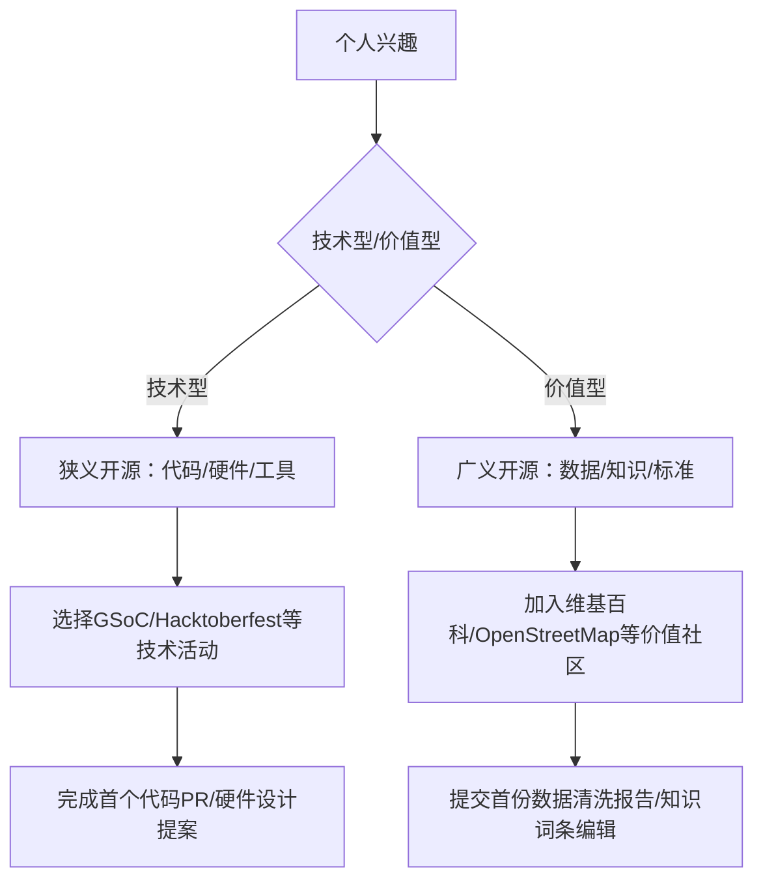

# **《如何参与开源》教案**

## **一、课程目标**  

- **认知升级**：明确狭义开源（软件代码开放）与广义开源（硬件、数据、教育等全领域开放）的核心差异，理解开源从技术协作到社会创新的多维价值。  

- **技能培养**：掌握狭义开源的代码贡献、文档优化等技术路径，以及广义开源的知识共享、标准制定等非技术参与方式。  

- **实践落地**：能根据个人兴趣选择适配的开源参与路径，完成至少 1 次跨维度（狭义 + 广义）的开源实践。  

## **二、核心内容框架**  

### **第一部分：开源认知基础——狭义与广义的边界突破**  

#### **1. 开源的双重维度解析**  

- **狭义开源**：聚焦软件领域，以 GPL/MIT 等许可证为法律基础，强调源代码开放与协作开发（如 Linux 内核开发模式）。

- **广义开源**：扩展至硬件（RISC-V 架构）、数据（OpenStreetMap 地理数据）、教育（Coursera 开放课程）等领域，核心是知识共享与标准开放。  

#### **2. 参与价值对比表**  

| **维度**       | **狭义开源**                               | **广义开源**                                       |  
|----------------|------------------------------------------|--------------------------------------------------|  
| **定义边界**   | 以技术成果开放为核心（代码、硬件设计、算法）       | 以数字世界全要素开放为核心（知识、数据、标准、教育、文化）   |  
| **核心领域**   | 软件（Linux）、硬件（RISC-V）、开发工具（Git）       | 开放数据、开放知识、开放教育、开放标准、开放科学           |  
| **参与形式**   | 代码贡献、漏洞修复、文档编写、测试用例开发           | 数据共享、知识共创、标准制定、教育资源共建、文化传播       |  
| **法律基础**   | 软件许可证（GPL/MIT/Apache）、硬件开源协议（CERN-OHL） | 知识共享协议（CC 协议）、开放数据许可（ODC）、公共版权 dedication（CC0） |  
| **典型案例**   | 参与 Linux 内核开发、贡献 Hadoop 分布式算法             | 编辑维基百科、上传 OpenStreetMap 地理数据、翻译 MOOC 课程       |  

### **第二部分：狭义开源参与路径——从代码贡献到生态共建**  

#### **1. 参与全流程**  

- **Step 1：项目选择策略**  

  - **领域匹配**：参与开源项目，首先要确保项目领域与自身兴趣、专业技能相匹配。思考自己在哪个技术领域积累了较多知识，是前
  端开发、后端架构，还是数据科学。比如，若你擅长 JavaScript 编程，对构建交互性强的用户界面充满热情，那专注于前端框架如 Vue、React 相关的开源项目会是不错的方向。在这些项目中，你能凭借专业知识理解代码逻辑，更高效地参与到功能改进、bug 修复等工作里。  

- **Step 2：贡献类型与技巧**  

  - **代码贡献**：  
    - 流程：Fork 项目→创建 Issue→提交 PR→参与 Code Review→合并（参考 Kubernetes 贡献指南）。  
    - 技巧：从"小修小补"开始（如修复文档错别字）。  

  - **测试与 QA**：使用 Jenkins 进行持续集成测试，为 Apache Kafka 编写故障模拟测试用例。  

- **Step 3：社区协作规范**  

  - **PR 规范**：按照社区指定贡献指南书写 PR 格式。  

  - **Code Review 文化**：秉持开放态度接纳建设性批评，以理性思辨精神对反馈意见加以考量。  

  - **决策机制**：理解多数社区采用的 Meritocracy（能者决策），如 Docker 项目技术委员会由核心贡献者选举产生。  

#### **2. 技术社区与平台**  

- **参与大型开源平台**  
  - **Google Summer of Code（GSoC）**：面向学生的长周期开源项目实习，2025 年支持 800+ 项目（如 Kubernetes 网络模块开发）。  
  - **Hacktoberfest**：每年 10 月全球大型规模开源贡献活动，2024 年的 Hacktoberfest 吸引了超过 500 万开发者。  

- **关注垂直领域技术社区**  

  - **Rust 社区**：通过 Rust Playground 提交语言特性改进建议，参与编译器优化（如修复 Async/Await 语法漏洞）。  

  - **AI 开源社区**：在 Hugging Face 提交模型微调方案，如为 Stable Diffusion 优化图像生成算法。  

#### **3. 企业级开源计划**  

- **科技巨头开源生态**  

  - **微软 OSS 奖学金计划**：为贡献 Azure 开源工具（如 Terraform Provider）的学生提供认证补贴与实习绿色通道。  

  - **华为开源人才培养计划**：参与 OpenHarmony 设备驱动开发，通过"鸿蒙开发者认证"可加入生态合作伙伴企业。  

  - **腾讯开源联盟**：通过 TOSA（腾讯开源联盟）参与内部开源项目孵化，遵循 Apache 基金会模式进行代码贡献与社区治理。  

  - **阿里开源项目**：在阿里云开发者社区（[https://developer.aliyun.com](https://developer.aliyun.com/)）提交 Serverless 应用优化方案，参与达摩院开源项目（如机器学习框架 PAI）。  

- **华为开源社区矩阵**  

  - **OpenHarmony 社区**：通过开放原子基金会官网（[https://www.openatom.org](https://www.openatom.org/)）注册账号，
  参与技术委员会（如 AI Model SIG），贡献代码或测试用例。截至 2023 年，该社区已有 5100 余位贡献者，覆盖医疗、交通等多个行
  业。  

  - **openEuler 社区**：访问官网（[https://openeuler.org](https://openeuler.org/)）下载源代码，参与操作系统内核开发。社区提供开发者培训、认证体系，支持多处理器架构创新。  

  - **openGauss 社区**：在 Gitee 平台（[https://gitee.com/opengauss](https://gitee.com/opengauss)）提交数据库优化代码，参与木兰宽松许可证（Mulan PSL v2）项目治理。  

- **初创公司开源协作**  

  - **Databricks Delta Lake 项目**：提交数据湖存储优化方案，参与构建湖仓一体技术标准。  

  - **HashiCorp Terraform**：贡献多云基础设施编排插件，支持国产云厂商（如阿里云、腾讯云）接入。  

#### **4. 高校与科研机构开源项目**  

- **学术型开源计划**  

  - **清华 OpenI 启智平台**：参与 GLM 大模型训练框架优化，贡献跨模态对齐算法（需通过 OpenI 代码审核流程）。

  - **MIT OpenCourseWare 贡献者计划**：将课程实验代码开源，补充 Python 数据结构可视化工具。  

#### **5. 国际组织参与路径**  

- **Apache 基金会**  

  - **贡献层级**：从用户（使用 Hadoop）→贡献者（提交 Patch）→提交者（获得代码提交权限）→PMC 成员（参与项目决策）→ASF Member（基金会"股东"）。  

  - **现实案例**：腾讯云专家堵俊平通过 8 年持续贡献，成为 ASF Member，主导项目孵化与社区治理。  
- **Linux 基金会**  

  - **技术认证**：通过 LFOSSA（Linux Foundation 开源软件学园）学习 Kubernetes、云原生等课程，获取官方认证（如 CKA）。

  - **峰会参与**：报名参加 GOTC 全球开源技术峰会，与国际开发者面对面交流。  

### **第三部分：广义开源参与路径——突破代码边界的创新协作**  

#### **1. 开放知识与文化传播**  

- **知识共创平台**  

  - **维基百科编辑**：参与"中国开源史"词条建设，补充红旗 Linux 发展历程细节（需通过维基百科中立性审核）。  

  - **GitBook 开源文档**：在《开源入门手册》项目中新增"广义开源价值观"章节，使用 Markdown 提交 PR。  

- **文化传播行动**  

  - **开源科普视频**：互联网上，了解或者模仿许多技术博主制作的优质开源科普视频。它们通过动画、案例和通俗语言，帮初学者快速理解开源的概念、发展、运作模式及重要意义，打开了了解开源世界的窗口。  

  - **播客节目策划**：组织一档开源主题播客，例如“开源世界新动态与参与指南”。邀请开源专家和活跃贡献者分享经验，设置听众互动环节，解答参与开源的困惑，以音频形式传播开源知识，激发大家参与热情。  

  - **校园宣讲会**：联合计算机学院举办"开源布道活动"，如邀请华为等大型企业的开源工程师分享 OpenHarmony 生态建设经验。  

#### **2. 开放数据与科学研究**  

- **数据共享平台**  

  - **Kaggle 数据集贡献**：清洗并上传开源数据集，标注 ODC-PDDL 协议（可商用共享）。

  - **中国开放科学数据平台**：注册后上传科研数据（如气候观测数据），遵循 CC0 协议实现无版权限制共享。  

- **开放科学实践**  

  - **预印本平台贡献**：在 arXiv 发布机器学习论文时，同步开源训练代码与数据集（需符合 MIT 许可证）。  

  - **临床试验数据开放**：参与 WHO 国际临床试验注册平台，标准化新冠药物试验数据格式。  

#### **3. 开放硬件与教育协作**  

- **开放硬件项目**  

  - **RISC-V 生态**：使用 KiCad 设计开源电路板，提交至玄铁 C930 处理器社区，支持 AI 边缘计算。  

  - **创客空间**：参与或者组织本地创客马拉松，开发开源智能硬件（如基于 Arduino 的环境监测设备）。  

- **开放教育资源**  

  - **Coursera 课程翻译**：将国外课程课程字幕翻译成简体中文，发布至 GitHub 教育仓库。  

  - **高校开源计划**：加入"开源软件供应链点亮计划"，参与 OSPP 开源之夏这类活动。  

#### **4. 开放标准与协议共建**  

- **国际标准组织**  

  - **开放原子基金会标准**：在 AtomGit 平台（[https://atomgit.com](https://atomgit.com/)）提交《开源软件供应链安全标准》修订建议。  

  - **ISO 开源标准工作组**：申请加入 ISO/IEC JTC 1/SC 7，参与软件开源标准制定。  

- **行业联盟参与**  

  - **开放原子基金会标准工作组**：加入"开源许可证合规"工作组，参与制定《GB/T 44272》配套实施细则。

  - **Linux 基金会边缘计算项目**：贡献 5G 边缘节点数据交互协议草案，推动物联网设备互操作标准落地。  

#### **5. 开放教育与技能共享**  

- **教育资源共建**  

  - **GitHub 教育仓库**：在《大学计算机基础》开源课程中补充"开源协作工具"章节，提供 Git 操作录屏教程。  

  - **MOOC 课程翻译**：将 Coursera《区块链技术》课程字幕翻译成彝语，提交至 edX 开源翻译平台。  

- **技能认证体系**  

  - **Linux 基金会开源领导力认证**：完成 100 小时社区运营贡献（如组织 10 场 Meetup），申请 CLF 认证。

  - **华为云开源开发者认证**：通过 OpenEuler 系统调优考试，获得"开源操作系统工程师"证书。  

#### **跨维度参与策略：从兴趣到行动的匹配模型**  

## **三、特色教学设计**  

### **1. 维度对比工作坊**  

- **案例分组辩论**  

  - 狭义组：分析"参与 Linux 内核开发对职业发展的影响"（参考 GitHub 贡献者薪资报告数据）。  

  - 广义组：辩论"开放数据是否应该完全无国界共享"（结合欧盟《数据治理法案》限制条款）。  
- **工具实操对比**  

  - 狭义：使用 Git 提交代码 PR（演示 GitHub 流程）vs 广义：使用 JOSM 编辑地图数据（演示 OpenStreetMap 贡献流程）。  

### **2. 社区对接会**  

- **实施步骤**  

  1. 开源社区技术成员线上分享参与路径。  

  2. 学生分组选择感兴趣的开源项目制定 3 个月参与计划。  

  3. 教师协调社区导师提供指导，跟踪学生贡献进度。  

### **3. 伦理困境辩论擂台**  

- **议题设置**  

  - **正方**：企业使用开源软件必须回馈社区（如阿里开源 Dubbo 框架）。  

  - **反方**：企业付费使用即履行责任，无需代码贡献。  

- **数据支撑**：引用微软收购 GitHub 后 PR 数量增长 30% 的数据，辩证分析商业与开源的共生关系。  

## **四、课后拓展任务**  

### **1. 实践类任务**  

- **开源贡献打卡**：在一段时间内完成至少 3 次不同类型的贡献（如 1 次代码 PR、1 次文档翻译、1 次 Issue 分类）。  

- **项目分析报告**：选择一个目标项目，撰写《参与可行性分析报告》，包含：  

  - 技术栈匹配度  

  - 社区活跃时间分布  
  
  - 潜在贡献点挖掘（如文档缺口、高频 Issue 类型）  

### **2. 生态调研与路径规划**  

- **调研报告**  
  - 分析开放原子基金会与 W3C 的治理模式差异（决策机制/参与门槛/成果转化）。  

  - 对比 GitHub Sponsors（狭义打赏）与 Patreon（广义知识付费）的用户付费动机。  

## **五、进阶思考**  

1. **价值转化难题**：如何量化广义开源参与的社会价值（如维基百科编辑时长 vs 代码贡献行数）？  

2. **全球治理参与**：面对许可证碎片化问题，中国开发者如何在 ISO 开源标准制定中发挥更大影响力？  

3. **文化适配性**：对于非计算机领域的外行人，如何让他们理解个人贡献透明的狭义开源模式？反之，如何让只钻研技术型的人才认识到广义开源的非功利价值？
