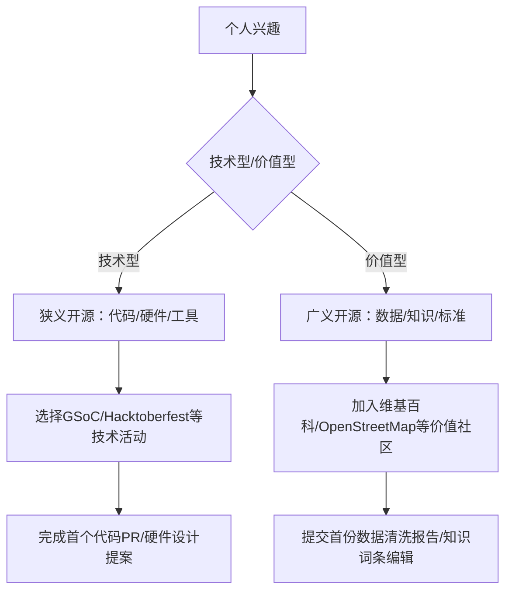
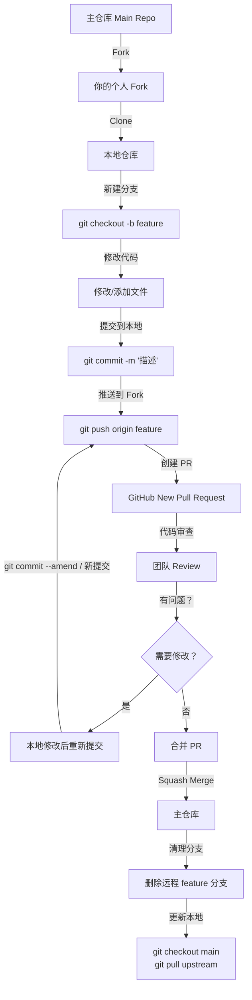
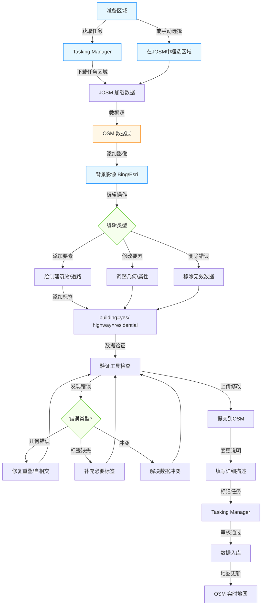

# 如何参与开源（how）

!!! note "本节概览"

    **认知升级**：明确狭义开源（软件代码开放）与广义开源（硬件、数据、教育等全领域开放）的核心差异，理解开源从技术协作到社会创新的多维价值。  
    **技能培养**：掌握狭义开源的代码贡献、文档优化等技术路径，以及广义开源的知识共享、标准制定等非技术参与方式。  
    **实践落地**：能根据个人兴趣选择适配的开源参与路径，完成至少 1 次跨维度（狭义 + 广义）的开源实践。  

## **一、参与开源——从狭义到广义**  

### **第一部分：开源认知基础**  

#### **1. 开源的双重维度解析**  

- **狭义开源**：聚焦软件领域，以 GPL/MIT 等许可证为法律基础，强调源代码开放与协作开发（如 Linux 内核开发模式）。

- **广义开源**：扩展至硬件（RISC-V 架构）、数据（OpenStreetMap 地理数据）、教育（Coursera 开放课程）等领域，核心是知识共享与标准开放。  

| **维度**       | **狭义开源**                               | **广义开源**                                       |  
|----------------|------------------------------------------|--------------------------------------------------|  
| **定义边界**   | 以技术成果开放为核心（代码、硬件设计、算法）       | 以数字世界全要素开放为核心（知识、数据、标准、教育、文化）   |  
| **核心领域**   | 软件（Linux）、硬件（RISC-V）、开发工具（Git）       | 开放数据、开放知识、开放教育、开放标准、开放科学           |  
| **参与形式**   | 代码贡献、漏洞修复、文档编写、测试用例开发           | 数据共享、知识共创、标准制定、教育资源共建、文化传播       |  
| **法律基础**   | 软件许可证（GPL/MIT/Apache）、硬件开源协议（CERN-OHL） | 知识共享协议（CC 协议）、开放数据许可（ODC）、公共版权 dedication（CC0） |  
| **典型案例**   | 参与 Linux 内核开发、贡献 Hadoop 分布式算法             | 编辑维基百科、上传 OpenStreetMap 地理数据、翻译 MOOC 课程       |  

### **第二部分：狭义开源参与路径——从代码贡献到生态共建**  

俱乐部提供[开源项目的相关信息](https://hust.openatom.club/projects/oseddl/)

#### **1. 参与全流程**  

**Step 1：项目选择策略**——**领域匹配**

参与开源项目，首先要确保项目领域与自身兴趣、专业技能相匹配。思考自己在哪个技术领域积累了较多知识，是前端开发、后端架构，还是数据科学。打个比方，如果你擅长 JavaScript 编程，对构建交互性强的用户界面充满热情，那前端框架如 Vue、React 相关的开源项目会是不错的方向。在这些项目中，你能凭借专业知识理解代码逻辑，更高效地参与到功能改进、bug 修复等工作里。  

**Step 2：贡献类型与技巧**  

**代码贡献**：  

- 流程：Fork 项目→创建 Issue→提交 PR→参与 Code Review→合并（参考 Kubernetes 贡献指南）。  
- 技巧：从"小修小补"开始（如修复文档错别字）。  

**测试与 QA**：使用 [Jenkins](https://www.jenkins.io/) 进行持续集成测试，为 [Apache Kafka](https://kafka.apache.org/) 编写故障模拟测试用例。  

**Step 3：社区协作规范**  

- **PR 规范**：按照社区指定贡献指南书写 Pull Request 格式。  

- **Code Review 文化**：秉持开放态度接纳建设性批评，以理性思辨精神对反馈意见加以考量。  

- **决策机制**：理解多数社区采用的 Meritocracy（能者决策），如 Docker 项目技术委员会由核心贡献者选举产生。  

#### **2. 技术社区与平台**  

**参与大型开源平台**  

- **Google Summer of Code（GSoC）**：面向学生的长周期开源项目实习，2025 年支持 800+ 项目（如 Kubernetes 网络模块开发）。  
- **Hacktoberfest**：每年 10 月全球大型规模开源贡献活动，2024 年的 Hacktoberfest 吸引了超过 500 万开发者。  

**关注垂直领域技术社区**  

- **Rust 社区**：通过 Rust Playground 提交语言特性改进建议，参与编译器优化（如修复 Async/Await 语法漏洞）。  

- **AI 开源社区**：在 Hugging Face 提交模型微调方案，如为 Stable Diffusion 优化图像生成算法。  

#### **3. 企业级开源计划**  

**科技巨头开源生态**  

- **微软 OSS 奖学金计划**：为贡献 Azure 开源工具（如 Terraform Provider）的学生提供认证补贴与实习绿色通道。  

- **华为开源人才培养计划**：参与 OpenHarmony 设备驱动开发，通过"鸿蒙开发者认证"可加入生态合作伙伴企业。  

- **腾讯开源联盟**：通过 TOSA（腾讯开源联盟）参与内部开源项目孵化，遵循 Apache 基金会模式进行代码贡献与社区治理。  

- **阿里开源项目**：在阿里云开发者社区（[https://developer.aliyun.com](https://developer.aliyun.com/)）提交 Serverless 应用优化方案，参与达摩院开源项目（如机器学习框架 PAI）。  

**华为开源社区矩阵**  

- **OpenHarmony 社区**：通过开放原子基金会官网（[https://www.openatom.org](https://www.openatom.org/)）注册账号，
  参与技术委员会（如 AI Model SIG），贡献代码或测试用例。截至 2023 年，该社区已有 5100 余位贡献者，覆盖医疗、交通等多个行
  业。  

- **openEuler 社区**：访问官网（[https://openeuler.org](https://openeuler.org/)）下载源代码，参与操作系统内核开发。社区提供开发者培训、认证体系，支持多处理器架构创新。  

- **openGauss 社区**：在 Gitee 平台（[https://gitee.com/opengauss](https://gitee.com/opengauss)）提交数据库优化代码，参与木兰宽松许可证（Mulan PSL v2）项目治理。  

**初创公司开源协作**  

- **Databricks Delta Lake 项目**：提交数据湖存储优化方案，参与构建湖仓一体技术标准。  

- **HashiCorp Terraform**：贡献多云基础设施编排插件，支持国产云厂商（如阿里云、腾讯云）接入。  

#### **4. 高校与科研机构开源项目**  

**学术型开源计划**  

- **清华 OpenI 启智平台**：参与 GLM 大模型训练框架优化，贡献跨模态对齐算法（需通过 OpenI 代码审核流程）。

- **MIT OpenCourseWare 贡献者计划**：将课程实验代码开源，补充 Python 数据结构可视化工具。  

#### **5. 国际组织参与路径**  

**Apache 基金会**  

- **贡献层级**：从用户（使用 Hadoop）→贡献者（提交 Patch）→提交者（获得代码提交权限）→PMC 成员（参与项目决策）→ASF Member（基金会"股东"）。  

- **现实案例**：腾讯云专家堵俊平通过 8 年持续贡献，成为 ASF Member，主导项目孵化与社区治理。  

**Linux 基金会**  

- **技术认证**：通过 LFOSSA（Linux Foundation 开源软件学园）学习 Kubernetes、云原生等课程，获取官方认证（如 CKA）。

- **峰会参与**：报名参加 GOTC 全球开源技术峰会，与国际开发者面对面交流。  

---

!!! question "思考一下：狭义开源能给我带来什么——参与 Linux 内核开发对职业发展的影响"

    **1.技术能力的深度认可**

    **数据支持**：

      - 根据 [GitHub Octoverse 2024](https://github.blog/news-insights/octoverse/octoverse-2024/#the-state-of-open-source) 报告，**贡献者的技术能力**（尤其是底层系统开发）是雇主和社区最看重的硬技能之一。Linux 内核开发涉及操作系统核心机制（如内存管理、进程调度、设备驱动），这种经验直接证明开发者具备 **系统级思维** 和 **复杂问题解决能力**。
      - 报告提到，**开源贡献者**（尤其是活跃于大型项目如 Linux 的开发者）在职业晋升中更易被识别为“技术领导者”（Technical Leader），因为其代码质量、协作能力和对社区规范的理解被视为“软硬结合”的优势。

    **职业影响**：

      - 更容易进入 **云计算、嵌入式系统、操作系统研发** 等高壁垒领域（如 Red Hat、IBM、AWS、Google 等企业）。
      - 在开源社区中，Linux 内核贡献者常被邀请担任技术顾问或架构师角色。

    **2.行业影响力的提升**

    **数据支持**：

      根据 [The Linux Foundation](https://www.linuxfoundation.org/) 的调研，**Linux 内核贡献者**的行业影响力显著高于普通开发者。例如：

      - 贡献者更容易被邀请参与 **行业标准制定**（如 POSIX 标准、Kubernetes 与 Linux 内核的集成）。
      - 报告指出，**开源社区活跃度**（如提交频率、代码审核量）与职业机会呈正相关，Linux 内核项目是开源社区中最受关注的项目之一。

    **职业影响**：

      - 成为 **技术布道者** 或 **社区领袖**，例如通过演讲、撰写技术文章（如 LWN.net、Phoronix）提升个人品牌。
      - 可能获得 **企业赞助** 或 **咨询合同**，例如为硬件厂商（如 Intel、AMD）优化驱动性能。

    **3.跨领域合作与人脉扩展**

    **数据支持**：

      - GitHub Octoverse 2024 提到，**开源协作网络**（Open Source Collaboration Network）是职业转型的关键桥梁。Linux 内核开发者通常与硬件工程师、编译器专家、安全研究员等跨领域人才合作，这种合作直接扩展了职业网络。
      - 例如，Linux 内核的 **安全模块（LSM）** 开发者常与网络安全公司（如 CrowdStrike、Palo Alto）建立联系。

    **职业影响**：

      - 更容易进入 **跨学科团队**（如 AI + 操作系统、区块链底层架构）。
      - 通过参与 **Linux 峰会（如 Kernel Summit）** 或社区活动（如 FOSDEM），与行业顶尖人物建立联系。

    **4.职业安全感与长期价值**

    **数据支持**：

      - 根据 [Stack Overflow 2024 调查](https://survey.stackoverflow.co/2024/)，**底层系统开发**（如操作系统、编译器）的岗位留存率高于其他领域。
      - Linux 内核的 **长期维护性**（LTS 版本支持 6-10 年）使其开发者具备 **抗技术淘汰能力**，即使在 AI 领域爆发的背景下，仍能保持竞争力。

    **职业影响**：
    
      - 在技术快速迭代的行业中，Linux 开发经验可作为 **职业“锚点”**，降低因技术过时导致的失业风险。
      - 更容易转型到 **安全、物联网、边缘计算** 等新兴领域（这些领域依赖 Linux 内核的定制化能力）。

    参与 Linux 内核开发不仅是技术能力的证明，更是 **职业跃迁的跳板**。它带来的行业认可、跨领域合作机会和长期职业价值，远超单一技能（如应用层开发）的局限性。结合 GitHub Octoverse 和 Linux 社区的生态趋势，这种经验将成为未来 10 年技术领域的“黄金资产”。

---

### **第三部分：广义开源参与路径——突破代码边界的创新协作**  

#### **1. 开放知识与文化传播**  

**知识共创平台**  

- **维基百科编辑**：比如可以参与"中国开源史"词条建设，补充红旗 Linux 发展历程细节（不过需要通过维基百科中立性审核）。  

- **GitBook 开源文档**：在《开源入门手册》项目中新增"广义开源价值观"章节，使用 Markdown 提交 PR。  

**文化传播行动**  

- **开源科普视频**：互联网上，了解或者模仿许多技术博主制作的优质开源科普视频。它们通过动画、案例和通俗语言，帮初学者快速理解开源的概念、发展、运作模式及重要意义，打开了了解开源世界的窗口。  

- **播客节目策划**：组织一档开源主题播客，例如“开源世界新动态与参与指南”。邀请开源专家和活跃贡献者分享经验，设置听众互动环节，解答参与开源的困惑，以音频形式传播开源知识，激发大家参与热情。  

- **校园宣讲会**：联合计算机学院举办"开源布道活动"，如邀请华为等大型企业的开源工程师分享 OpenHarmony 生态建设经验。  

#### **2. 开放数据与科学研究**  

**数据共享平台**  

- **Kaggle 数据集贡献**：清洗并上传开源数据集，标注 ODC-PDDL 协议（可商用共享）。

- **中国开放科学数据平台**：注册后上传科研数据（如气候观测数据），遵循 CC0 协议实现无版权限制共享。  

**开放科学实践**  

- **预印本平台贡献**：在 arXiv 发布机器学习论文时，同步开源训练代码与数据集（需符合 MIT 许可证）。  

- **临床试验数据开放**：参与 WHO 国际临床试验注册平台，标准化新冠药物试验数据格式。  

#### **3. 开放硬件与教育协作**  

**开放硬件项目**  

- **RISC-V 生态**：使用 KiCad 设计开源电路板，提交至玄铁 C930 处理器社区，支持 AI 边缘计算。  

- **创客空间**：参与或者组织本地创客马拉松，开发开源智能硬件（如基于 Arduino 的环境监测设备）。  

**开放教育资源**  

- **Coursera 课程翻译**：将国外课程课程字幕翻译成简体中文，发布至 GitHub 教育仓库。  

- **高校开源计划**：加入"开源软件供应链点亮计划"，参与 OSPP 开源之夏这类活动。  

#### **4. 开放标准与协议共建**  

**国际标准组织**  

- **开放原子基金会标准**：在 [AtomGit 平台](https://atomgit.com/)提交《开源软件供应链安全标准》修订建议。  

- **ISO 开源标准工作组**：申请加入 ISO/IEC JTC 1/SC 7，参与软件开源标准制定。  

**行业联盟参与**  

- **开放原子基金会标准工作组**：加入"开源许可证合规"工作组，参与制定《GB/T 44272》配套实施细则。

- **Linux 基金会边缘计算项目**：贡献 5G 边缘节点数据交互协议草案，推动物联网设备互操作标准落地。  

#### **5. 开放教育与技能共享**  

**教育资源共建**  

- **GitHub 教育仓库**：在《大学计算机基础》开源课程中补充"开源协作工具"章节，提供 Git 操作录屏教程。  

- **MOOC 课程翻译**：将 Coursera《区块链技术》课程字幕翻译成简体中文，提交至 edX 开源翻译平台。  

**技能认证体系**  

- **Linux 基金会开源领导力认证**：完成 100 小时社区运营贡献（如组织 10 场 Meetup），申请 CLF 认证。

- **华为云开源开发者认证**：通过 OpenEuler 系统调优考试，获得"开源操作系统工程师"证书。

---

!!! question "辩论一下：开放数据是否应该完全无国界共享"

    基于欧盟[《数据治理法案》（Data Governance Act）](https://eur-lex.europa.eu/legal-content/EN/TXT/PDF/?uri=COM:2020:767:FIN)的核心原则，我们有以下观点：

    !!! success "支持有限制跨境共享的论据（法案立场）"
        1. **数据主权与安全保障**  
            - 法案强调对**高度敏感数据**（如健康、公共安全数据）的出境限制（第5(11)条、第17条）。要求通过**安全处理环境**（Secure Processing Environment）访问数据（第5(4)条），防止未经授权转移。  
            - **非个人数据**出境需满足“充分性认定”（第5(9)条），确保第三国提供等效保护（如知识产权、商业秘密）。

        2. **权益保护与合规性**  
            - 公共部门数据再利用需保障**第三方权利**（个人隐私、商业秘密等），禁止无条件开放（第 3-5 条）。  
            - 数据中介机构必须**在欧盟设立主体或代表**（第 10(3) 条），接受欧盟监管，确保服务中立性（第 11(1) 条）。

        3. **国际协作需法律框架** 
            - 第三国强制获取欧盟数据需基于**司法互助条约**（如 MLA）（第 30(2) 条），避免法律冲突。  
            - 若无条约，需满足**比例原则**和**司法审查**（第 30(3) 条），例如数据最小化、目的特定性。

    !!! info "支持无国界共享的潜在理由"
        1. **科研与创新效益**  
            - 法案鼓励**数据利他主义**（第 15-22 条），允许为科研、公共福利跨境共享数据（如气候研究、医疗创新）。  
            - **欧洲数据空间**（如健康、交通）旨在打破壁垒（序言第 11 条），但需符合统一标准。

        2. **经济效率与规模效应**  
            - 单一数据市场可降低企业跨境协作成本（序言第 4 条），尤其助力中小企业（第 6(4) 条减免费用）。  
            - **FAIR 原则**（可发现、可访问、可互操作、可重用）被提倡（第 2 页），隐含开放导向。

        3. **技术中立性争议**  
            - 法案豁免**特定中介**（如物联网平台、广播机构，第 18 条），但未彻底否定跨境技术协作。

    **关键平衡点：法案的“有条件开放”框架**

    1. **分级治理机制**  

       | **数据类型**       | 出境条件                                                                 |
        |--------------------|--------------------------------------------------------------------------|
        | 一般公共数据       | 允许再利用，但需匿名化/安全环境处理（第 5(3)-(5) 条）                         |
       | 高度敏感数据       | 需欧盟授权法案附加条件（如健康数据限制出境，第 5(11) 条）                     |
       | 数据利他主义       | 跨境共享需透明同意（第 22 条欧洲统一同意书）                                |

    2. **中介机构的桥梁作用**  
        - 数据中介（Data Sharing Services）必须**技术中立**（第 11(1) 条），促进跨境交换，但禁止滥用数据。  
        - **认证机制**（如“欧盟认可的数据利他组织”）提升可信度（第 15 条），间接支持合规跨境流动。

    3. **主权与合作的折衷**  
        - 禁止**排他性协议**（第 4 条），但允许成员国因公共利益有限豁免（如 3 年独家授权）。  
        - 建立**欧洲数据创新委员会**（第 26-27 条），协调跨境标准，减少碎片化。
    
    **总结**：开放数据的无国界共享与主权保护的矛盾，本质上是**效率与公平、全球化与本土化**的博弈。法案本身作为两种思想的妥协产物，通过规则、技术和国际合作，构建“有限开放”的数据治理生态。这也是未来大方向的趋势。

---

### **跨维度参与策略：从兴趣到行动的匹配模型**  

### 工具实操对比

狭义：比如使用 Git 提交代码 PR（GitHub 流程）：

---

广义：比如使用 JOSM 编辑地图数据（OpenStreetMap 贡献流程）：

---

## **二、拓展任务**  

### **1. 实践类任务**  

**开源贡献打卡**：在一段时间内完成至少 3 次不同类型的贡献（如 1 次代码 PR、1 次文档翻译、1 次 Issue 分类）。  

**项目分析报告**：选择一个目标项目，撰写《参与可行性分析报告》，包含：  

- 技术栈匹配度  

- 社区活跃时间分布  
  
- 潜在贡献点挖掘（如文档缺口、高频 Issue 类型）  

**社区对接会**：

1. 开源社区技术成员线上分享参与路径。  

2. 学生分组选择感兴趣的开源项目制定 3 个月参与计划。  

3. 教师协调社区导师提供指导，跟踪学生贡献进度。  

### **2. 生态调研与路径规划**  

**调研报告**  

- 分析开放原子基金会与 W3C 的治理模式差异（决策机制/参与门槛/成果转化）。  

- 对比 GitHub Sponsors（狭义打赏）与 Patreon（广义知识付费）的用户付费动机。

!!! question "企业使用开源代码需要对社区做贡献吗——辩证分析商业与开源的共生关系"  

    - **正方**：企业使用开源软件必须回馈社区（如阿里开源 Dubbo 框架）。  

    - **反方**：企业付费使用即履行责任，无需代码贡献。  

## **三、进阶思考**  

1. **价值转化难题**：如何量化广义开源参与的社会价值（如维基百科编辑时长 vs 代码贡献行数）？  

2. **全球治理参与**：面对许可证碎片化问题，中国开发者如何在 ISO 开源标准制定中发挥更大影响力？  

3. **文化适配性**：对于非计算机领域的外行人，如何让他们理解个人贡献透明的狭义开源模式？反之，如何让只钻研技术型的人才认识到广义开源的非功利价值？
