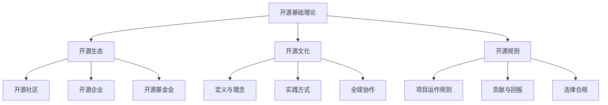
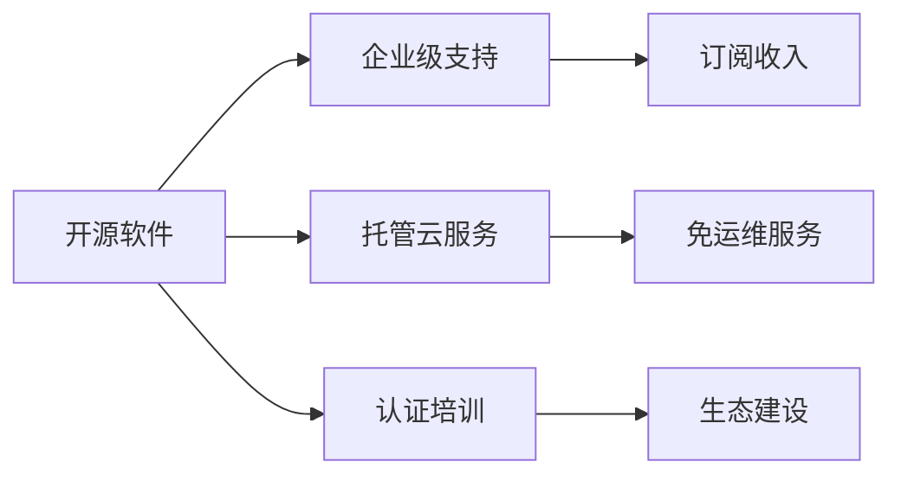
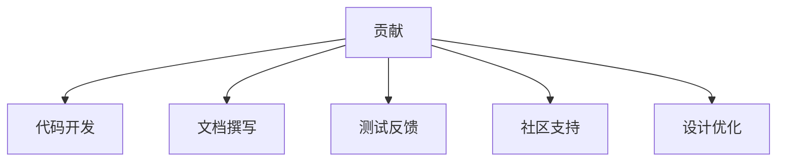

# 开源基础理论导览

!!! note "主要作者"
    [@Dreadful-Me](github.com/Dreadful-Me)

## 🚀 开启开源世界之旅

本章将带您深入探索开源的核心生态系统与文化基因，通过生动的案例和互动实践，理解开源世界的运作规则。

## 📚 核心知识图谱



## 🌍 特色学习路径

### 一、名词解释

#### 1、开源生态

##### ①开源社区

核心精神：开放 · 协作 · 共享 · 透明 · 自由

经典案例：Linux 社区 · Firefox 社区

##### ②开源企业

商业化模式：



标杆案例：Red Hat

##### ③开源基金会

核心职能

全球标杆：Linux 基金会 · ASF · CNCF

#### 2、开源协议

各协议类型比较

### 二、开源文化

#### 1、定义与理念

多维内涵：知识共享 · 透明实践 · 精英治理

四大自由：运行自由 · 研究自由 · 传播自由 · 改进自由

#### 2、开源文化的实践

!!! example "GitHub 协作流程标准化"
    ```mermaid
      sequenceDiagram
    autonumber
    贡献者 ->>+ 维护者: 提交Issue
    维护者 -->>- 贡献者: 标记为good-first-issue
    贡献者 ->> 仓库: 创建PR (关联Issue)
    维护者 ->> CI系统: /build
    CI系统 -->> 维护者: ✅ 测试通过
    维护者 ->> 仓库: /merge squash
    ```

渐进式参与路径：
初级贡献：文档改进/社区支持/测试参与
核心贡献：功能开发/安全审计/架构优化

#### 3、开源的全球性

跨域协作特征：时区接力 · 法律框架

全球协作典范：OpenStreetMap · Wikipedia

### 三、开源世界规则

#### 1、开源项目的运作规则

治理模式进化：仁慈独裁者 · 精英治理 · 共识驱动 · 社区驱动

标杆案例：Apache 之道 · Kubernetes 治理

#### 2、贡献与回报

多元价值回报：技术成长 · 职业机遇 · 社区认同



#### 3、开源项目的法律与合规

许可证合规关键：GPL 项目衍生作品必须开源 · MIT 项目需保留版权声明

专利防御机制：Apache 2.0 内置专利授权条款 · 防御性专利联盟抵御"专利流氓"

案例与思考
