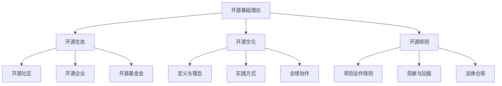

# 开源基础理论导览

!!! note "主要作者"
    [@Dreadful-Me](github.com/Dreadful-Me)

## 🚀 开启开源世界之旅
本章将带您深入探索开源的核心生态系统与文化基因，通过生动的案例和互动实践，理解开源世界的运作规则。

## 📚 核心知识图谱


## 🌍 特色学习路径

### 1. 生态探秘

!!! example "Linux 社区发展史"
    - **社区驱动力量解析**  
      从 1991 年 Linus Torvalds 发布首个 Linux 内核开始，社区协作如何推动操作系统革命
    - **协作模式演变过程**  
      邮件列表→版本控制→CI/CD→自动化治理的进化路径

!!! tip "Red Hat商业化启示"
    ```mermaid 
    graph LR 
      A[开源软件] --> B[企业级支持]
      A --> C[云服务集成]
      A --> D[认证培训]
      B --> E[订阅收入]
      C --> F[混合云解决方案]
      D --> G[生态建设]
    ```

### 2. 文化解码

!!! note "自由软件运动起源"
    **Richard Stallman 与 GNU 理念**  
    - 1983 年发起 GNU 计划  
    - "自由软件"四大自由原则  
    - Copyleft 许可模式创新  

!!! example "GitHub协作流程标准化"
    ```mermaid 
      sequenceDiagram
    autonumber
    贡献者 ->>+ 维护者: 提交Issue
    维护者 -->>- 贡献者: 标记为good-first-issue
    贡献者 ->> 仓库: 创建PR (关联Issue)
    维护者 ->> CI系统: /build
    CI系统 -->> 维护者: ✅ 测试通过
    维护者 ->> 仓库: /merge squash
    ```

### 3. 规则掌握

!!! warning "许可证合规关键点"
    | 许可证类型 | 核心要求 | 典型案例 |
    |-----------|---------|----------|
    | GPL系列 | 衍生作品必须开源 | Linux内核 |
    | Apache 2.0 | 保留版权声明 | Android, Kubernetes |
    | MIT/BSD | 仅需署名 | React, .NET Core |

!!! question "Kubernetes 采用民主决策优势之处"
    ```mermaid
    pie
      title 决策机制优势
      "避免厂商锁定": 35
      "加速生态采纳": 30
      "分散维护压力": 20
      "促进创新": 15
    ```

🔗 相关资源
Linux 基金会官网 https://www.linuxfoundation.org/
开源之道《Understanding Open Source》