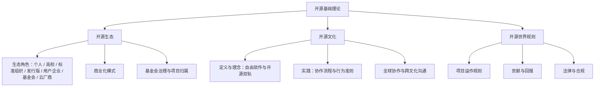

# 开源基础理论导览

!!! note "主要作者"
    [@Dreadful-Me](https://github.com/Dreadful-Me)

## 本章定位

本章回答三个问题：开源生态由哪些角色构成、开源文化如何形成并约束协作、开源世界的规则（治理、贡献回报、法律合规）如何运转。它是第 2 次课到第 4 次课的概念基础，也为第 5 次课之后的动手实践提供判断依据。

本章不要求记住宣传口号，而要求你能对任意一个真实项目回答：它由谁维护、按什么许可证发布、我可以通过什么渠道参与。

## 本章与 8 次课的对应

| 课次 | 课堂主题 | 本章对应小节 | 当次成果 |
|------|---------|-------------|---------|
| 第 2 次课 | 历史与生态：GNU、Linux、OSI；社区、企业、基金会与商业模式 | [开源生态](sec1/1-open_source_ecosystem.md)：社区、企业、基金会、[生态角色全景](sec1/1-open_source_ecosystem.md#生态角色全景)与[中国的开源基金会与生态](sec1/1-open_source_ecosystem.md#中国的开源基金会与生态) | 项目生态角色分析 |
| 第 3 次课 | 许可证与合规：版权、专利、常见许可证及选择 | [开源许可证详解](sec1/2-open_source_licenses.md)、[名词与生态导览](sec1/terminology.md)、[开源项目的法律与合规](sec3/3-legal-and-compliance.md) | 许可证判断练习 |
| 第 4 次课 | 社区文化与治理：社区角色、行为准则、治理方式、沟通与 Issue | [开源文化](sec2/culture.md)、[开源项目的运作规则](sec3/1-project-operations.md)、[开源世界规则导览](sec3/rules.md) | 贡献选题与实施提案 |

第 1 次课的项目画像与第 5—8 次课的实践环节会反复用到本章的判断框架，具体要求见[真实贡献项目](../course/project.md)：项目画像需要看许可证、治理与维护状态，贡献复盘需要理解回报机制与社区健康度。

## 建议学习路径与课时切分

**按课次推进（推荐）**

1. 第 2 次课前：读[开源生态系统](sec1/1-open_source_ecosystem.md)与[名词与生态导览](sec1/terminology.md)，完成一个项目的生态角色分析。
2. 第 3 次课前：读[开源许可证详解](sec1/2-open_source_licenses.md)与[开源项目的法律与合规](sec3/3-legal-and-compliance.md)，对自选项目做一次许可证判断。
3. 第 4 次课前：读[开源文化](sec2/culture.md)、[开源项目的运作规则](sec3/1-project-operations.md)与[开源世界规则导览](sec3/rules.md)，整理项目入口档案并写出提案。

**课时切分建议**

| 课时 | 建议内容 | 课上活动 | 课后产出 |
|------|---------|---------|---------|
| 90 分钟 | 生态角色与基金会治理 | 分组分析一个真实项目的角色地图 | 项目生态角色分析表 |
| 90 分钟 | 许可证类型与义务 | 对照 `LICENSE` 判断义务与兼容性 | 许可证判断练习 |
| 90 分钟 | 文化与行为准则 | 阅读行为准则与贡献指南，模拟一次提问 | 项目入口档案与提案草稿 |

## 核心知识图谱

```mermaid
graph TD
    A[开源基础理论] --> B[开源生态]
    A --> C[开源文化]
    A --> D[开源世界规则]
    B --> B1["生态角色：个人 / 高校 / 标准组织 / 发行版 / 用户企业 / 基金会 / 云厂商"]
    B --> B2[商业化模式]
    B --> B3[基金会治理与项目归属]
    C --> C1["定义与理念：自由软件与开源双轨"]
    C --> C2["实践：协作流程与行为准则"]
    C --> C3[全球协作与跨文化沟通]
    D --> D1[项目运作规则]
    D --> D2[贡献与回报]
    D --> D3[法律与合规]
```

## 各小节导览

| 小节 | 一句话摘要 | 阅读时长 |
|------|-----------|---------|
| [名词与生态导览](sec1/terminology.md) | 全章核心术语表、常见误解与自测题，建议边学边查。 | 15 分钟 |
| [开源生态系统](sec1/1-open_source_ecosystem.md) | 社区、企业与基金会的运作方式，以及生态角色分析工作表和许可证变更与社区分叉。 | 40 分钟 |
| [开源许可证详解](sec1/2-open_source_licenses.md) | 各协议类型比较、主要义务与许可证选择方法。 | 30 分钟 |
| [开源文化](sec2/culture.md) | 自由软件运动、协作实践、行为准则怎么读、沟通礼仪与社区健康度。 | 40 分钟 |
| [开源世界规则导览](sec3/rules.md) | 第三节的入口：项目入口档案、沟通前检查清单与提案写作。 | 10 分钟 |
| [开源项目的运作规则](sec3/1-project-operations.md) | 谁说了算、核心角色与透明的决策机制。 | 35 分钟 |
| [贡献与回报](sec3/2-contributions-rewards.md) | 六类回报、项目是否值得投入的判断方法、回报的现实面与学生参与渠道。 | 30 分钟 |
| [开源项目的法律与合规](sec3/3-legal-and-compliance.md) | 许可证合规、版权与专利、合规流程与常见风险。 | 30 分钟 |

!!! tip "导览使用建议"
    本章内容较多，不必按顺序通读。按课次推进时先读对应小节；遇到不熟悉的术语，回到[核心术语表](sec1/terminology.md#核心术语表)查询；准备选题时，直接使用[如何分析一个项目的生态角色](sec1/1-open_source_ecosystem.md#如何分析一个项目的生态角色)与[项目入口档案](sec3/rules.md#项目入口档案)两张工作表，把结论写进你的贡献提案。
