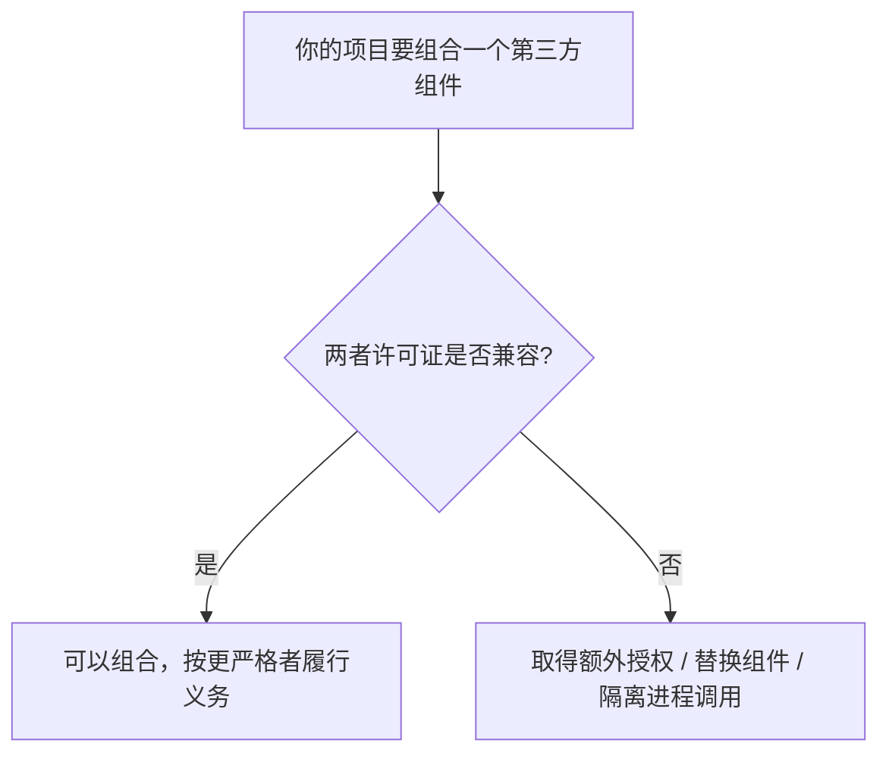
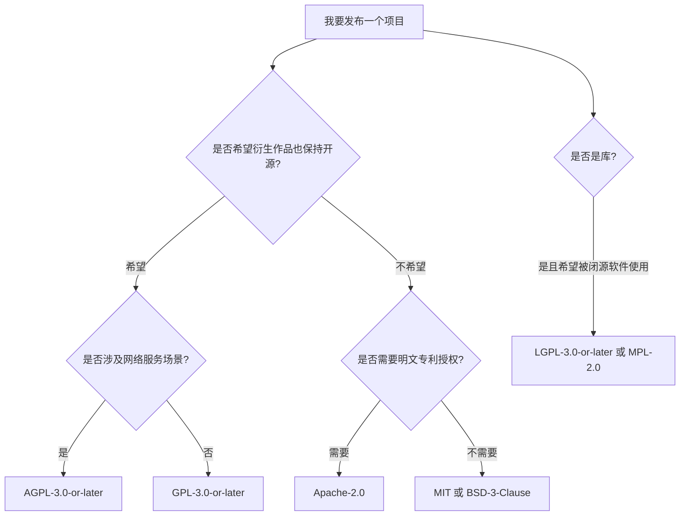

# 开源许可证

!!! note "主要作者"
    [@Dreadful-Me](https://github.com/Dreadful-Me)

!!! warning "本章内容与时效"

    开源许可证的具体条款以 [OSI 批准列表](https://opensource.org/licenses)、[SPDX License List](https://spdx.org/licenses/) 与各许可证原文为准。本节说明的是通用规则，**实际项目中以目标仓库 `LICENSE` 文件与 `CONTRIBUTING` 的要求为最终依据**。

## 学习目标

完成本节后，你应当能够：

1. 说明为什么"代码公开可见"不等于"开源"，并解释许可证在其中的作用；
2. 区分宽松型（permissive）、弱 copyleft、强 copyleft 与 source-available 四类许可证；
3. 针对"使用 / 修改 / 分发 / 提供网络服务"四类行为，判断某一许可证是否触发义务、触发哪些义务；
4. 使用 SPDX 标识符准确描述一个项目的许可证；
5. 判断常见的许可证组合是否兼容，并说出理由。

## 一、为什么必须有许可证

软件一旦被创作完成，作者就自动享有版权。**没有许可证的仓库并不等于"可以随便用"，而是默认"保留所有权利"**：他人没有合法权利复制、修改或分发它。GitHub 上未选择许可证的公开仓库就属于这种情况。

因此开源许可证的作用不是"放弃版权"，而是**在版权框架下授予他人特定权利，并附加相应条件**。它同时回答三个问题：

- 你可以做什么（使用、修改、分发、商用）；
- 你必须做什么（保留声明、提供源码、标注修改）；
- 你不能做什么（移除声明、以特定方式闭源分发、使用商标）。

!!! note "开源的定义"

    一个许可证是否"开源"，通常以[开源定义（OSD）](https://opensource.org/osd)的十条标准衡量，并由 OSI 维护批准列表。**源代码可以查看（source-available）不等于通过 OSD**——这是后文 SSPL、BUSL、Elastic License 等许可证的关键区别。

## 二、义务何时触发：四类行为

同一个许可证，在不同使用方式下的义务完全不同。判断合规问题的第一步不是"这是什么许可证"，而是"**我做了哪一类行为**"。

| 行为 | 典型场景 | 通常是否触发义务 |
|------|----------|------------------|
| **使用** | 内部部署、自己运行、学习研究 | 一般不触发（无分发）。仍需遵守许可证对使用方式的限制 |
| **修改** | 打补丁、二次开发、内部改造 | 仅在**分发**修改后的版本时触发 copyleft 的源码义务 |
| **分发** | 发布产品、交付客户、上传二进制、随硬件出货 | **触发全部义务**：许可证与版权声明、NOTICE、提供对应源码等 |
| **提供网络服务** | 把修改后的软件做成 SaaS 供他人使用 | 多数许可证不触发；**AGPL 第 13 条**会触发源码提供义务；SSPL 等 source-available 许可证也会 |

!!! tip "记住这条判断顺序"

    先问"我有没有把软件交给别人"（分发），再问"我有没有改过它"（修改），最后才问"这是什么许可证"。顺序颠倒会让你把大量不需要处理的情况当成合规问题。

## 三、许可证家族全景

按 copyleft（著佐权，俗称"传染性"）强度划分，开源许可证可分为三大族；此外还有不属于开源的 source-available 一族，以及面向内容、数据、硬件与 AI 模型的专门许可证。

### 3.1 宽松型（permissive）

对被许可方最友好，允许把代码用于闭源商业产品。

| 许可证（SPDX 标识符） | 核心义务 | 专利条款 | 典型项目 |
|----------------------|----------|----------|----------|
| `MIT` | 保留版权声明与许可证文本 | 无明文条款 | React、Rails、Node.js |
| `ISC` | 同 MIT，措辞更简 | 无明文条款 | OpenBSD 部分组件 |
| `BSD-2-Clause` | 保留版权声明与免责声明 | 无明文条款 | Nginx、部分 BSD 工具 |
| `BSD-3-Clause` | 增加"不得用作者名义背书"条款 | 无明文条款 | Go |
| `Apache-2.0` | 保留声明与 `NOTICE`、标注修改、附许可证 | **明文专利授权 + 专利报复终止**；不授予商标权 | Android、Kubernetes、Kafka |

!!! warning "Apache-2.0 不是 copyleft"

    常见错误是把 Apache-2.0 说成"弱传染"。它**没有任何传染性**：你可以把 Apache-2.0 代码集成进闭源产品。真正需要记住的是它的三件事——专利授权、专利报复终止、`NOTICE` 文件。

### 3.2 弱 copyleft

copyleft 的效力范围被限定在文件的边界或库的边界内。

| 许可证 | 效力范围 | 主要义务 | 典型项目 |
|--------|----------|----------|----------|
| `MPL-2.0` | **文件级** | 分发可执行形式时，须提供**全部 Covered Software**（所有 MPL 覆盖的文件，含未修改的）的 Source Code Form；copyleft 不扩散到 Larger Work 中不属于 Covered Software 的独立文件 | Firefox、Thunderbird |
| `LGPL-2.1` / `LGPL-3.0`（各有 `-only` 与 `-or-later` 两种写法） | **库级** | 动态链接通常可用于闭源程序；须允许用户替换库版本（可重链接） | glibc、部分 Qt |
| `EPL-2.0` | 模块级 | 修改过的贡献须以 EPL 提供；含专利授权 | Eclipse 项目 |
| `CDDL-1.0` | 文件级 | 修改过的文件须以 CDDL 提供 | OpenZFS |

!!! tip "LGPL 的实践要点"

    LGPL 允许闭源软件调用该库，但必须满足"用户能够替换库版本"这一条件。静态链接 LGPL 库需要额外提供目标文件以便重新链接，因此工程上通常优先选择动态链接。

### 3.3 强 copyleft

一旦分发，整个衍生作品都必须在同一许可证下提供源码。

| 许可证 | 特点 | 典型项目 |
|--------|------|----------|
| `GPL-2.0-only` | 无明文专利条款（FSF 主张含隐含许可）；与 `Apache-2.0` 不兼容 | Linux 内核、Git |
| `GPL-2.0-or-later` | 允许按后续版本使用 | VLC、部分 GNU 工具 |
| `GPL-3.0-only` / `GPL-3.0-or-later` | 明文专利授权、反 Tivoization、终止与补救条款；与 `Apache-2.0` 兼容 | Bash、GIMP |
| `AGPL-3.0-only` / `AGPL-3.0-or-later` | 在 GPLv3 基础上增加**第 13 条网络交互条款** | Nextcloud（`AGPL-3.0-or-later`）、Grafana（历史版本） |

!!! tip "`only` 与 `or-later` 必须逐个项目确认"

    同一系列的不同项目可能采用不同写法：Linux 内核与 Git 都是 `GPL-2.0-only`，而 VLC 是
    `GPL-2.0-or-later`；Nextcloud 声明的是 `AGPL-3.0-or-later`。上表的"典型项目"只用于帮助记忆，
    **实际判断请打开该项目的 `LICENSE` / `COPYING` 或源码文件头的 SPDX 标识符**。

!!! danger "Linux 内核停留在 GPLv2"

    一个流传很广的错误说法是"Linux 内核后来升级到了 GPLv3"。实际上内核自 1992 年 0.12 版起使用 GPLv2，并**明确停留在 GPLv2**，没有采用"or later"。因此内核代码与 Apache-2.0 代码在默认情况下是**不兼容**的。

### 3.4 source-available：可以使用源码，但不是开源

这类许可证公开源代码，却附加了 OSD 不允许的限制，因此**不被 OSI 认可为开源许可证**。理解它们的意义在于：大量知名项目近年的许可证变更正是围绕它们展开。

| 许可证 | 限制要点 | 常见动机 |
|--------|----------|----------|
| `SSPL-1.0` | 基于 AGPLv3 改写第 13 条：若把软件作为服务提供，须公开**整个服务栈**的源码 | 阻止云厂商"只提供服务、不回馈代码" |
| `BUSL-1.1` | 授予有限的生产使用许可，通常约定在数年后的特定日期自动转为开源许可证 | 保护商业版本，同时承诺最终开放 |
| `Elastic License 2.0` | 禁止把软件作为托管服务提供给第三方，禁止绕过许可密钥功能 | 阻止托管服务竞争 |

!!! example "许可证变更与社区分叉"

    这是当前开源生态最有教学价值的一条主线：

    1. **HashiCorp** 2023 年把 Terraform 等从 `MPL-2.0` 改为 `BUSL-1.1`，社区随即分叉出 **OpenTofu**，并捐给 Linux 基金会；
    2. **Redis** 从 `BSD-3-Clause` 改为 `RSALv2`/`SSPLv1`，Linux 基金会主导的分叉 **Valkey** 出现；Redis 8 又回归 `AGPLv3`；
    3. **Elastic** 2021 年从 `Apache-2.0` 改为 `SSPL`/`ELv2`，2024 年重新以 `AGPLv3` 授权（同时保留 `ELv2`/`SSPL` 选项）；
    4. **MongoDB** 2018 年从 `AGPLv3` 改为 `SSPL`。

    **结论**：许可证不只决定法律义务，也塑造社区结构与商业关系。看到一个项目时，先确认它**当前**的许可证，而不是记忆中的旧版本。

### 3.5 内容、数据与硬件许可证

| 领域 | 常用许可证 | 说明 |
|------|-----------|------|
| 文档与素材 | `CC-BY-4.0`、`CC-BY-SA-4.0`、`CC0-1.0` | **不建议用于软件**：CC 许可证没有区分源代码与目标代码，也没有专利授权 |
| 数据库 | `ODbL-1.0` | 要求衍生数据库以同样许可证开放（OpenStreetMap） |
| 开源硬件 | `CERN-OHL-S`、`CERN-OHL-W`、`CERN-OHL-P` | 分别对应强互惠、弱互惠、宽松 |

### 3.6 AI 模型许可证

模型权重与训练数据带来了新的许可问题。目前需要知道三类情况：

- **通过 OSD 的许可证**：部分模型以 `Apache-2.0` 或 `MIT` 发布，属于真正的开源；
- **自定义社区许可证**：如 Llama Community License，含可接受使用政策与用户规模门槛（如月活超过特定量级需另行授权），**不属于 OSI 批准的开源许可证**；
- **带使用限制的 RAIL 类许可证**：对用途作出限制，同样不符合 OSD 的"不得歧视领域"要求。

!!! note "OSAID：开源 AI 定义"

    OSI 于 2024 年 10 月发布 **Open Source AI Definition (OSAID) 1.0**，要求在"数据信息、代码、参数"三方面提供修改的**首选形式**，才可称为开源 AI。判断一个"开源大模型"是否真的开源，应以该定义与许可证原文为准，而不是看宣传语。

## 四、GPL 系列：v1 / v2 / v3 的差异

| 维度 | GPLv1（1989） | GPLv2（1991） | GPLv3（2007） |
|------|---------------|---------------|---------------|
| 核心目标 | 阻止专有衍生作品 | 明确"分发即开源"，加入"自由或死亡"式条款 | 应对 Tivoization、DRM、软件专利与许可证兼容 |
| 专利 | 无明文条款 | 无明文条款（FSF 主张隐含许可） | **第 11 条明文专利授权 + 专利报复终止** |
| 硬件锁定 | 未涉及 | 未涉及 | **反 Tivoization**：须提供"安装信息"，允许用户安装修改版 |
| 与 `Apache-2.0` 兼容 | 否 | **否**（`GPL-2.0-only`） | **是** |
| 终止条款 | 自动终止 | 违反即终止 | 增加**补救期**（首次违规可在 30 日内纠正） |
| 与 `GPL-2.0-only` 兼容 | — | — | 否（v2-only 与 v3 互不兼容） |

!!! question "为什么内核不升级到 GPLv3？"

    想一想：反 Tivoization 条款要求设备厂商允许用户安装修改后的固件，这与部分硬件厂商的产品策略直接冲突。当你在真实项目里看到"`GPL-2.0-only`"这个标识时，它意味着**这个项目主动放弃了 v3 提供的专利保护，以换取更广泛的采用**。

## 五、兼容性与组合

把不同许可证的代码组合在一起时，可能出现**义务冲突**——即无法同时满足两者的要求。此时唯一的合法做法是取得额外授权或替换组件。



常见组合的判断（**以各许可证原文与 SPDX 兼容性说明为准**）：

下表统一使用完整 SPDX 标识符。写成 `GPL-2.0`、`GPL-3.0` 而不带后缀是**不严谨**的：`only` 与 `or-later` 会直接改变结论。

| 组合 | 是否兼容 | 原因 |
|------|----------|------|
| `Apache-2.0` + `GPL-3.0-only` / `GPL-3.0-or-later` | ✅ 兼容 | GPLv3 第 11 条的专利条款与 Apache-2.0 不冲突，组合作品可按 GPLv3 分发 |
| `Apache-2.0` + `GPL-2.0-only` | ❌ 不兼容 | Apache-2.0 的专利与免责要求附加了 GPLv2 不允许的条件 |
| `GPL-2.0-only` + `GPL-3.0-only` / `GPL-3.0-or-later` | ❌ 不兼容 | `GPL-2.0-only` 不允许按后续版本使用 |
| `MPL-2.0` + `GPL-2.0-only` / `GPL-2.0-or-later` 等次级许可证 | ✅ **有条件**兼容 | §1.12 把次级许可证定义为 GPL 2.0、LGPL 2.1、AGPL 3.0 **以及这些许可证的后续版本**；§3.3 允许在与次级许可证作品组合的 Larger Work 中，额外按该次级许可证分发 MPL 覆盖的代码。**前提是 Covered Software 不属于 §1.5 定义的 `Incompatible With Secondary Licenses`**，须检查声明与原始授权历史（见下方）。`only` 后缀限制的是被许可人自行升级版本，并不把该版本排除出次级许可证列表 |
| `MIT` / `BSD-3-Clause` + 任意 copyleft | ✅ 兼容 | 宽松许可证不附加冲突条件，组合作品按 copyleft 履行义务 |
| `GPL-3.0-only` / `GPL-3.0-or-later` + `AGPL-3.0-only` / `AGPL-3.0-or-later` | ⚠️ 单向 | GPLv3 第 13 条允许与 AGPLv3 组合；反向（AGPL 代码并入 GPLv3-only 作品）不成立 |
| `SSPL-1.0` / `BUSL-1.1` / `Elastic-2.0` + 任何开源许可证 | ❌ 不可视为开源组合 | 它们不是开源许可证，组合后整体不再是开源作品 |

!!! warning "MPL 次级许可证机制需要检查两种不兼容情形"

    [MPL-2.0 原文 §1.5](https://www.mozilla.org/en-US/MPL/2.0/)（亦见 [SPDX 全文](https://spdx.org/licenses/MPL-2.0.html)）规定，符合下列任一情形的 Covered Software 都属于 `Incompatible With Secondary Licenses`：

    - 初始贡献者附上了 Exhibit B 的不兼容声明；
    - 代码原先按 MPL 1.1 或更早版本提供，且没有同时按次级许可证提供。

    因此，不能只凭文件头没有 Exhibit B 声明就判定兼容，还须核查相关代码的原始授权历史。只有排除上述两种情形，才能在满足 §3.3 的组合条件时使用次级许可证机制。

!!! warning "链接不等于组合"

    判断的关键是**是否构成同一衍生作品**。通常：

    - 静态链接、直接复制代码、修改同一文件 → 很可能构成衍生作品；
    - 通过**进程边界**调用（独立进程 + 命令行 / RPC / HTTP 接口）、通过插件接口动态加载 → 争议较大，需按项目官方解释与法律意见判断。

    不要用"我们把它拆成两个进程"当作绕过 GPL 的通用技巧——这需要真实的架构隔离与法律评估，而不是形式上的拆包。

## 六、常见误判

| 误解 | 事实 |
|------|------|
| "公开源码就是开源" | 需要符合 OSD 的许可证；source-available 不是开源 |
| "开源就是免费" | 开源是权利许可，不等于零价格；商业支持、托管服务可以收费 |
| "没有 LICENSE 文件就可以随便用" | 默认保留所有权利，使用即侵权风险 |
| "用 MIT 的代码要开源我的项目" | 不需要；只需保留声明 |
| "用了 Apache-2.0 就是 copyleft" | 不是；它没有传染性 |
| "AGPL 只要不分发就没关系" | 第 13 条的触发条件是"修改 + 用户通过网络交互"，**与分发无关，也与用户来自组织内部还是外部无关** |
| "GPL 一律不能商用" | 可以商用；限制的是闭源分发，不是收费 |
| "改一改、换个名字就没问题" | 修改必须标注，移除版权声明违反几乎所有许可证 |
| "MIT 和 GPL 代码放一起没事" | 需判断是否构成同一衍生作品与兼容性 |
| "开源许可证覆盖专利和商标" | 商标通常明确不授予；专利条款因许可证而异 |

## 七、如何为新项目选择许可证



!!! warning "图中的 `*-or-later` 是一个需要你自己决定的选项"

    上图按惯例给出 `GPL-3.0-or-later` / `AGPL-3.0-or-later` / `LGPL-3.0-or-later`
    （FSF 推荐"or later"，便于下游把代码与新版本组合）。但 `only` 与 `or-later` **必须写清楚**：
    只写 `GPL-3.0` 属于不严谨的旧式写法，它会直接影响下游的兼容性与再许可范围。若你的项目
    不希望被他人升级到后续版本，就明确写 `GPL-3.0-only`。

选择时至少考虑四个维度：

1. **是否允许闭源商用**（宽松 vs copyleft）；
2. **是否需要专利保护**（`Apache-2.0` 与 `GPL-3.0-only` / `GPL-3.0-or-later` 提供明文授权）；
3. **生态采用成本**（与上下游项目的兼容性、企业法务的接受度）；
4. **是否只发布文档或数据**（考虑 CC 系列、`ODbL`，不要用 CC 许可软件）。

发布时的三个动作：

- 在仓库根目录放置完整许可证文本，文件名为 `LICENSE`（或 `LICENSE.txt`、`COPYING`）；
- 在包元数据与源码文件头使用 **SPDX 标识符**标注，例如：
  ```text
  SPDX-License-Identifier: Apache-2.0
  ```
- 存在第三方代码时，保留其原始声明，必要时在 `NOTICE` 中说明。

## 八、SPDX 标识符

SPDX 标识符是描述许可证的**标准短名**，用于包元数据、源码文件头与软件物料清单（SBOM）。

| 项目 | 推荐写法 | 不推荐写法 |
|------|----------|------------|
| MIT | `MIT` | `MIT License`、`mit` |
| Apache 2.0 | `Apache-2.0` | `Apache 2`、`ASL2` |
| GPLv2 | `GPL-2.0-only` 或 `GPL-2.0-or-later` | `GPLv2`（无法区分 only/or-later） |
| GPLv3 | `GPL-3.0-only` 或 `GPL-3.0-or-later` | `GPLv3` |
| LGPLv3 | `LGPL-3.0-only` 或 `LGPL-3.0-or-later` | `LGPLv3` |
| AGPLv3 | `AGPL-3.0-only` 或 `AGPL-3.0-or-later` | `AGPL` |
| MPL 2.0 | `MPL-2.0` | `MPL2` |

!!! tip "为什么必须区分 only 与 or-later"

    `GPL-2.0-only` 与 `GPL-2.0-or-later` 在法律上完全不同：后者允许使用者按 GPLv3 的条款使用代码，前者不允许。判断许可证兼容性时，这个区别经常是决定性的。

## 九、本节自测

1. 你在一款闭源商业产品中使用了 `MIT` 许可的库，需要做什么？
2. 你把一个 `Apache-2.0` 的组件与 `GPL-2.0-only` 的代码静态链接，并把产物**对外分发**，是否合法？
3. 你修改了一个 `AGPL-3.0-or-later` 项目并用它对外提供在线服务，但没有分发任何二进制文件。你是否需要提供源码？
4. 一个仓库没有 `LICENSE` 文件，你能否把它复制进自己的项目？
5. 用 SPDX 标识符写出 Linux 内核的许可证。

??? note "参考答案"

    1. 在产品中保留该库的版权声明与许可证文本。不需要开源你的产品。
    2. **不合法（对外分发时）**。`Apache-2.0` 与 `GPL-2.0-only` 不兼容，这个组合无法按现有许可证对外分发。注意区分行为：如果只是在组织内部链接并运行、不向他人分发，copyleft 的分发义务尚未触发；一旦分发（交付客户、随硬件出货、上传二进制）就无法满足两者的全部要求。
    3. **需要**。AGPLv3 第 13 条针对网络交互设定源码提供义务。
    4. **不能**。无许可证意味着保留所有权利。
    5. `GPL-2.0-only`。

---

需要动手判断真实仓库时，请进入[许可证判断练习](3-license-practice.md)。
