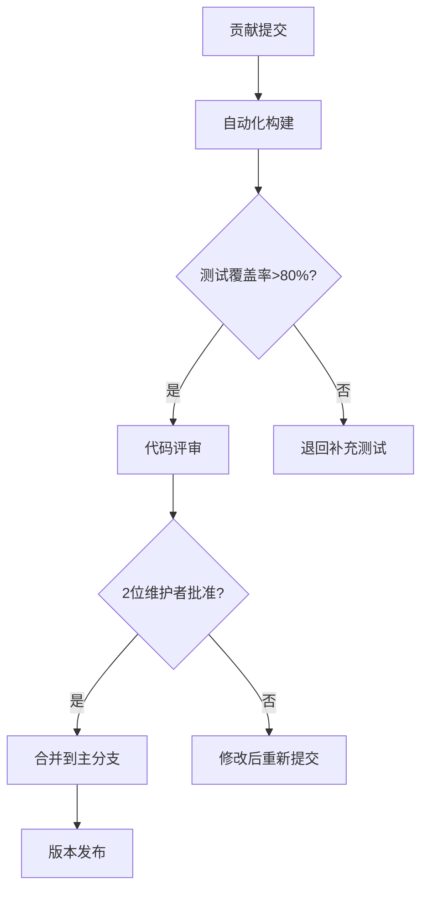

# 开源文化

!!! note "本节概览"
    开源文化不仅仅是开放源代码，更是一种全新的技术哲学和协作方式。本节将深入探讨开源文化的核心内涵与实践模式，揭示其如何通过开放共享、透明协作的价值观重塑软件开发范式。我们将了解从自由软件运动到现代开源生态的思想演变，分析全球开发者如何跨越地理与文化界限协同创新，并探索开源模式对技术创新、知识传播和社会发展的深远影响。
    本节作者：[xzss-ops](https://github.com/xzss-ops)
  
## 定义与理念

### 开源文化的多维内涵

开源文化是一种以**开放协作**为核心的技术哲学体系，其内涵远超出代码公开的范畴：

1.**知识共享范式**：

* 通过 OSI 认证的开放许可证（MIT、GPL、Apache 等）实现技术成果的合法共享  
* 建立可追溯的知识传承机制  
* 包括代码、设计文档、测试用例、问题解决方案甚至决策过程  

2.**透明化实践**：

* 项目决策过程、缺陷跟踪、技术路线图等开发全周期信息公开  
* 接受社区监督  
* 典型案例：Linux 内核开发通过 [lkml.org](https://lkml.org/) 邮件列表公开所有技术讨论  

3.**协作创新模式**：

* 基于 **Meritocracy（精英治理）** 原则  
* 通过分布式贡献网络激发集体智慧  
* 贡献者的影响力基于其贡献质量而非身份背景

4.**技术民主化**：  

* 打破商业软件的技术垄断
* 赋予用户软件控制权与二次开发自由  
* 如 Android 开源项目允许手机厂商深度定制系统  

5.**可持续生态**：  

* 通过基金会（[Apache](https://apache.org/)、[Linux](https://www.linuxfoundation.org/)、[CNCF](https://www.cncf.io/)）治理模式保障项目长期发展  
* 避免单一企业控制风险  

### 自由软件运动：开源的思想基石

**Richard Stallman 与 GNU 工程的历史性贡献**  
1983 年，MIT 人工智能实验室研究员 Richard Stallman 因打印机驱动问题无法修复，愤而发起 [GNU 计划](https://www.gnu.org/)，发表《GNU 宣言》：

> "软件的自由关乎用户控制自身计算的权利，而非价格问题。专有软件是对用户自由的剥夺"

**四大基本自由的核心主张**：  

1.**运行自由**  

*允许用户出于任何目的运行软件，包括商业用途和科研分析  

2.**研究自由**  

* 提供源代码访问权限  
*支持软件运行机制研究，这是理解软件行为的基础  

3.**传播自由**  

* 保障用户自由分发软件副本的权利  
*可免费或收费分发  

4.**改进自由**  

* 确保用户可修改源代码并发布衍生版本  
* 使社区能持续改进软件  

???+ note "自由软件与开源的辩证关系"
    1998 年 Netscape 开源 Navigator 代码后，成立[开源倡议组织（OSI）](https://opensource.org/)制定开源定义，形成当代开源文化的双轨思想体系：
  
    * 自由软件强调伦理自由（用户自由权）
    * 开源软件侧重协作效率（实用价值）
    
    该理念催生 GPLv2（1991）、GPLv3（2007）等法律框架，成为现代开源生态的基石。

---

## 开源文化的实践

### 标准化协作框架  

现代开源项目通过结构化流程保障协作效率与质量：

| 协作机制       | 功能描述                                                                 | 关键价值                          | 典型工具                     |
|----------------|--------------------------------------------------------------------------|-----------------------------------|------------------------------|
| Issues 追踪     | 记录功能需求、缺陷报告和优化建议 包含标签分类、负责人分配、里程碑追踪    | 构建需求共识 可视化项目演进路线 | GitHub Issues, Jira          |
| Pull Request   | 贡献者提交代码修改的标准流程 自动触发 CI 测试 支持代码差异对比和讨论 | 实现分布式开发 集中质量控制    | GitLab MR, Gerrit            |
| Code Review    | 强制性的同行评审（需 2+ 维护者批准） 检查代码风格、性能影响和安全漏洞   | 保障代码质量 促进知识传递      | Crucible, Phabricator        |
| CI/CD 流水线   | 自动化构建测试体系 包含单元测试、集成测试 安全扫描、制品发布         | 确保变更可靠性 降低验证成本    | Jenkins, GitHub Actions      |
| RFC 流程       | 重大变更需通过"请求评论"流程 提案需说明背景、方案设计和影响评估        | 平衡创新与稳定性 避免技术债务  | IETF RFC, Python PEP         |
| 社区治理       | 通过章程明确决策流程 模式：BDFL、委员会制、基金会治理                  | 保障项目长期稳定发展              | Apache 投票制 Linux 层级评审 |

### 实践参与路径  

**渐进式贡献模型**（以 [Apache 软件基金会](https://apache.org/)项目为例）：  

**1. 初级参与阶段**  

①**文档改进**  

* 修正 API 文档错误，补充使用示例，增加多语言翻译  
* 案例：[Kubernetes](https://kubernetes.io/) 要求新功能必须同步更新文档  

②**社区支持**  

* 在论坛解答基础问题，复现报告缺陷  
* 机制：[Python](https://www.python.org/) 社区"导师制"引导新人  

③**测试参与**  

* 编写边界测试用例，验证边缘场景兼容性  
* 工具：[JUnit](https://junit.org/) 提供标准化测试模板  

④**本地化工作**  

* 翻译 UI 界面，适配区域格式（日期/货币）  
* 成果：[Vue.js](https://vuejs.org/) 支持 35 种语言版本  

**2. 核心贡献阶段**  

①**功能开发**  

* 遵循项目编码规范（如 Linux 内核的 [checkpatch.pl](https://www.kernel.org/doc/html/v4.17/process/submitting-patches.html#checkpatch) 标准）  
* 贡献前需签署贡献者许可协议（CLA

②**架构优化**

* 提出性能改进方案并通过 RFC 流程论证  
* 案例：[Redis](https://redis.io/) 集群方案经 3 轮社区讨论

③**安全审计**

* 参与 CVE 漏洞修复，实施供应链安全检查  
* 实践：[Node.js](https://nodejs.org/) 设立专门安全工作组

④**生态扩展**

* 开发插件/驱动扩展项目功能  
* 规模：[VS Code](https://code.visualstudio.com/) 扩展市场超 4 万个插件  

???+ note "质量保障机制"
    大型项目采用分层维护者体系（如 Linux 的"子系统维护者-核心团队"结构）：  
  
    *Apache 要求重要决策需获得至少 3 个 +1 投票且无 -1 反对票  
    *   所有贡献必须符合项目行为准则（如 CNCF 的社区守则）  
    *   自动化测试覆盖率通常要求 >80%  

---

## 开源的全球性

### 跨域协作特征

开源社区构建了人类历史上规模最大的分布式协作网络：

1.**时区接力开发**  

* 欧洲提交 → 亚洲审核 → 美洲合并  
* 形成 24 小时开发周期  
* 数据：Docker 每日接收来自 15 个时区的贡献

2.**多语言协作体系**

* 代码注释英语标准化  
* 文档多语言支持（如 TensorFlow 提供 11 种语言文档）  
* 自动翻译集成（Weblate 平台）

3.**文化适应机制**  

* 贡献者公约（Contributor Covenant）禁止地域歧视  
* 建立跨文化冲突调解委员会（如 Ubuntu 社区）  
* 节日适配：避免在重要文化节日安排截止日期

4.**法律合规框架**  

* CLA（贡献者许可协议）明确知识产权归属  
* DCO（开发者原创证书）保障代码法律可追溯性  
* 出口管制自动合规检测  

5.**基础设施中立化**  

* Linux 基金会托管敏感项目  
* 规避地缘政治影响  
* 案例：RISC-V 开源指令集架构  

### 全球协作典范

**OpenStreetMap 的地理信息革命**  

1.**协作规模**  

* 全球 200+ 万 注册编辑者，覆盖所有主权国家  
* 2023 年地图更新超 10 亿次  

2.**技术架构**  

* 分层数据模型：点（Nodes）- 路径（Ways）- 关系（Relations）  
* 差分更新系统：每分钟处理数万次编辑  
* 冲突解决算法：基于时间戳和编辑者信誉的自动合并  

3.**人道应用**  

* 海地地震：72 小时完成灾区地图重建  
* 乌克兰危机：实时标记避难所和检查站  
* 新冠疫情：全球医院位置数据整合  

**Wikipedia 的多语言知识工程**  

1.**协作模型**  

* 287 个语言版本独立运营  
* 共享 MediaWiki 技术平台  
* 月均编辑量 2000+ 万

2.**质量机制**  

* 算法监测：ClueBot NG 实时检测恶意篡改（准确率 99.7%）  
* 编辑评审：新内容需经资深用户审核  
* 来源核查：关键事实需可靠参考文献  

3.**文化平衡实践**  

* 允许文化视角差异（如历史事件描述）  
* 仲裁委员会处理重大编辑争议  
* 本地化策略：法语版侧重哲学，日语版强化动漫  

### 全球协作价值与影响

1.**技术创新加速**  

* Linux 内核：每版本整合 1600+ 公司贡献，发布周期缩短至 2 个月  
* VS Code：开源后 3 年成为最流行 IDE，月活超 1400 万  
* Apache Kafka：从 LinkedIn 内部项目发展为实时数据处理标准

2.**知识扩散机制**  

* 非洲开发者通过开源贡献获得全球雇佣机会  
* 印度理工学院将开源贡献纳入学分体系  
* 拉丁美洲政府采用开源节省 90% 软件成本

3.**社会韧性价值**  

* 俄乌冲突：乌克兰政府通过 GitHub 发布 Diia 政务服务  
* 气候研究：开源气候模型被 IPCC 报告采用  
* 公共卫生：Covid 期间开源呼吸机设计全球共享

4.**经济模型创新**  

* 开源核心 + 商业服务（Red Hat 模式）  
* 开放核心 + 企业版功能（GitLab 模式）  
* 公有云托管服务（MongoDB Atlas）  

???+ note "协作范式启示"
    开源证明分布式群体智慧可产出工业级技术成果（如现今已超 4000 万行代码的 Linux 内核）。  
    联合国教科文组织 2021 年将开源列入数字公共产品清单。  
    开源协作正向生物医药（OpenLab）、硬件（RISC-V）等领域扩展，成为数字时代的新型生产范式。
