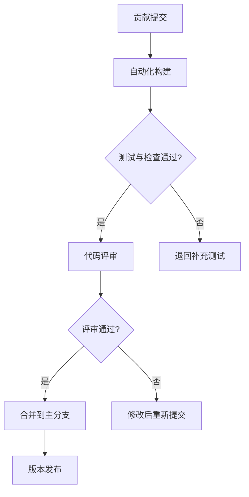

# 开源文化

!!! note "主要作者"

    [@xzss-ops](https://github.com/xzss-ops)

!!! note "本节概览"
    开源文化不仅仅是开放源代码，更是一种全新的技术哲学和协作方式。本节将深入探讨开源文化的核心内涵与实践模式，揭示其如何通过开放共享、透明协作的价值观重塑软件开发范式。我们将了解从自由软件运动到现代开源生态的思想演变，分析全球开发者如何跨越地理与文化界限协同创新，并探索开源模式对技术创新、知识传播和社会发展的深远影响。
  
## 定义与理念

### 开源文化的多维内涵

开源文化是一种以**开放协作**为核心的技术哲学体系，其内涵远超出代码公开的范畴：

1.**知识共享范式**：

* 通过 OSI 认证的开放许可证（MIT、GPL、Apache 等）实现技术成果的合法共享  
* 建立可追溯的知识传承机制  
* 包括代码、设计文档、测试用例、问题解决方案甚至决策过程  

2.**透明化实践**：

* 项目决策过程、缺陷跟踪、技术路线图等开发全周期信息公开  
* 接受社区监督  
* 典型案例：Linux 内核开发通过邮件列表公开所有技术讨论，归档可在 [lore.kernel.org](https://lore.kernel.org/) 检索  

3.**协作创新模式**：

* 基于 **Meritocracy（精英治理）** 原则  
* 通过分布式贡献网络激发集体智慧  
* 贡献者的影响力基于其贡献质量而非身份背景

4.**技术民主化**：  

* 打破商业软件的技术垄断
* 赋予用户软件控制权与二次开发自由  
* 如 Android 开源项目允许手机厂商深度定制系统  

5.**可持续生态**：  

* 通过基金会（[Apache](https://apache.org/)、[Linux](https://www.linuxfoundation.org/)、[CNCF](https://www.cncf.io/)）治理模式保障项目长期发展  
* 避免单一企业控制风险  

### 自由软件运动：开源的思想基石

**Richard Stallman 与 GNU 工程的历史性贡献**

20 世纪 80 年代初，MIT 人工智能实验室的研究员 Richard Stallman 因打印机驱动相关软件无法修复而受挫，由此开始反思专有软件对用户自由的限制。1983 年 9 月，他宣布发起 [GNU 计划](https://www.gnu.org/)，目标是开发一套完全自由的操作系统；1985 年 3 月，他发表《GNU 宣言》，系统阐述“软件应当自由”的主张，并随后创立自由软件基金会。这些主张的核心是：软件的自由关乎用户能否控制自身的计算，而不是软件的价格高低；专有软件则限制了用户的这一自由。

**四大基本自由的核心主张**：  

1.**运行自由**  

*允许用户出于任何目的运行软件，包括商业用途和科研分析  

2.**研究自由**  

* 提供源代码访问权限  
*支持软件运行机制研究，这是理解软件行为的基础  

3.**传播自由**  

* 保障用户自由分发软件副本的权利  
*可免费或收费分发  

4.**改进自由**  

* 确保用户可修改源代码并发布衍生版本  
* 使社区能持续改进软件  

???+ note "自由软件与开源的辩证关系"
    这里存在两条并行发展的线索，而不是一条因果链：

    * 自由软件运动催生了 GPLv2（1991）与 GPLv3（2007）等法律框架，为开源提供了版权许可上的基础设施；
    * 1998 年 Netscape 开源 Navigator 代码后，[开源倡议组织（OSI）](https://opensource.org/)成立并提出[开源定义](https://opensource.org/osd)，形成与“自由软件”并行的“开源”话语。

    两者共享“源代码可获得、可修改、可再分发”的实践基础，但侧重不同：自由软件强调伦理自由（用户自由权），开源侧重协作效率与商业可用性（实用价值）。这一“自由软件”与“开源”的双轨话语，共同构成现代开源生态的思想基石。

---

## 开源文化的实践

### 标准化协作框架  

现代开源项目通过结构化流程保障协作效率与质量：

| 协作机制       | 功能描述                                                                 | 关键价值                          | 典型工具                     |
|----------------|--------------------------------------------------------------------------|-----------------------------------|------------------------------|
| Issues 追踪     | 记录功能需求、缺陷报告和优化建议 包含标签分类、负责人分配、里程碑追踪    | 构建需求共识 可视化项目演进路线 | GitHub Issues, Jira          |
| Pull Request   | 贡献者提交代码修改的标准流程 自动触发 CI 测试 支持代码差异对比和讨论 | 实现分布式开发 集中质量控制    | GitHub PR, GitLab MR, Gerrit   |
| Code Review    | 同行评审：检查代码风格、性能影响与安全漏洞 批准人数以项目 `CONTRIBUTING` 为准（多数项目 1 名 reviewer 即可；ASF 的发布投票要求至少 3 个 +1） | 保障代码质量 促进知识传递      | GitHub PR Review, GitLab MR, Gerrit |
| CI/CD 流水线   | 自动化构建测试体系 包含单元测试、集成测试 安全扫描、制品发布         | 确保变更可靠性 降低验证成本    | Jenkins, GitHub Actions      |
| RFC 流程       | 重大变更需通过"请求评论"流程 提案需说明背景、方案设计和影响评估        | 平衡创新与稳定性 避免技术债务  | IETF RFC, Python PEP         |
| 社区治理       | 通过章程明确决策流程 模式：BDFL、委员会制、基金会治理                  | 保障项目长期稳定发展              | Apache 投票制 Linux 层级评审 |

### 实践参与路径  

**渐进式贡献模型**（以 [Apache 软件基金会](https://apache.org/)项目为例）：  

**1. 初级参与阶段**  

①**文档改进**  

* 修正 API 文档错误，补充使用示例，增加多语言翻译  
* 案例：[Kubernetes](https://kubernetes.io/) 要求新功能必须同步更新文档  

②**社区支持**  

* 在论坛解答基础问题，复现报告缺陷  
* 机制：[Python](https://www.python.org/) 社区"导师制"引导新人  

③**测试参与**  

* 编写边界测试用例，验证边缘场景兼容性  
* 工具：[JUnit](https://junit.org/) 提供标准化测试模板  

④**本地化工作**  

* 翻译 UI 界面，适配区域格式（日期/货币）  
* 成果：[Vue.js](https://vuejs.org/) 社区维护着多种语言的界面与文档翻译  

**2. 核心贡献阶段**  

①**功能开发**  

* 遵循项目编码规范（如 Linux 内核的 [checkpatch.pl](https://docs.kernel.org/process/submitting-patches.html) 标准）  
* Apache 系项目多要求签署贡献者许可协议（CLA，Contributor License Agreement），而 Linux 内核等项目使用 DCO（Developer Certificate of Origin，开发者原创证书）  
* DCO 的落地方式是提交信息中的 `Signed-off-by: 姓名 <邮箱>` 行：贡献者以此声明自己有权提交该代码，并同意开发者原创证书的条款  

②**架构优化**

* 提出性能改进方案并通过 RFC 流程论证  
* 案例：[Redis](https://redis.io/) 集群方案经 3 轮社区讨论

③**安全审计**

* 参与 CVE 漏洞修复，实施供应链安全检查  
* 实践：[Node.js](https://nodejs.org/) 设立专门安全工作组

④**生态扩展**

* 开发插件/驱动扩展项目功能  
* 规模：[VS Code](https://code.visualstudio.com/) 扩展市场提供数万个扩展  

```mermaid
graph TD
    A[贡献提交] --> B[自动化构建]
    B --> C{测试与检查通过?}
    C -->|是| D[代码评审]
    C -->|否| E[退回补充测试]
    D --> F{评审通过?}
    F -->|是| G[合并到主分支]
    F -->|否| H[修改后重新提交]
    G --> I[版本发布]
```

???+ note "质量保障机制"
    大型项目常采用分层维护者体系（如 Linux 的“子系统维护者—核心团队”结构）：

    * ASF 的发布投票（release vote）要求至少 3 个 +1 票，一般性技术决策多以 lazy consensus（无反对即通过）方式推进；
    * 所有贡献都必须符合项目行为准则（如 CNCF 的社区守则）；
    * 部分项目会对自动化测试覆盖率提出要求，具体阈值以项目文档为准。

## 行为准则怎么读、怎么用

行为准则（Code of Conduct，CoC）是社区对“如何对待彼此”的公开承诺，也是遇到骚扰、歧视或人身攻击时可以依据的正式文件。多数现代项目使用 [Contributor Covenant](https://www.contributor-covenant.org/zh-cn/)，也有项目在其基础上改写或自建。

一份典型的 CoC 包含四部分：

1. **承诺**：承诺为所有人提供无骚扰的参与环境，通常列出受保护特征（年龄、外貌、残障、族裔、性别认同、经验水平、国籍、宗教、性取向等）。
2. **行为标准**：正面示例（使用欢迎性语言、尊重不同观点、接受建设性批评）与不可接受行为（性化语言或图像、挑衅与侮辱、公开或私下骚扰、未经许可公开他人隐私信息等）。
3. **适用范围**：通常覆盖项目所有官方空间（仓库、Issue、PR、邮件列表、聊天频道、线上会议），以及个人在公开场合代表项目时的行为。
4. **执行与举报**：说明如何举报（通常是专用邮箱或表单）、由谁处理（CoC 委员会或指定维护者）、可能的处置措施（警告、删除评论、临时或永久封禁）。

**怎么用：**

- **先读**：进入社区前找到 `CODE_OF_CONDUCT.md`，确认举报邮箱、处理流程和申诉方式。若项目没有 CoC，冲突只能依赖平台规则与维护者的个人判断。
- **会用**：自己或他人遭遇越界行为时，按文件规定的渠道举报，而不是只在私下抱怨；举报时保留链接、截图与时间线。
- **与导师、维护者的关系**：导师和维护者既是 CoC 的执行者，同样受 CoC 约束。你可以就技术问题请教他们，但不必接受带有侮辱、贬低或持续施压的沟通；若越界者是维护者本人，应改用 CoC 指定的举报渠道，而不是继续在其私人渠道中交涉。
- **注意边界**：CoC 不是压制技术争论的工具。对代码和方案的严格批评是正常的，针对个人的攻击才是越界。

!!! warning "举报前的自我保护"

    举报可能带来压力。请保留证据并优先使用项目提供的正式渠道；若涉及人身安全或违法内容，应同时向平台（如 GitHub）和现实中的相应机构求助。

## 沟通礼仪与跨文化协作

开源协作默认是异步的：你面对的是不同时区、不同母语、不同工作节奏的人。写出“一次能说清”的消息，本身就是最基本的礼貌。

**异步沟通的三段式写法：**

1. **背景**：我在做什么，环境是什么（操作系统、版本、依赖、相关配置）。
2. **复现与现象**：我做了什么、期望看到什么、实际看到什么；能给出最小可复现示例最好。
3. **期望结果**：希望对方提供什么（确认问题、给出方向，还是评审补丁）；如果是在提问，说明自己已经尝试过哪些方法。

**时区与响应预期：**

- 不要默认对方在线。多数维护者用业余时间参与项目，发出消息后等上一两天是正常的。
- 不要只发“在吗？”，直接把问题写完整，让对方一次就能回答。
- 有明确截止时间时，提前说明并给出理由。

**英文沟通的基本句式：**

- 提问：`I'm trying to ... . I expected ..., but ... . Could you point me to the right place?`
- 认领任务：`I'd like to work on this. Is anyone already on it?`
- 提交后：`I've opened a PR for this. Happy to adjust based on your feedback.`
- 收到批评：`Thanks for the review — that's fair. I'll update the branch.`
- 避免全大写、连续感叹号和命令式语气，也不要把中文的“你们必须”直译成英文。

**渠道与边界：**

- 优先使用项目公开渠道（Issue、PR、邮件列表、讨论区），让问题和答案对后来者可见。
- 不要把维护者的私人邮箱、微信或私聊当作默认求助渠道，除非对方主动邀请。
- 不要反复 @ 或私信催促；一周内没有回复时，可以在原线程礼貌跟进一次，并补充新的信息。

**违反行为准则的举报路径：**

1. 查阅项目的 `CODE_OF_CONDUCT.md`，使用其中的举报邮箱或表单；
2. 渠道缺失时，通过仓库的 `SECURITY` 文件或维护者公开联系方式联系，但不要在公开 Issue 中曝光当事人信息；
3. 涉及平台违规（骚扰、仇恨言论、泄露隐私）时，同时使用 GitHub、GitLab 等平台的举报功能；
4. 课程场景下，可同步向任课教师或课程助教说明情况。

## 社区健康度

选择长期投入的项目时，除了“代码写得怎么样”，还应看“社区是否健康”。

- **Bus factor（巴士因子）**：如果关键维护者突然离开，项目能否继续？只有一个活跃维护者、且缺少文档与权限移交记录的项目风险最高。
- **贡献者集中度**：从提交分布看，若绝大多数提交来自同一家公司或同一个人，项目的中立性与可持续性都较弱；贡献者来源分散、且持续有新人进入的项目更健康。
- **维护者倦怠**：维护者长期处理大量 Issue，还要承受催促与指责，这是项目停摆的主要原因之一。常见缓解方式包括轮值、公开响应时限、关闭评论区，以及礼貌而坚定地拒绝超出范围的请求。
- **可持续资助**：看项目是否有基金会支持、赞助计划、商业服务，或是否有公司直接雇佣维护者。纯志愿项目并非不可持续，但资金与人力缺口会更明显。
- **CHAOSS 指标**：CHAOSS 社区提供了一套开放的社区健康度量框架（如贡献者规模、Issue 关闭时长、发布频率、新人留存率），可作为项目比较时的参考。指标本身不是结论，重要的是它反映的趋势。

对学生而言，健康的项目通常意味着：提问能得到回应、评审意见具体且可执行、新手任务被明确标注。如果一个项目长期无人回应 Issue，即使代码质量很高，也不适合作为课程贡献的目标。

---

## 开源的全球性

### 跨域协作特征

开源社区构建了人类历史上规模最大的分布式协作网络：

1.**时区接力开发**  

* 欧洲提交 → 亚洲审核 → 美洲合并  
* 形成 24 小时开发周期

2.**多语言协作体系**

* 代码注释英语标准化  
* 文档多语言支持（如 TensorFlow 提供多种语言的文档）  
* 自动翻译集成（Weblate 平台）

3.**文化适应机制**  

* 贡献者公约（Contributor Covenant）禁止地域歧视  
* 建立跨文化冲突调解委员会（如 Ubuntu 社区）  
* 节日适配：避免在重要文化节日安排截止日期

4.**法律合规框架**  

* CLA（贡献者许可协议）明确知识产权归属  
* DCO（开发者原创证书）保障代码法律可追溯性  
* 出口管制与制裁合规：面向美国市场或使用美国技术的项目需关注 EAR（出口管理条例）与 OFAC（海外资产管理办公室）制裁清单的基本要求，遇到具体问题应咨询专业法律意见  

5.**基础设施中立化**  

* Linux 基金会托管敏感项目  
* 规避地缘政治影响  
* 案例：RISC-V 开源指令集架构  

### 全球协作典范

**OpenStreetMap 的地理信息革命**  

1.**协作规模**  

* 全球千万量级注册编辑者，覆盖绝大多数国家和地区  

2.**技术架构**  

* 分层数据模型：点（Nodes）- 路径（Ways）- 关系（Relations）  
* 差分更新系统：只同步发生变化的数据，降低带宽与合并成本  
* 冲突解决算法：基于时间戳和编辑者信誉的自动合并  

3.**人道应用**  

* 海地地震：全球志愿者在极短时间内协同完成灾区地图绘制  
* 乌克兰危机：实时标记避难所和检查站  
* 新冠疫情：全球医院位置数据整合  

**Wikipedia 的多语言知识工程**  

1.**协作模型**  

* 300 多个语言版本独立运营  
* 共享 MediaWiki 技术平台

2.**质量机制**  

* 算法监测：ClueBot NG 等机器人实时检测恶意篡改  
* 编辑评审：新内容需经资深用户审核  
* 来源核查：关键事实需可靠参考文献  

3.**文化平衡实践**  

* 允许文化视角差异（如历史事件描述）  
* 仲裁委员会处理重大编辑争议  
* 本地化策略：法语版侧重哲学，日语版强化动漫  

### 全球协作价值与影响

1.**技术创新加速**  

* Linux 内核：企业开发者与独立贡献者共同参与开发，通过公开协作推动持续迭代
* VS Code：开源后迅速成为最受欢迎的编辑器之一  
* Apache Kafka：从 LinkedIn 内部项目发展为实时数据处理的事实标准

2.**知识扩散机制**  

* 非洲开发者通过开源贡献获得全球雇佣机会  
* 多国高校将开源贡献纳入课程或实践学分（具体政策以各校规定为准）  
* 公共部门通过采用开源软件降低采购与维护成本

3.**社会韧性价值**  

* 公共服务数字化：乌克兰的 Diia 政务服务应用以开源方式发布，公民可在线办理证件与政务事项  
* 气候研究：开源气候模型被 IPCC 报告采用  
* 公共卫生：Covid 期间开源呼吸机设计全球共享

4.**经济模型创新**  

* 开源核心 + 商业服务（Red Hat 模式）  
* 开放核心 + 企业版功能（GitLab 模式）  
* 公有云托管服务（MongoDB Atlas）  

???+ note "协作范式启示"
    开源证明分布式群体智慧可以产出工业级技术成果（如代码规模庞大的 Linux 内核）。  
    数字公共产品联盟（DPGA）等国际倡议将开源软件视为数字公共产品的核心组成部分。  
    开源协作正向硬件（如 RISC-V 指令集架构）等领域扩展，成为数字时代的一种新型生产范式。
