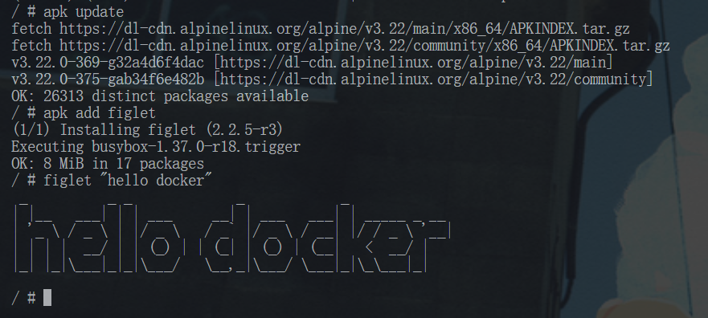
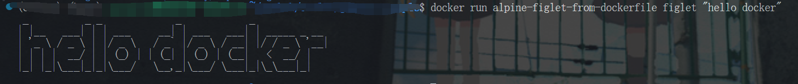
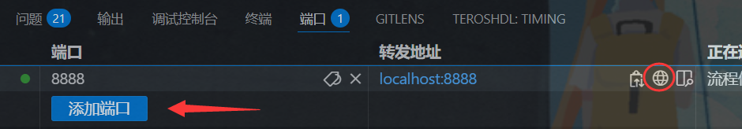

# 自定义镜像之 Dockerfile 详解

!!! note "主要作者"

    yxw

Docker 生态之所以如此繁荣，是因为有许许多多的组织或者开发者贡献了大量的功能不同的镜像，这些镜像被用在各种场景中，比如软件分发，CI/CD，云原生应用部署，可观测性等等。

我们将从最简单的镜像创建方式开始，只需将一个 commit 容器实例作为镜像即可。然后，我们将探索一种更强大、更实用的镜像创建方法：Dockerfile。

## 从容器创建镜像

首先使用交互式运行一个 alpine 容器。

```bash
docker run -it alpine
```

然后我们在容器中执行一些命令，比如安装一个软件，然后退出容器。

```bash
apk update
apk add figlet
figlet "hello docker"
exit
```



图 1. 在 alpine 容器中安装 figlet 后的运行结果
{: .caption }

这样，我们就在 alpine 容器中安装了 figlet 工具，当然，之后我们会安装一些更加有用的软件，
比如 git，nginx 等等。然后我们需要将这个新的容器环境跟其他人分享，我们可以通过 commit 命令将容器保存为一个镜像。

```bash
docker ps -a #查看容器
docker commit CONTAINER_ID
```

这样，我们就创建了一个装有 figlet 的镜像，我们可以通过 docker image 命令查看。

```bash
docker image ls
```

从上一个命令中，获取新创建镜像的 ID，将其重新 tag 为 alpine-figlet。

```bash
docker tag IMAGE_ID alpine-figlet
```

然后我们就可以使用这个新的镜像了。

```bash
docker run alpine-figlet figlet "hello docker"
```

最后我们也可以使用 `docker push` 命令将镜像推送到镜像仓库中，其他人便可以使用 `docker pull` 来使用这个镜像了。

## Dockerfile 详解

上述从容器创建镜像的方式虽然简单易懂，但是如果涉及版本迭代的时候，
比如下次我需要再额外安装一个 git 命令，就需要重新 commit 一个容器，然后重新 tag 一个镜像，
这样比较麻烦，而且容易出错。因此，我们需要一种更加灵活的镜像创建方式，这就是 Dockerfile。
我们来使用 Dockerfile 来完成上述的同样的事情：

```dockerfile
FROM alpine:3.21
RUN apk update &&\
    apk add figlet &&\
    apk add git
```

最后使用 `docker build` 命令来构建镜像：

```bash
docker build -t alpine-figlet-from-dockerfile .
```

同样可以使用这个镜像

```bash
docker run alpine-figlet-from-dockerfile figlet "hello docker"
```



图 2. 用 Dockerfile 构建镜像后运行 figlet 的结果
{: .caption }

这样当我们需要安装 git 的时候，只需要修改 Dockerfile 中的命令后重新构建镜像即可。

```bash
docker build -t alpine-figlet-from-dockerfile .
docker run alpine-figlet-from-dockerfile git
```

## .dockerignore 与构建上下文

`docker build` 最后那个参数不是"Dockerfile 的路径"，而是**构建上下文（build context）**：
Docker 客户端会先把整个上下文目录打包发给 Docker daemon，daemon 之后才能在 `COPY` / `ADD`
里访问这些文件。这意味着：

- 上下文越大，`docker build` 越慢（每次构建都要重新传输一遍）；
- 如果上下文里含密钥（`.env`、私钥）或庞大的 `node_modules`，既拖慢构建，也可能被
  `COPY . .` 意外打进镜像。

`.dockerignore` 放在上下文根目录（与 Dockerfile 同级），语法与 `.gitignore` 类似：

```text
.git
.gitignore
node_modules
__pycache__
*.pyc
*.log
.env
.venv
dist
```

!!! warning "`.dockerignore` 不能当作安全边界"

    `.dockerignore` 只是**不把文件发给 daemon**，它不能阻止密钥以别的方式进入镜像。真正的
    密钥应当在运行时通过 `-e` / `--env-file` / secret 注入，而不是固化进镜像层——镜像层里的
    内容即使后续被删除，仍然可以被翻出来。

## 层缓存：指令顺序为什么重要

Dockerfile 的每条指令都会生成一个镜像层。构建时如果某条指令与缓存中的完全一致，Docker 就直接
复用这一层；**一旦某一层失效，它之后的所有层都必须重新构建**。因此要把"变化频率低"的操作放前面，
"变化频率高"的放后面。

反例（每改一行代码都要重装依赖）：

```dockerfile
FROM node:22-alpine
WORKDIR /app
# 反例：先复制全部源码，源码一改，下面这层缓存立刻失效
COPY . .
RUN npm install
CMD ["node", "server.js"]
```

正例（只有依赖清单变化时才重装依赖）：

```dockerfile
FROM node:22-alpine
WORKDIR /app
# 先只复制依赖清单：只要它没变，这一层永远命中缓存
COPY package.json package-lock.json ./
RUN npm install --omit=dev
# 再复制源码：改代码不会让上面的依赖层失效
COPY . .
CMD ["node", "server.js"]
```

另外两条实践建议：

- `COPY` 具体文件或目录，优于 `COPY .`，后者会让任何文件改动都击穿缓存；
- 把 `apt-get update` 与 `apt-get install` 写在同一条 `RUN` 里，并顺手清理
  `/var/lib/apt/lists/*`，否则镜像里会长期保留过期的包索引。

## 多阶段构建：把工具链留在 builder 里

编译型语言（C/C++、Go、Rust）构建时需要编译器、头文件与构建工具，但**运行时并不需要它们**。
只写一个阶段，这些工具链就会全部留在最终镜像里。多阶段构建允许你在 `builder` 阶段完成编译，
再把产物复制到干净的小镜像中。

被测程序 `hello.c`：

```c
#include <stdio.h>

int main(void) {
    puts("hello from a tiny image");
    return 0;
}
```

Dockerfile：

```dockerfile
# ---- 构建阶段：只在 builder 里装工具链 ----
FROM debian:bookworm AS builder

RUN apt-get update && \
    apt-get install -y --no-install-recommends gcc libc6-dev && \
    rm -rf /var/lib/apt/lists/*

WORKDIR /src
COPY hello.c .
# -static 是为了让产物不依赖运行阶段可能缺失的动态库
RUN gcc -O2 -static -o hello hello.c

# ---- 运行阶段：只带走编译产物，不带工具链 ----
FROM debian:bookworm-slim

COPY --from=builder /src/hello /usr/local/bin/hello

CMD ["hello"]
```

对比两个镜像的体积：

```bash
docker image ls
```

```text
REPOSITORY   TAG       IMAGE ID       CREATED          SIZE
hello        1stage    a1b2c3d4e5f6   10 seconds ago   ~350MB   # 单阶段：工具链全部留下
hello        2stage    f6e5d4c3b2a1   5 seconds ago    ~80MB    # 多阶段：只留产物
```

（这里的体积数字只是示意，实际大小取决于基础镜像与你装的依赖。）

要注意两点：

- 两个阶段的基础镜像应属于**同一个发行版族**（都用 `debian` 或都用 `alpine`），否则
  glibc / musl 混用会导致二进制跑不起来；
- `COPY --from=builder` 只能拿到构建阶段里实际存在的文件，产物必须在 builder 阶段就生成好。

## 以非 root 用户运行

容器默认以 root 运行。在 Dockerfile 里创建普通用户并用 `USER` 切换：

```dockerfile
FROM alpine:3.21

# 创建一个专用的非 root 用户（-S 表示系统用户）
RUN addgroup -S app && adduser -S -G app app

WORKDIR /app

# 注意 --chown：以 root 身份 COPY 进来的文件默认属于 root，非 root 用户将无法写入
COPY --chown=app:app app.sh ./

USER app

CMD ["/bin/sh", "app.sh"]
```

!!! note "容器内的 UID 与宿主机的权限关系"

    Linux 只认 UID 数字，不认用户名。容器里的 UID 1000 与宿主机的 UID 1000 会被当成同一个
    用户；因此在 bind mount 场景下，如果容器内进程的 UID 与你宿主机的 UID 不一致，就会遇到
    "Permission denied"。常见做法是把容器用户建成与宿主机一致的 UID，或在运行时用
    `docker run --user $(id -u):$(id -g)` 对齐。

## HEALTHCHECK

`HEALTHCHECK` 让镜像自带一条"探活命令"，Docker 会按周期执行它，并把结果记录到容器状态里：

```dockerfile
FROM nginx:1.25-alpine

# 每 30 秒检查一次，3 秒超时，连续 3 次失败判定为 unhealthy，启动后给 5 秒宽限期
HEALTHCHECK --interval=30s --timeout=3s --retries=3 --start-period=5s \
    CMD wget -q -O /dev/null http://127.0.0.1/ || exit 1
```

构建并运行后，在 `docker ps` 的 `STATUS` 列就能直接看到健康状态：

```bash
docker ps
```

```text
CONTAINER ID   IMAGE      STATUS                    PORTS                  NAMES
a1b2c3d4e5f6   my-nginx   Up 1 minute (healthy)     0.0.0.0:80->80/tcp     web
```

也可以用 `docker inspect` 查看每次探测的详细输出：

```bash
docker inspect -f '{{json .State.Health}}' web
```

!!! warning "HEALTHCHECK 只做标记，不会自动重启"

    `HEALTHCHECK` 只是把状态标记为 `healthy` / `unhealthy`，**不会**帮你重启或替换容器。
    真正的自动恢复要靠 Compose 的 `depends_on: condition: service_healthy`（编排时等依赖就绪），
    或 Kubernetes 的探针与重启策略。

## 使用 Dockerfile 构建一个 jupyter notebook 镜像

接下来让我们使用 Docker 来构建一个真实可用的镜像，比如 jupyter notebook 镜像。为了更好的演示，我们再预置一个 sample-notebook.ipynb。
创建 Dockerfile 和 sample-notebook.ipynb 两个文件于 jupyter_sample 文件夹目录下。

### 用 `uv pip compile` 生成可复现的 requirements.txt

Python 依赖如果直接写在 Dockerfile 里用 `pip install 包==版本` 安装，包一多就非常难维护，
而且只能钉住**直接依赖**，传递依赖仍然会漂移。更推荐的做法是：在宿主机上用
[uv](../tools/1-useful-oss.md) 把宽松约束"编译"成完全钉死的 requirements.txt，再把这份文件 `COPY`
进镜像。

先写一个只描述直接依赖的 `requirements.in`：

```text
jupyterlab
pandas>=2.3,<3
numpy>=2,<3
matplotlib
ipykernel
```

然后在宿主机上编译：

```bash
# --python-version 要与镜像里的 Python 版本一致，否则解析出的版本可能装不上
uv pip compile requirements.in --python-version 3.13 -o requirements.txt
```

生成的 `requirements.txt` 会包含全部直接依赖与传递依赖的精确版本，把它一起提交到仓库，构建就是
可复现的。首次编译需要联网；之后只要不修改 `requirements.in`，就不需要重新生成。

dockerfile:

```dockerfile
FROM python:3.13-slim

# 安装系统依赖
RUN apt-get update && \
    apt-get install -y --no-install-recommends \
    curl \
    && rm -rf /var/lib/apt/lists/*

# 先复制依赖清单：只要 requirements.txt 没变，这一层就命中缓存
COPY requirements.txt .
RUN pip install --no-cache-dir -r requirements.txt

# 安装 Jupyter 内核
RUN python -m ipykernel install --name python3

# 创建非 root 用户，并让它拥有工作目录
RUN useradd --create-home --uid 1000 jupyter
WORKDIR /notebooks
COPY --chown=jupyter:jupyter sample-notebook.ipynb .

# 暴露 Jupyter 端口
EXPOSE 8888

# 切换到非 root 用户（见上文「以非 root 用户运行」）
USER jupyter

# 启动命令：Jupyter 默认要求认证，token 由环境变量注入，不要写进镜像
CMD ["jupyter", "lab", "--ip=0.0.0.0", "--no-browser"]
```

sample-notebook.ipynb:

```json
{
 "cells": [
  {
   "cell_type": "code",
   "execution_count": null,
   "id": "637fd6d7",
   "metadata": {
    "vscode": {
     "languageId": "plaintext"
    }
   },
   "outputs": [],
   "source": [
    "import pandas as pd\n",
    "df = pd.DataFrame(\n",
    "    {\n",
    "        \"Name\": [\n",
    "            \"Braund, Mr. Owen Harris\",\n",
    "            \"Allen, Mr. William Henry\",\n",
    "            \"Bonnell, Miss. Elizabeth\",\n",
    "        ],\n",
    "        \"Age\": [22, 35, 58],\n",
    "        \"Sex\": [\"male\", \"male\", \"female\"],\n",
    "    }\n",
    ")\n",
    "df[\"Age\"]"
   ]
  }
 ],
 "metadata": {
  "language_info": {
   "name": "python"
  }
 },
 "nbformat": 4,
 "nbformat_minor": 5
}
```

以下命令的作用是根据 jupyter_sample 目录下的 Dockerfile 构建一个名为 jupyter-sample 的镜像。

```bash
docker build -t jupyter-sample jupyter_sample/
```

该镜像使用 RUN 指令来安装依赖，使用 WORKDIR 指令设置工作目录，
使用 COPY 指令将代码复制到镜像中，使用 EXPOSE 指令来暴露端口，
使用 USER 切换到非 root 用户，最后使用 CMD 指令来启动 jupyter notebook 服务。

使用上述镜像来启动 jupyter notebook 服务。

```bash
# 只把端口发布到宿主机回环地址（127.0.0.1），并通过 -e 注入认证 token
docker run -d -p 127.0.0.1:8888:8888 -e JUPYTER_TOKEN='随机生成的强口令' jupyter-sample
```

!!! warning "Jupyter 的认证不可关闭"

    **Jupyter 的认证不可关闭；正确做法是设置 token 或密码哈希，并通过 `-e` 或 secret 注入。
    本地测试也要只绑定回环地址。**

    ```bash
    # 用环境变量注入 token：容器启动时读取 JUPYTER_TOKEN 作为访问口令
    docker run -d -p 127.0.0.1:8888:8888 -e JUPYTER_TOKEN='随机生成的强口令' jupyter-sample
    ```

    如果想用"密码"而不是"token"，可以用 `jupyter server password` 生成 argon2 哈希，再通过配置
    文件或 secret 挂载注入；**不要**把密码哈希写进镜像层。

    历史上流传的 `--NotebookApp.token=''`（空 token）与 `--NotebookApp.disable_check_xsrf=True`
    实际上等于把 notebook 服务完全对外开放，绝对不要在教材、示例或生产环境里这样写。

注意命令里的 `-p 127.0.0.1:8888:8888`：它把容器内的 8888 端口只映射到宿主机的回环地址，
同一网段的其他机器无法直接访问。在 VS Code 上我们可以通过添加一个端口映射来实现访问。



图 3. 在 VS Code 中转发容器端口
{: .caption }

点击这个浏览器图标，就可以访问 jupyter notebook 服务了。
