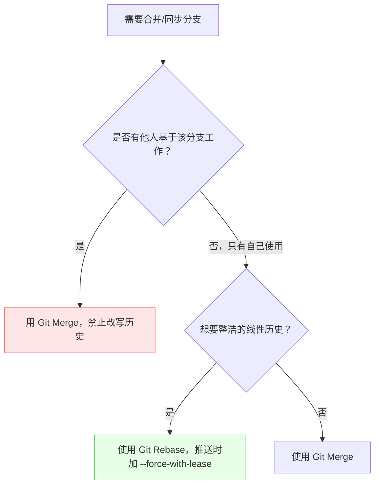

# Git Rebase vs. Git Merge

**目的：**搞懂 Git 这两种合并分支的酷炫方式，以后合并代码不再纠结！

**内容：**

咱们先不讲那些复杂的理论，直接上例子，保证你一看就明白！

## 先懂两个基础概念 

**分支 (Branch)**：就像游戏里的存档点，你可以独立开发功能而不影响主线  
**提交 (Commit)**：每次代码变动的存档记录，包含作者/时间/修改内容

!!! note "新旧命令写法对照"

    `git checkout` 是一个身兼多职的老命令：既切换分支，也恢复文件。新版本 Git（2.23+）把它拆成两个更明确的命令，本文统一使用新写法：

    | 用途 | 新写法 | 旧写法 |
    | ---- | ------ | ------ |
    | 切换分支 | `git switch <branch>` | `git checkout <branch>` |
    | 创建并切换分支 | `git switch -c <branch>` | `git checkout -b <branch>` |
    | 恢复文件内容 | `git restore <file>` | `git checkout -- <file>` |

    旧写法目前仍然可用，但官方文档已把 `switch` / `restore` 作为推荐做法。看到别人的教程里出现 `git checkout` 时，按用途对应到上表即可。

## 场景模拟：团队合作开发新功能 

假设你和小伙伴们正在一起开发一个超酷炫的新功能，每个人负责一部分：

* **你：**负责开发用户登录界面 (在 `feature/login` 分支)
* **小伙伴 A：**负责开发商品展示页面 (在 `feature/product` 分支)
* **主分支：**`main` 分支，是大家共同的基础

### Git Merge：简单粗暴，历史全记录 

1. **你完成了登录界面的开发，想要把代码合并到 `main` 分支：**

    ```bash
    git switch main  # 切换到 main 分支
    git merge feature/login  # 把 feature/login 分支合并到 main 分支
    ```

    * **结果：**Git 会创建一个新的合并提交（merge commit），把你的 `feature/login` 分支和 `main` 分支的最新代码合并在一起。

    * **特点：**简单！`main` 分支的历史记录会完整保留所有分支的开发过程，就像一本详细的日记。

2. **小伙伴 A 也完成了商品展示页面的开发，同样合并到 `main` 分支：**

    ```bash
    git switch main
    git merge feature/product
    ```

    * **结果：**又多了一个合并提交！

    * **潜在问题：**如果很多人都在不同的分支上开发，`main` 分支的历史记录可能会变得很乱，像蜘蛛网一样 🕸️。

### Git Rebase：乾坤大挪移，历史更清晰 

1. **你完成了登录界面的开发，这次咱们用 `rebase`：**

    ```bash
    git switch feature/login  # 切换到 feature/login 分支
    git rebase main  # 把 main 分支的最新代码“垫”到你的 feature/login 分支下面
    git switch main
    git merge feature/login # 快速向前合并
    ```

    * **结果：**
        * `rebase` 会把你的 `feature/login` 分支上的提交“移动”到 `main` 分支的最新提交之后。就像是把你的分支“嫁接”到了 `main` 分支上。
        * 然后再次在 `main` 进行 `merge` 时，由于 `feature/login` 是直接从 `main` 分支“生长”出来的，所以可以直接快速合并（fast-forward），不会产生额外的合并提交。

    * **特点：**干净！`main` 分支的历史记录会是一条直线，非常清晰。

2. **小伙伴 A 也用 `rebase` 合并：**

    ```bash
    git switch feature/product
    git rebase main
    git switch main
    git merge feature/product #快速向前合并
    ```

    * **结果：**同样，`main` 分支的历史记录依然保持一条直线。

    * **潜在问题：**`rebase` 会改写提交历史，判断能不能用的标准是**是否有他人基于这个分支工作**，而不是“这个分支有没有推送过”。如果别人正在这个分支上开发，就不要 `rebase`，否则他们的本地历史会与你分叉。个人 fork 上只有自己使用的分支，即使推送过也可以 rebase，之后用 `git push --force-with-lease` 更新即可；主干（`main`）和团队共享分支则一律禁止改写。

> **图解变基**：
> 主分支：A — B — C  
> 你的分支：A — D — E  
> `git rebase main` 后：  
> 主分支：A — B — C  
> 你的分支变为：A — B — C — D' — E'  
> (你的提交被"搬"到最新主干之后)

## 遇到代码冲突怎么办？

两种方式都会出现冲突，解决方式不同：

**Merge 冲突**：解决一次冲突，生成合并提交  
**Rebase 冲突**：可能需多次解决（每个被移动的提交都可能冲突）

推荐新手先用 `git mergetool` 可视化工具处理冲突

## 常用命令速查 

| 场景                     | Merge 方案               | Rebase 方案                 |
|--------------------------|-------------------------|---------------------------|
| 个人本地分支合并          | `git merge feature`     | `git rebase main`         |
| 他人正在使用的分支        | ✅ 安全                  | ❌ 禁止（会改写他们依赖的历史）|
| 只有自己用的个人 fork 分支 | ✅ 安全                  | ✅ 可以 rebase，推送时用 `git push --force-with-lease` |
| 主干与共享分支            | ✅ 安全                  | ❌ 禁止                     |
| 更新本地分支              | `git pull`（合并式）     | `git pull --rebase`       |
| 放弃当前操作              | `git merge --abort`     | `git rebase --abort`      |

!!! warning "判定条件是“谁在用”，不是“有没有推送”"

    - 只要**有他人基于该分支工作**（共同开发的分支、主干、发布分支），就不能改写历史，用 `git merge`。
    - **只有自己使用的分支**（例如个人 fork 里的 `fix/xxx`）即使已经推送，也可以 `rebase` 整理，之后用 `git push --force-with-lease` 更新远程；它会先检查远程是否出现了你未见过的提交，从而避免覆盖别人的工作。
    - 绝对不要用 `git push --force` 覆盖共享分支。这与[参与开源项目](../6-participate-in.md)和[真实贡献项目](../../../course/project.md)中的流程一致。

## 交互式变基：`git rebase -i`

交互式变基用来**整理自己分支上的提交**，也是项目贡献指南里常见的“发起 PR 前请合并同类提交”所要求的操作。

```bash
git rebase -i <base>
```

`BASE` 是你要保留的历史起点，例如 `HEAD~3`（整理最近 3 个提交）或 `upstream/main`（整理这个分支上你自己的全部提交）。

执行后会打开编辑器，列出从 `BASE` 之后的每个提交，形如：

```text
pick a1b2c3d feat: add login form
pick e4f5g6h fix typo
pick i7j8k9l chore: review feedback
```

把每行行首的 `pick` 改成你需要的动作：

| 动作 | 含义 | 典型用途 |
| ---- | ---- | -------- |
| `pick` | 保留该提交 | 默认 |
| `reword` | 保留改动，但重新编辑提交信息 | 标题写错，改动本身没问题 |
| `edit` | 停下来让你修改该提交（可追加内容） | 需要拆分或补文件 |
| `squash` | 并入上一个提交，并**合并两条提交信息**供你编辑 | 多个相关的功能提交 |
| `fixup` | 并入上一个提交，**丢弃本条提交信息** | 纯粹的笔误修正、CI 修补 |
| `drop` | 删除该提交（也可直接删掉这一行） | 提交已经被别的方式取代 |

例如把三条提交压成一条：

```text
pick a1b2c3d feat: add login form
fixup e4f5g6h fix typo
fixup i7j8k9l chore: review feedback
```

保存退出后，Git 会按新的顺序重放提交；如果中途出现冲突：

```bash
git add 已解决的文件
git rebase --continue   # 继续重放

git rebase --skip       # 跳过当前这条提交（确认它已经不需要了）
git rebase --abort      # 放弃整个变基，回到操作前的状态
```

!!! warning "交互式变基的两条底线"

    1. 它会重写提交哈希，**不要对主干或他人正在使用的分支使用**；整理完成后只对自己 fork 的分支用 `git push --force-with-lease`。
    2. 变基中途遇到冲突时不要慌：`git status` 会告诉你当前停在哪一步，`--continue` / `--skip` / `--abort` 就是全部出口，`git reflog` 可以找回操作前的状态。

### 用 `--onto` 搬运一段提交

`git rebase --onto <新基地> <旧基地> <分支>` 可以把“从旧基地之后到分支顶端”的那段提交，整体搬到新基地之上。典型场景是把误开在 `main` 上的功能提交搬到正确的 `feature` 分支：

```bash
git switch feature
git rebase --onto feature main fix/wrong-base
```

意思是：取出 `fix/wrong-base` 分支上“`main` 之后”的提交，重放到 `feature` 之上。

## 总结：选哪个？

| 特性         | Git Merge                                                                                             | Git Rebase                                                                                                                  |
| :----------- | :---------------------------------------------------------------------------------------------------- | :------------------------------------------------------------------------------------------------------------------------ |
| 历史记录     | 完整，包含所有分支的开发过程                                                                                    | 简洁，一条直线                                                                                                                |
| 操作难度     | 简单                                                                                                 | 稍复杂，需要理解“变基”的概念                                                                                                          |
| 适用场景     | 适合小型团队，或者希望保留完整开发历史的情况                                                                            | 适合个人开发，或者希望保持主分支历史清晰的情况                                                                                              |
| **注意事项** | **有他人基于该分支工作时不要改写历史**：合并是安全的                                                           | **有他人基于该分支工作时禁止 `rebase`**；个人 fork 分支可 rebase 后用 `--force-with-lease` 推送                                    |
| **比喻**   | **像一本详细的日记，记录了所有发生的事情**                                                                           | **像一棵树，主干清晰，分支从主干生长出来**                                                                                                |
| **口诀**   | **`merge`虽乱心不乱，`rebase`虽直易出错**                                                                     | **`merge`虽乱心不乱，`rebase`虽直易出错**                                                                                  |



> 主干（`main`）和团队共享分支永远属于“有他人工作”的一类，无论它是否推送过。

## 趣味小练习 

!!! warning "为什么要建两个目录"

    Merge 和 Rebase 必须分别演示。如果在同一个仓库里先做完 merge，`main` 就已经包含了 `feature` 的全部提交，接着再执行 rebase 只会得到 `Already up to date.`，看不到任何区别。所以下面用**两个独立的 `git init` 目录**做对照实验。

### 方案 A：Merge（目录 `merge-demo`）

```bash
git init -b main merge-demo && cd merge-demo
echo "Hello" > file.txt
git add file.txt && git commit -m "Initial commit"
git switch -c feature
echo "New feature" >> file.txt
git commit -am "Add feature"
git switch main
# 让 main 上也有一条独立提交，制造出真正的分叉
echo "Main work" > main.txt
git add main.txt && git commit -m "Main work"
git merge feature        # 产生一个合并提交
git log --oneline --graph --all
```

期望历史（分叉处生成合并提交 `M`）：

```text
*   M Merge branch 'feature' into main
|\
| * F Add feature
* | G Main work
|/
* I Initial commit
```

### 方案 B：Rebase（目录 `rebase-demo`）

```bash
git init -b main rebase-demo && cd rebase-demo
echo "Hello" > file.txt
git add file.txt && git commit -m "Initial commit"
git switch -c feature
echo "New feature" >> file.txt
git commit -am "Add feature"
git switch main
echo "Main work" > main.txt
git add main.txt && git commit -m "Main work"
git switch feature
git rebase main          # feature 上的提交被重放到 main 最新提交之后
git switch main
git merge feature        # 此时可以快进，不产生合并提交
git log --oneline --graph --all
```

期望历史（一条直线，`F'` 是哈希已改变的 `Add feature`）：

```text
* F' Add feature
* G Main work
* I Initial commit
```

### 对比结论

1. 两个目录里 `git log --oneline --graph` 的形状不同：A 有分叉与合并提交，B 是直线。
2. 用 `git log --format="%h %p %s"` 对比提交的父提交：A 的 `F` 父提交仍是 `I`，B 的 `F'` 父提交变成了 `G`——这解释了为什么 rebase 之后哈希一定会变。

思考一下，在你的团队项目中，哪种合并方式更适合？

希望这个文档能帮助你更好地理解 Git Rebase 和 Git Merge！记住，实践出真知，多动手试试，你会发现 Git 其实很有趣！😉
