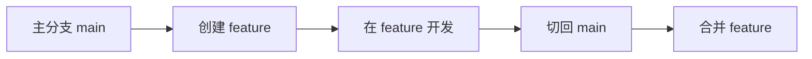
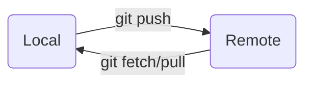

# Git 辅助本地开发

!!! note "主要作者"

    yinchunyuan

## 目的

掌握如何利用 Git 管理本地开发流程。

## 内容

!!! note "新旧写法对照"

    本文统一使用 `git switch`（切换分支）和 `git restore`（恢复文件）。你会在旧教程里看到它们的前身 `git checkout <branch>` 与 `git checkout -- <file>`，两者目前仍然可用，只是把“切分支”和“改文件”两种语义混在了同一个命令里，容易误操作。看到 `git checkout` 时，按用途对应到 `switch` 或 `restore` 即可。

### 1. 管理多个本地分支

在 Git 中，管理多个本地分支有助于开发与实验。每个功能、修复或实验都可以在独立的分支上进行，避免直接影响主分支的稳定性。通过合理的分支管理，可以确保代码的整洁和高效的开发流程。

  > **新手提示**：分支就像独立的代码副本，允许你在不影响主线代码的情况下进行修改。主分支（通常叫`main`或`master`）应保持稳定状态。

- **创建本地分支**：
  使用 `git branch` 命令创建新的分支。分支可以用来独立开发某个功能或实验性修改。创建分支后，使用 `git switch` 命令切换到该分支进行开发。

  示例：

  ```bash
  git branch new-feature     # 创建一个新的分支
  git switch new-feature   # 切换到新分支
  ```

  也可以通过 git switch -c 命令同时创建并切换到新分支：

  ```bash
  git switch -c new-feature   # 创建并切换到新分支
  ```

  > **命名建议**：  
  > - 功能分支：`feat/search-api`  
  > - 修复分支：`fix/login-error`  
  > - 实验分支：`exp/new-algorithm`  
  > 避免使用空格和特殊字符

- **切换分支**
  通过 git switch 命令，开发者可以随时切换到不同的分支，继续开发其他功能或者修复问题。这使得多任务并行开发成为可能。

  ```bash
  git switch main          # 切换到主分支
  git switch feature-branch # 切换到指定的功能分支
  ```

  > **注意**：切换分支前请先提交或保存当前修改，否则未提交的更改会被带到新分支！

- **查看本地分支**：
  使用 git branch 命令可以列出所有本地分支，当前所在的分支会以*标记。此命令帮助开发者了解自己在哪个分支上工作。

  ```bash
  git branch
  ```

  输出示例：

  ```bash
  * feature-branch
  main
  develop
  ```

- **删除本地分支**：
  完成开发或实验后，可以使用 git branch -d 命令删除已经不再需要的分支。如果分支还没有被合并，会有提示，要求确认删除。可以使用-D 强制删除。

  ```bash
  git branch -d old-feature  # 删除本地的旧功能分支
  git branch -D feature-to-delete # 强制删除未合并的支
  ```

### 2. 合并本地分支

当在不同分支上进行开发后，通常需要将其合并到主分支或其他分支上。这可以通过 git merge 命令来实现。



- **合并分支**：
  在目标分支上执行 git merge 命令，将另一个分支的修改合并到当前分支。这是开发过程中最常用的操作之一。

  ```bash
  git switch main         # 切换到主分支
  git merge new-feature     # 将新特性分支合并到主分支
  ```

  如果发生冲突，Git 会提示冲突的文件，开发者需要手动解决这些冲突。
- **解决合并冲突**：
  如果 Git 在合并时发现冲突，会标记出冲突的部分。开发者可以通过编辑文件来手动解决冲突。解决冲突后，执行 git add 命令标记冲突已解决，然后执行 git commit 提交合并结果

  ```bash
  # 解决冲突后，添加解决的文件
  git add conflicted-file
  # 提交合并结果
  git commit -m "Resolved merge conflict"
  ```

### 3. 管理本地分支与远程分支的同步

本地与远程分支的同步通过三个核心命令实现：

1. **`git fetch`**：从远程仓库获取最新提交记录，但不修改本地代码。  
2. **`git pull`**：获取远程更新并自动合并到当前分支。  
3. **`git push`**：将本地提交推送到远程仓库。  

这三个命令共同维护本地与远程分支的一致性。

- **从远程获取最新更改**：
  使用 git fetch 命令可以从远程仓库获取最新的提交，而不自动合并。这可以帮助你查看远程仓库的变化，进行对比分析，而不会直接影响你的本地代码。

  ```bash
  git fetch origin       # 获取远程仓库的最新更改
  ```

- **拉取并合并远程更改**：
  使用 git pull 命令可以从远程仓库拉取更新并自动合并到本地分支。若使用 git pull --rebase，则采用 rebase 策略代替合并操作，历史记录将更加线性。

  ```bash
  git pull origin main   # 拉取远程主分支的更改并合并
  ```

- **推送本地更改到远程**：
  使用 git push 命令可以将本地提交上传到远程仓库。

  ```bash
  git push -u origin feature-branch      # 推送新分支（首次需设置上游）
  git push       # 后续推送（已设置上游）
  git push --force-with-lease origin feature-branch  # 仅用于确认无人共用的个人分支
  ```

  不要对共享分支强制推送。`--force-with-lease` 会在远程分支出现未知更新时拒绝覆盖，但仍应遵循目标项目的分支和提交整理规则。



### 4. 实验性开发与回滚

  Git 为开发者提供了很大的灵活性，特别是在进行实验性开发时。如果某个实验失败，开发者可以随时回滚到之前的稳定版本。恢复文件用 `git restore`，移动分支指针用 `git reset`，两者作用范围完全不同。

- **丢弃工作区中某个文件的修改**：
  如果当前修改还没有提交，想要把文件恢复到上一次提交的状态，使用 `git restore`：

  ```bash
  git restore file.txt      # 用当前提交里的内容覆盖工作区的 file.txt
  ```

  丢弃当前目录下所有已跟踪文件的未提交修改：

  ```bash
  git restore .
  ```

  在按下回车之前，更安全的顺序是先把现场完整保存下来，确认真的不需要之后再丢弃：

  ```bash
  git stash push -u -m "丢弃前的完整现场"   # -u 连未跟踪文件一起保存
  git stash list                            # 确认已保存
  git stash show -p stash@{0}               # 需要时查看保存了什么
  ```

  之后若确实不需要这些改动就执行 `git stash drop`；想反悔则执行 `git stash pop` 取回。

  另外要记住，**`git restore` 不会删除未跟踪文件**。新创建的、从未被 `git add` 过的文件不在它的作用范围内，需要自己用 `rm` 删除；`git clean -n` 可以预览 `git clean -f` 会删掉哪些未跟踪文件，确认无误再执行。

- **重置分支到某个历史提交**：
  如果需要将分支重置到某个历史提交，可以使用 git reset 命令。--hard 选项会清除所有未提交的更改，回到指定的历史版本。

  ```bash
  git reset --hard HEAD~1  # 重置当前分支到上一个提交
  ```

  > **⚠️ 重要警告**：  
  > `--hard` 操作会永久丢弃未提交的修改！使用前确保：  
  >
  > 1. 真正需要放弃当前所有更改  
  > 2. 已备份重要代码片段（可先用 `git stash push -u` 保存现场）
  >
  > 如果目标提交**已经推送**到共享分支，不要用 `reset` 改写历史，改用 `git revert SHA` 生成反向提交。

  如果希望保留文件的修改但回到某个历史提交，可以使用--soft 选项：

  ```bash
  git reset --soft HEAD~1  # 保留修改，回到上一个提交
  ```

### 5. 使用 Stash 保存临时修改

  在 Git 中，有时你可能需要暂时保存当前的工作进度，并切换到其他分支进行开发。这时可以使用 git stash 命令将未提交的更改保存到堆栈中。

  **典型使用场景**：  
  当你在分支 A 上开发到一半，突然需要：  

  1. 修复分支 B 的紧急 bug  
  2. 临时查看其他分支代码  
  3. 同步上游更新

  但又不想提交未完成的工作时，使用 stash 最合适。

- **保存当前修改**：
  使用 git stash 可以将当前的修改保存到堆栈中，然后恢复到干净的工作目录。

  ```bash
  git stash        # 保存当前修改
  git stash list   # 查看保存的 stash
  ```

- **恢复保存的修改**：
  使用 git stash pop 命令可以恢复最近保存的修改。该命令会将修改应用到当前分支，并从 stash 堆栈中删除。

  ```bash
  git stash pop    # 恢复最近保存的修改并从 stash 堆栈中删除
  ```

- **应用特定的 stash**：
  如果有多个保存的 stash，可以指定应用某个特定的 stash。

  ```bash
  git stash apply stash@{2}  # 恢复第二个保存的 stash
  ```

## 新手速查表

| 场景                     | 命令                          | 是否可逆 | 注意事项 |
|--------------------------|-------------------------------|----------|----------|
| 切换分支                 | `git switch <分支名>`         | 可逆     | 未提交修改会被带到新分支 |
| 临时保存现场             | `git stash push -u`           | 可逆     | 用 `git stash pop` 取回 |
| 丢弃工作区修改（单文件） | `git restore <文件>`          | **不可逆** | 先 `git stash push -u` 再决定 |
| 丢弃工作区修改（全部）   | `git restore .`               | **不可逆** | 不影响未跟踪文件 |
| 删除未跟踪文件           | `git clean -f`                | **不可逆** | 先用 `git clean -n` 预览 |
| 移出暂存区               | `git restore --staged <文件>` | 可逆     | 工作区修改保留 |
| 删除已合并分支           | `git branch -d 分支名`        | 基本可逆 | 误删可用 `git reflog` 找回 |
| 强制删除未合并分支       | `git branch -D 分支名`        | 基本可逆 | 提交仍在 reflog 中 |
| 改写当前分支历史         | `git reset --hard HEAD~1`     | **不可逆** | 已推送的提交应改用 `git revert` |
| 查看操作历史             | `git reflog`                  | 只读     | 误操作救命工具 |
| 检查远程状态             | `git remote show origin`      | 只读     | 显示远程分支跟踪关系 |

> 标注“不可逆”的命令不会询问确认，执行后不能靠 Git 自己恢复。工作区文件一旦被覆盖，只能依赖编辑器历史、备份或 `git stash`。

## 总结

   Git 帮助开发者在本地进行多分支管理，提供了灵活的开发与实验机制。通过合理的分支管理、合并与回滚操作，可以有效提升开发效率，并保持代码的整洁与可维护性。同时，借助 stash 功能，开发者能够灵活处理临时任务，避免丢失未完成的工作。Git 的本地开发流程为团队提供了更高效的协作机制，使得开发者能够更加专注于功能开发、问题解决与实验创新。
