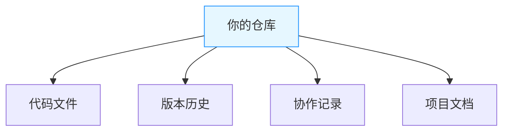
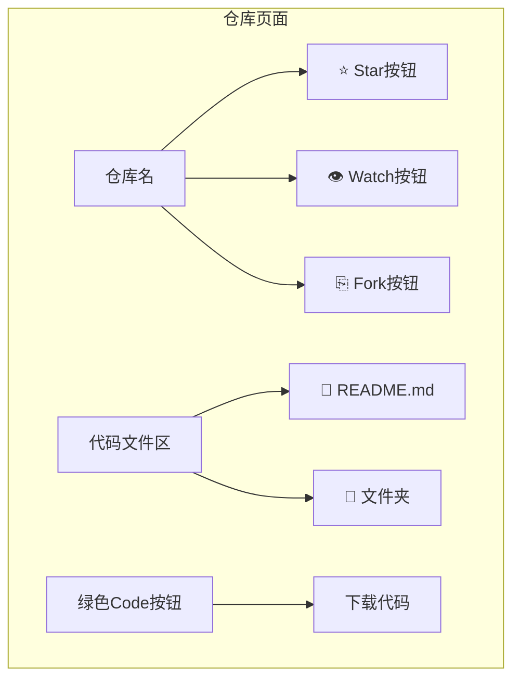

# 代码托管平台简介

> 本子节旨在让学生了解如何使用代码托管平台（如 GitHub、Gitee 等）进行代码管理与协作，掌握平台的基本功能和常用操作。

---

## 什么是代码托管平台

代码托管平台是一种基于云服务的开发协作工具，主要用于存储、管理和协同开发代码项目。它通过集成版本控制系统（如 Git）、协作工具和自动化流程，为开发者提供全生命周期的代码管理支持，是现代软件开发和开源生态的核心基础设施。

!!! note "云存档：理解代码托管的本质"

    **核心价值类比**：代码托管平台的核心功能类似于游戏的**云存档**系统：
    
    | 游戏场景             | 代码托管场景                | 解决的问题               |
    |----------------------|---------------------------|--------------------------|
    | 本地存档易丢失       | 本地代码无备份             | 数据安全                 |
    | 多设备同步存档       | 多电脑开发无缝切换         | 开发连续性               |
    | 创建多个存档点       | 版本控制 (commit 历史)       | 版本回溯                 |
    | 多人联机协作         | 团队协同开发               | 协作冲突管理             |
    
    **实际案例**：当你在开发游戏时：  
    1. 本地开发 → 相当于单机游戏  
    2. 上传至 GitHub → 启用云存档  
    3. 队友克隆 (clone) 项目 → 多人联机加入世界  
    4. 提交 Pull Request → 申请将你的建筑加入主世界

## 平台基本功能与操作

### 仓库以及其浏览与搜索

#### 什么是仓库

仓库（Repo）就像是一个**共享的游戏存档文件夹**，里面包含项目的所有内容（代码/素材/文档）。与本地文件夹不同：

- 🌩️ **云端存储**：代码永不丢失，多设备可访问
- 🕰️ **历史记录**：每次修改自动生成存档点（版本）
- 👥 **多人协作**：支持多人同时编辑（自动合并修改）

仓库是你的项目在云端的"家"：

#### 浏览仓库

如果你想浏览平台上的仓库（比如 GitHub 或 Gitee），可以按照以下步骤操作：

1. **打开平台网站**：首先，访问 GitHub 或 Gitee 的官方网站。
2. **查找感兴趣的仓库**：在首页或搜索栏中输入你感兴趣的关键词，比如项目名称或编程语言。
3. **进入仓库详情页面**：点击你感兴趣的仓库名称，进入仓库详情页面。在这里，你可以查看代码、问题、拉取请求等内容。

#### 界面速览（GitHub 示例）

#### 搜索仓库

如果你想更精准地找到某个仓库，可以使用搜索功能：

1. **输入关键词**：在搜索栏中输入关键词，比如项目名称、编程语言等。
2. **使用过滤器**：为了缩小搜索范围，你可以使用过滤器，比如按语言、星标数、更新时间等进行筛选。
3. **查看搜索结果**：点击搜索结果中的仓库名称，进入仓库详情页面，查看详细信息。

### 其他常见术语

!!! tip "核心概念速记"

    掌握这些基础术语即可开始使用（后续课程会深入讲解）：
    
    | 术语           | 作用                  | 相当于        |
    | :------------ | :-------------------- | :------------ |
    | **Fork**      | 创建独立副本          | 项目另存为    |
    | **Star**      | 收藏项目              | 添加书签      |
    | **Watch**     | 订阅更新              | 开启提醒      |
    | **Issues**    | 问题追踪              | 任务清单      |
    | **Pull Request** | 提交修改           | 方案提案      |

#### 1. **复制仓库（Fork）**

- **是什么**：将别人的仓库复制到自己的账户下，就像你在微博上“转发”一条动态到自己的主页一样。
- **为什么重要**：让你可以自由修改代码，就像你可以在转发的内容上加自己的评论或修改。同时，你还可以将改进贡献回原项目。
- **使用场景**：参与开源项目、实验性修改，就像你看到一篇有趣的文章，想自己试试修改后再分享给别人。

---

#### 2. **点赞/收藏（Star）**

- **是什么**：对仓库点赞，表示支持或收藏，就像你在小红书或微博上给喜欢的帖子点个赞或收藏起来。
- **为什么重要**：方便你快速找到喜欢的项目，同时也是对开发者的鼓励，就像你收藏了一篇好文章，以后可以随时翻出来看。
- **使用场景**：收藏优质项目、支持开发者，比如你看到一个很棒的工具库，点个 Star 表示支持。

---

#### 3. **关注仓库（Watch）**

- **是什么**：关注仓库，接收更新通知，就像你在虎扑或贴吧上关注一个话题，每次有新回复都会提醒你。
- **为什么重要**：让你随时了解项目的动态，比如新功能发布或 Bug 修复，就像你关注的博主发了新内容，你会第一时间知道。
- **使用场景**：跟踪感兴趣的项目、参与社区讨论，比如你关注了一个开源项目，想随时了解它的进展。

---

#### 4. **问题跟踪（Issues）**

- **是什么**：用于报告 Bug、提出新功能或讨论任务，就像你在 Steam 社区或贴吧里发帖提问或反馈问题。
- **为什么重要**：是项目管理和协作的核心工具，帮助开发者沟通和解决问题，就像你在论坛上发帖后，其他人可以回复并提供解决方案。
- **使用场景**：报告问题、提出改进建议、讨论技术细节，比如你发现了一个 Bug，可以在 Issues 里提出来。

---

#### 5. **代码合并请求（Pull Request/Merge Request）**

- **是什么**：请求将你的代码修改合并到原项目，就像你在贴吧或论坛上写了一篇长文，希望版主把它加进精华帖里。
- **为什么重要**：是开源贡献的核心方式，让开发者可以协作改进代码，就像你写了一篇好文章，希望更多人看到并认可。
- **使用场景**：提交代码改进、修复 Bug、添加新功能，比如你修复了一个问题，可以提交 Pull Request 让原作者合并你的修改。

---

#### 6. **自动化工作流（CI/CD）**

- **是什么**：自动化测试、构建和部署的工具，就像你在 Steam 上设置了自动更新游戏，每次有新版本都会自动下载安装。
- **为什么重要**：提升开发效率，确保代码质量，就像你设置了自动回复，不用每次手动处理重复的事情。
- **使用场景**：自动化测试、持续集成/持续交付，比如每次提交代码后，自动运行测试并发布新版本。
- **案例**:[开源操作系统训练营的自动化测评](https://github.com/LearningOS/template-2024a-rcore/blob/ch8/.github/workflows/build.yml)，[本教程](https://github.com/hust-open-atom-club/intro2oss/actions)

---

## 常用代码托管平台

下表只描述各平台的**定位与免费额度的衡量维度**。具体数字（协作者上限、每月 CI 分钟数、私有仓库数量）会随平台政策变化，使用前请以各平台官网定价页为准，教材不在此固化容易过期的数值。

| **平台**      | **核心特点**                                                       | **免费额度（衡量维度）**                                                  | **适用场景**               |
| ------------------- | ------------------------------------------------------------------------ | ------------------------------------------------------------------------ | -------------------------------- |
| **GitHub**    | 全球最大开源社区，功能全面，CI/CD（GitHub Actions）        | 私有仓库数量与协作者人数不限；Actions 每月提供一定免费额度，超出后按量计费   | 开源项目、个人开发者、企业项目   |
| **GitLab**    | 一体化 DevOps，内置 CI/CD，支持私有部署                  | 官方 SaaS 免费版可用功能较多，但 CI/CD 计算分钟数有月度上限；自建实例成本自行控制 | 企业级 DevOps、私有部署          |
| **Gitee**     | 国内访问快，中文支持好，CI/CD 国内优化；2021 年起公开仓库需实名认证并通过开源审核 | 免费提供公开与私有仓库，企业版另有额度                              | 国内开发者、企业项目、开源项目   |
| **AtomGit**   | 由**开放原子开源基金会**运营，国内访问较快，与基金会项目生态衔接紧密       | 免费提供公开与私有仓库，额度以官网为准                             | 参与国内基金会生态的个人与团队   |
| **Bitbucket** | 与 Atlassian 工具集成（Jira、Trello），CI/CD（Pipelines）  | 免费版对**协作者人数有上限**，Pipelines 每月提供一定免费额度          | 企业团队、Atlassian 工具用户     |
| **Codeberg**  | 非营利组织运营、基于 Forgejo，强调隐私与无商业追踪，社区自治              | 免费，主要面向自由/开源软件项目，资源来自捐赠，不适合大规模 CI        | 自由软件项目、注重隐私的开发者   |
| **GitLink**   | **CCF（中国计算机学会）**官方支持，专注科研开源生态，符合国内合规标准，支持项目孵化与学术协作 | 免费，侧重学术与教育场景                              | 学术研究、国内开源项目、教育领域 |

**一句话总结**：

- **GitHub**：全球开源标杆。
- **GitLab**：企业 DevOps 首选。
- **Gitee**：国内开发者的好选择。
- **AtomGit**：开放原子开源基金会运营的国内平台。
- **Bitbucket**：Atlassian 生态集成。
- **Codeberg**：非营利、重隐私的自由软件家园。
- **GitLink**：CCF 支持的学术开源阵地。

> **AtomGit 与 GitLink 的定位区分**：两者都面向国内开源生态，但运营主体不同。AtomGit 由开放原子开源基金会运营，与 OpenHarmony、openEuler 等基金会项目衔接更紧；GitLink 由中国计算机学会（CCF）支持，更偏向科研、教学与学术协作。选题时按项目所属生态选择即可。

### 新手常见问题

Q：一定要用 Git 命令吗？  
A：网页界面可以完成浏览、小改动和简单评审，是很实用的补充。但本课程要求的**可评审贡献**——在分支上提交、发起 Pull Request、响应 CI 与 review——必须通过分支与提交完成，因此 Git 命令是必修内容。

Q：私有项目收费吗？  
A：主流平台（GitHub/Gitee/GitLink）**免费提供私有仓库**

Q：代码被看到会泄密吗？  
A：创建时选择 🔒**Private**（私有）选项即可隐藏代码

### 仓库级配置文件

除了 README 和 LICENSE，成熟项目的仓库里通常还有几个“约定文件名”。它们不是 Git 的功能，而是平台识别的配置文件，决定了协作流程怎么走。看到它们时，说明维护者希望按固定方式接收贡献。

| 文件或目录 | 平台 | 作用 | 你应该怎么用 |
| ---------- | ---- | ---- | ------------ |
| `.github/ISSUE_TEMPLATE/` | GitHub 等 | 新建 Issue 时自动套用的模板（Bug 报告、功能请求） | 按模板逐项填写；缺复现步骤的 Issue 常被直接关闭 |
| `.github/pull_request_template.md` | GitHub 等 | 新建 PR 时自动填入的描述模板 | 逐项填写，勾选本地验证项，见[PR 描述范例](../6-participate-in.md) |
| `CODEOWNERS` | GitHub、GitLab 等 | 指定路径的默认评审人；自动请求对应维护者评审 | 改动落在谁的负责范围内，PR 会自动带上评审人 |
| `SECURITY.md` | GitHub 等 | 说明安全漏洞的**非公开**报告渠道 | 发现漏洞时不要开公开 Issue，先读它 |
| `.github/workflows/` | GitHub | CI 工作流定义，决定 PR 会跑哪些检查 | 提交前在本地跑同样的命令，见[读懂自动检查结果](../6-participate-in.md) |

## 总结

!!! summary "学习目标"
    - 了解常见的代码托管平台（如 GitHub、Gitee 等）及其基本功能。
    - 学会在浏览器中浏览和搜索仓库。
    - 掌握平台的基本概念，如 Fork、Star、Watch 等。  

!!! tip "下一步学习"
    - [GitHub Skills：动手练习仓库工作流](https://skills.github.com/)
    - [Learn Git Branching：交互式学分支与 rebase](https://learngitbranching.js.org/?locale=zh_CN)
    - [GitHub 官方新手教程](https://docs.github.com/zh/get-started)
    - [Gitee 帮助中心](https://gitee.com/help)

这些技能将为后续的代码开发、团队协作和开源贡献打下坚实的基础。

