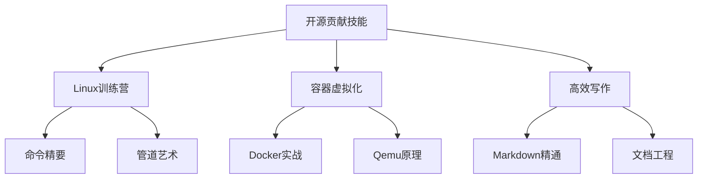

# 开源贡献基础技能导览  

!!! note "主要作者"  
    [@Dreadful_Me](https://github.com/Dreadful_Me)

## 🚀 开启 Git 与协作之旅

本章将带您系统掌握开源贡献全流程技能，从 Git 基础到高级协作，从个人项目管理到社区级贡献，通过渐进式学习路径成长为合格的开源贡献者。  

## Markdown 基础技能

!!! note 基本语法
    在这里，你将学习：

    1. 使用分级**标题**，学会用不同量级的标题来展现层次；

    2. 对不同的语句使用不同的**强调**方式来达成不同的目的；

    3. **列点**来清晰地表达内容的不同方面；

    4. 插入**链接与图片**从而使得界面更加灵活生动；

    5. **引用**外部信息和权威语句来给自己背书；

    6. 添加**代码语句和代码块**方便迅速上手；

    7. 利用**表格**来将死板的语言更具体化的分门别类；

    8. 最后，利用**分割线**让不同的段落泾渭分明

!!! warning 进阶语法
    除了基本的对文本的操作，markdown 文档能做的不止于此：

    - 使用 LaTeX 语法书写数学公式

    - 直接嵌入原生 HTML 标签，以实现更复杂的排版和样式

    - 通过 mermaid 代码块插入图表

    - 使用一种叫“图床”的工具上传图片。

    - ......

## 💡 四阶段学习体系

### 1. [导学阶段](https://oss.openatom.club/ch3/sec1/subsec1/1-git-introduction/)

!!! tip "环境准备三步走"
    1. **平台初识**：GitHub/Gitee 功能探索
    2. **实战入门**：创建首个仓库
    3. **合规起点**：选择开源许可证

!!! example "核心任务卡"

    ```mermaid 
    graph TB 
    A[注册GitHub] --> B[创建个人仓库] 
    A --> C[Fork俱乐部项目] 
    B --> D[配置README] 
    C --> E[提交首个Issue]
    ```

### 2. [基础阶段](https://oss.openatom.club/ch3/sec1/subsec2/1-basic-configuration/)

!!! warning "Git 生存法则"
    | 场景 | 核心命令 | 应用要点 |
    |------|----------|----------|
    | 版本控制 | `git init/clone` | 建立版本库 |
    | 变更管理 | `git add/commit` | 原子性提交 |
    | 问题排查 | `git diff/reset` | 撤销与比对 |

### 3. [专业阶段](https://oss.openatom.club/ch3/sec1/subsec3/1-rebase-merge/)

!!! tip "高级工作流"
    ```mermaid
    graph LR
    A[特性分支] --> B{合并策略}
    B -->|协作开发| C[Rebase]
    B -->|公共分支| D[Merge]
    C --> E[整洁历史]
    D --> F[保留轨迹]
    ```

### 4. [项目阶段](https://oss.openatom.club/ch3/sec1/subsec4/1-linux-patch/)

!!! danger "Linux 内核贡献须知"
    - 遵循内核编码规范
    - 补丁包含完整变更说明
    - 通过邮件列表提交

!!! success "团队协作评估"
    ```mermaid
    pie
    title 贡献评估维度
    "代码质量" : 40
    "文档完善" : 25
    "Issue解决" : 20
    "社区互动" : 15
    ```

## 🔧 开发工具箱

| 类别       | 推荐工具                  | 应用场景              |  
|------------|-------------------------|-----------------------|  
| **版本控制** | Git + GitLens           | 代码历史管理          |  
| **协作平台** | GitHub/Gitee            | 项目托管&PR 流程       |  
| **持续集成** | GitHub Actions          | 自动化测试/部署       |  
| **调试分析** | GitHub Network Graph    | 项目关系可视化 |  

## 🌟 拓展技能树



## 🔧明星工具推荐

!!! example "效率提升神器"

- tmux：终端会话管理（多窗口操作）
- better-commits：规范化提交助手
- opencommit：AI 生成提交信息
- pre-commit：自动化代码检
