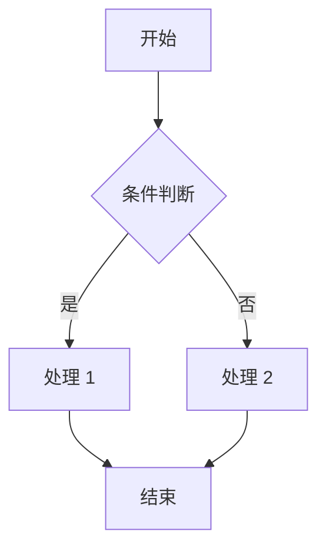

# Markdown 进阶语法

!!! note "主要作者"

    [@Paulkm2006](https://github.com/Paulkm2006)

Markdown 除了基本的文本格式化，还支持更高级的功能，如公式、HTML 标签和图表等。下面将分别介绍这些进阶用法。

## 1. 数学公式

Markdown 支持使用 LaTeX 语法书写数学公式，常见于支持 MathJax 或 KaTeX 的渲染器中。

**行内公式**：使用 `$...$` 包裹公式内容  
```md preview
$E=mc^2$
```

**块级公式**：使用 `$$...$$` 包裹公式内容  

```md preview
$$
\int_{a}^{b} f(x)\,dx = F(b) - F(a)
$$
```

## 2. HTML 标签与 CSS 样式

Markdown 支持直接嵌入原生 HTML 标签，以实现更复杂的排版和样式。例如：

```md preview

<p style="color: red;text-align: center;">这是一个红色的段落。</p>
<p align="center">
    
</p>

<table>
    <tr>
        <td>Foo</td>
        <td>Bar</td>
    </tr>
    <tr>
        <td>Hello</td>
        <td>World</td>
    </tr>
</table>

```

!!! tips

    部分 Markdown 渲染器可能会限制某些 HTML 标签的使用。若非特殊情况，请尽量使用原生Markdown语法而不是HTML标签。

## 3. 图表

部分 Markdown 编辑器或平台（如 Typora、Obsidian、Jupyter Notebook、Github）支持通过代码块插入图表，常见语法有 Mermaid。

```md preview

```

Mermaid 提供了[在线的图标编辑器](https://www.mermaidchart.com/play)，编辑好后复制左侧 Markdown 代码即可。

!!! tips

    使用图表功能时，请确保你的 Markdown 渲染器支持相应的语法。

## 4. 图片进阶

### 使用图床

在插入图片时，我们需要确保图片的 URL 可以被外界访问。当我们只能提交一个文件时，就可以使用一种叫“图床”的工具上传图片。

常用的图床有 [sm.ms 图床（需登录）](https://sm.ms/) [jike 图床（浏览器插件）](https://jiketuchuang.com/)

我们同样可以选择使用阿里云 OSS 或 Github 仓库等储存图片。

### 插入徽章（Badge）

徽章（Badge）是一种小型的图标标签，常用于展示项目状态、版本信息、构建状态等。在 Markdown 中，我们可以通过图片链接的方式插入徽章。

```md preview
展示 Github Star 状态


展示许可证信息


展示构建状态


展示版本信息


展示代码语言

```


可以访问 [shields.io](https://shields.io/) 来生成自定义的徽章。

## 5. 高级语法

!!! warning

    请注意，以下出现的大部分语法无法被VS Code或本文档渲染，但可用于Github文档中。在使用时，请确保你的目标用户会通过支持的渲染器访问，以达到最优效果

### 勾选框

```md preview
- [ ] 未勾选的项目
- [x] 勾选的项目
```

### 表情符号

可以通过 `:CODE:` 来插入一个表情。其中，每个表情的`code`可通过[这个网页](https://github.com/ikatyang/emoji-cheat-sheet/blob/master/README.md)查询

通常来说，我们会在[commit message](../sec1/subsec2/6-commit-message.md)的初始位置插入一个表情符号，让用户和其他维护者能够一眼看出此次 commit 的性质，如：

```md preview
:hammer: fix(api): fix handling logic

:broom: chore: cleanup build deps
```

### 提及其他人（Github）

可以使用 `@username` 或 `@org/team` 提及 Github 的用户。被提及的用户会收到通知。

### 提及 Issue 及 Pull Request（Github）

复制指向 Issue 或 PR 的链接地址并放到 Markdown 中，Github 会自动渲染为对应页面的标题

### 提及代码特定行（Github）

在 Github 代码文件中点击行号左侧，选择“复制永久链接”（Copy permalink），得到的链接放入 Markdown 后，Github 将自动渲染为对应的代码块。

---
更多高级用法可参考各平台的官方文档或插件说明。Github 的 Markdown 用法可以在 [这个页面](https://docs.github.com/en/get-started/writing-on-github/getting-started-with-writing-and-formatting-on-github/basic-writing-and-formatting-syntax) 查询
