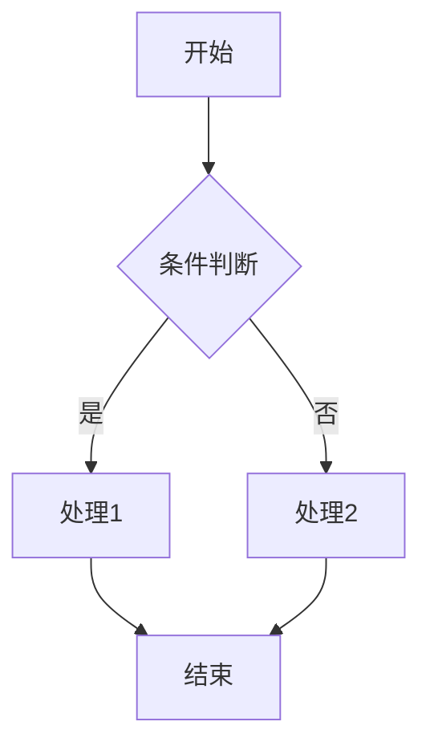

!!! note "主要作者"

    [@Paulkm2006](https://github.com/Paulkm2006)

## Markdown 进阶语法

Markdown 除了基本的文本格式化，还支持更高级的功能，如公式、HTML 标签和图表等。下面将分别介绍这些进阶用法。

### 1. 数学公式

Markdown 支持使用 LaTeX 语法书写数学公式，常见于支持 MathJax 或 KaTeX 的渲染器中。

**行内公式**：使用 `$...$` 包裹公式内容  
例如：`$E=mc^2$` 显示为 $E=mc^2$

**块级公式**：使用 `$$...$$` 包裹公式内容  
例如：
```
$$
\int_{a}^{b} f(x)\,dx = F(b) - F(a)
$$
```
显示为：

<p align="center">
    

</p>

### 2. HTML 标签与 CSS 样式

Markdown 支持直接嵌入原生 HTML 标签，以实现更复杂的排版和样式。例如：

```html
<!-- 插入一个带颜色的段落并居中 -->
<p style="color: red;text-align: center;">这是一个红色的段落。</p>

<!-- 插入图片，自定义大小并居中 -->
<p align="center">
    
</p>

<!-- 使用 HTML 插入表格（不推荐） -->
<table>
    <tr>
        <td>Foo</td>
        <td>Bar</td>
    </tr>
    <tr>
        <td>Hello</td>
        <td>World</td>
    </tr>
</table>

```

<p style="color: red;text-align: center;">这是一个红色的段落。</p>
<p align="center">
    
</p>

<table>
    <tr>
        <td>Foo</td>
        <td>Bar</td>
    </tr>
    <tr>
        <td>Hello</td>
        <td>World</td>
    </tr>
</table>

!!! tips

    部分 Markdown 渲染器可能会限制某些 HTML 标签的使用。若非特殊情况，请尽量使用原生Markdown语法而不是HTML标签。

### 3. 图表

部分 Markdown 编辑器或平台（如 Typora、Obsidian、Jupyter Notebook）支持通过代码块插入图表，常见语法有 Mermaid。




mermaid 提供了[在线的图标编辑器](https://www.mermaidchart.com/play)，编辑好后复制左侧 markdown 代码即可。

!!! tips
    
    使用图表功能时，请确保你的 Markdown 渲染器支持相应的语法。

### 4. 图片进阶


#### 使用图床

在插入图片时，我们需要确保图片的 URL 可以被外界访问。当我们只能提交一个文件时，就可以使用一种叫“图床”的工具上传图片。

常用的图床有 [sm.ms 图床（需登录）](https://sm.ms/) [jike 图床（浏览器插件）](https://jiketuchuang.com/)

我们同样可以选择使用阿里云 OSS 或 Github 仓库等储存图片。

#### 插入徽章（Badge）

徽章（Badge）是一种小型的图标标签，常用于展示项目状态、版本信息、构建状态等。在 Markdown 中，我们可以通过图片链接的方式插入徽章。


```markdown
展示 Github Star 状态


展示许可证信息


展示构建状态


展示版本信息


展示代码语言

```

效果如下：


你可以访问 [shields.io](https://shields.io/) 来生成自定义的徽章。

---
更多高级用法可参考各平台的官方文档或插件说明。