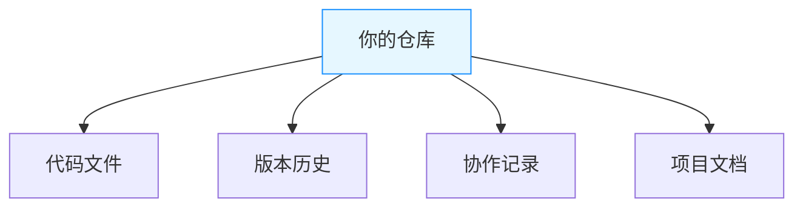
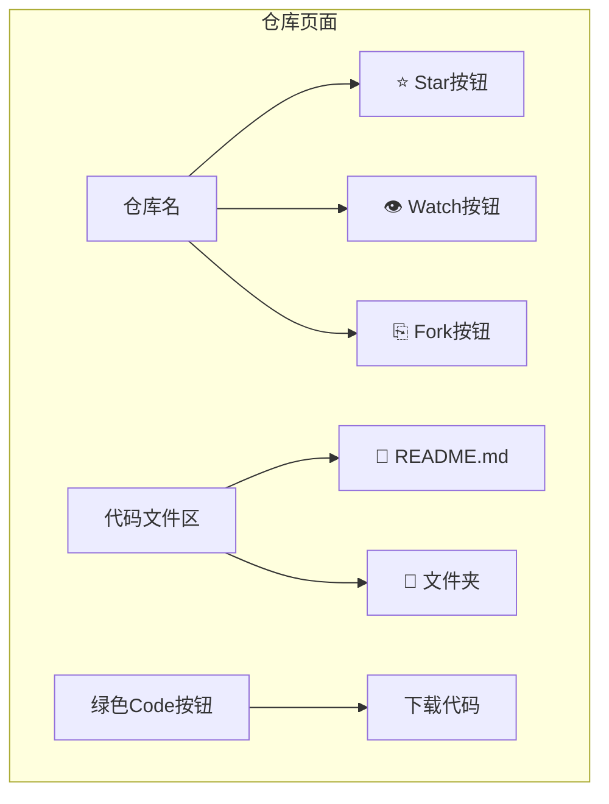

# 代码托管平台简介

> 本子节旨在让学生了解如何使用代码托管平台（如 GitHub、Gitee 等）进行代码管理与协作，掌握平台的基本功能和常用操作。

---

## 什么是代码托管平台

代码托管平台是一种基于云服务的开发协作工具，主要用于存储、管理和协同开发代码项目。它通过集成版本控制系统（如 Git）、协作工具和自动化流程，为开发者提供全生命周期的代码管理支持，是现代软件开发和开源生态的核心基础设施。

!!! note "云存档：理解代码托管的本质"

    **核心价值类比**：代码托管平台的核心功能类似于游戏的**云存档**系统：
    
    | 游戏场景             | 代码托管场景                | 解决的问题               |
    |----------------------|---------------------------|--------------------------|
    | 本地存档易丢失       | 本地代码无备份             | 数据安全                 |
    | 多设备同步存档       | 多电脑开发无缝切换         | 开发连续性               |
    | 创建多个存档点       | 版本控制 (commit 历史)       | 版本回溯                 |
    | 多人联机协作         | 团队协同开发               | 协作冲突管理             |
    
    **实际案例**：当你在开发游戏时：  
    1. 本地开发 → 相当于单机游戏  
    2. 上传至 GitHub → 启用云存档  
    3. 队友克隆 (clone) 项目 → 多人联机加入世界  
    4. 提交 Pull Request → 申请将你的建筑加入主世界

## 平台基本功能与操作

### 仓库以及其浏览与搜索

#### 什么是仓库

仓库（Repo）就像是一个**共享的游戏存档文件夹**，里面包含项目的所有内容（代码/素材/文档）。与本地文件夹不同：

- 🌩️ **云端存储**：代码永不丢失，多设备可访问
- 🕰️ **历史记录**：每次修改自动生成存档点（版本）
- 👥 **多人协作**：支持多人同时编辑（自动合并修改）

仓库是你的项目在云端的"家"：

#### 浏览仓库

如果你想浏览平台上的仓库（比如 GitHub 或 Gitee），可以按照以下步骤操作：

1. **打开平台网站**：首先，访问 GitHub 或 Gitee 的官方网站。
2. **查找感兴趣的仓库**：在首页或搜索栏中输入你感兴趣的关键词，比如项目名称或编程语言。
3. **进入仓库详情页面**：点击你感兴趣的仓库名称，进入仓库详情页面。在这里，你可以查看代码、问题、拉取请求等内容。

#### 界面速览（GitHub 示例）

#### 搜索仓库

如果你想更精准地找到某个仓库，可以使用搜索功能：

1. **输入关键词**：在搜索栏中输入关键词，比如项目名称、编程语言等。
2. **使用过滤器**：为了缩小搜索范围，你可以使用过滤器，比如按语言、星标数、更新时间等进行筛选。
3. **查看搜索结果**：点击搜索结果中的仓库名称，进入仓库详情页面，查看详细信息。

### 其他常见术语

!!! tip "核心概念速记"

    掌握这些基础术语即可开始使用（后续课程会深入讲解）：
    
    | 术语           | 作用                  | 相当于        |
    | :------------ | :-------------------- | :------------ |
    | **Fork**      | 创建独立副本          | 项目另存为    |
    | **Star**      | 收藏项目              | 添加书签      |
    | **Watch**     | 订阅更新              | 开启提醒      |
    | **Issues**    | 问题追踪              | 任务清单      |
    | **Pull Request** | 提交修改           | 方案提案      |

#### 1。**复制仓库（Fork）**

- **是什么**：将别人的仓库复制到自己的账户下，就像你在微博上“转发”一条动态到自己的主页一样。
- **为什么重要**：让你可以自由修改代码，就像你可以在转发的内容上加自己的评论或修改。同时，你还可以将改进贡献回原项目。
- **使用场景**：参与开源项目、实验性修改，就像你看到一篇有趣的文章，想自己试试修改后再分享给别人。

---

#### 2。**点赞/收藏（Star）**

- **是什么**：对仓库点赞，表示支持或收藏，就像你在小红书或微博上给喜欢的帖子点个赞或收藏起来。
- **为什么重要**：方便你快速找到喜欢的项目，同时也是对开发者的鼓励，就像你收藏了一篇好文章，以后可以随时翻出来看。
- **使用场景**：收藏优质项目、支持开发者，比如你看到一个很棒的工具库，点个 Star 表示支持。

---

#### 3。**关注仓库（Watch）**

- **是什么**：关注仓库，接收更新通知，就像你在虎扑或贴吧上关注一个话题，每次有新回复都会提醒你。
- **为什么重要**：让你随时了解项目的动态，比如新功能发布或 Bug 修复，就像你关注的博主发了新内容，你会第一时间知道。
- **使用场景**：跟踪感兴趣的项目、参与社区讨论，比如你关注了一个开源项目，想随时了解它的进展。

---

#### 4。**问题跟踪（Issues）**

- **是什么**：用于报告 Bug、提出新功能或讨论任务，就像你在 Steam 社区或贴吧里发帖提问或反馈问题。
- **为什么重要**：是项目管理和协作的核心工具，帮助开发者沟通和解决问题，就像你在论坛上发帖后，其他人可以回复并提供解决方案。
- **使用场景**：报告问题、提出改进建议、讨论技术细节，比如你发现了一个 Bug，可以在 Issues 里提出来。

---

#### 5。**代码合并请求（Pull Request/Merge Request）**

- **是什么**：请求将你的代码修改合并到原项目，就像你在贴吧或论坛上写了一篇长文，希望版主把它加进精华帖里。
- **为什么重要**：是开源贡献的核心方式，让开发者可以协作改进代码，就像你写了一篇好文章，希望更多人看到并认可。
- **使用场景**：提交代码改进、修复 Bug、添加新功能，比如你修复了一个问题，可以提交 Pull Request 让原作者合并你的修改。

---

#### 6。**自动化工作流（CI/CD）**

- **是什么**：自动化测试、构建和部署的工具，就像你在 Steam 上设置了自动更新游戏，每次有新版本都会自动下载安装。
- **为什么重要**：提升开发效率，确保代码质量，就像你设置了自动回复，不用每次手动处理重复的事情。
- **使用场景**：自动化测试、持续集成/持续交付，比如每次提交代码后，自动运行测试并发布新版本。
- **案例**:[开源操作系统训练营的自动化测评](https://github.com/LearningOS/template-2024a-rcore/blob/ch8/.github/workflows/build.yml)，[本教程](https://github.com/hust-open-atom-club/intro2oss/actions)

---

## 常用代码托管平台

| **平台**      | **核心特点**                                                       | **适用场景**               |
| ------------------- | ------------------------------------------------------------------------ | -------------------------------- |
| **GitHub**    | 全球最大开源社区，功能全面，CI/CD（GitHub Actions），私有仓库有限        | 开源项目、个人开发者、企业项目   |
| **GitLab**    | 一体化 DevOps，内置 CI/CD，支持私有部署，免费版功能强大                  | 企业级 DevOps、私有部署          |
| **Gitee**     | 国内访问快，中文支持好，适合国内开发者，CI/CD 国内优化                   | 国内开发者、企业项目、开源项目   |
| **AtomGit**   | 新兴平台，简洁易用，国内访问较快                                         | 个人开发者、小型团队             |
| **Bitbucket** | 与 Atlassian 工具集成（Jira、Trello），CI/CD（Pipelines），私有仓库有限  | 企业团队、Atlassian 工具用户     |
| **GitLink**   | CCF 官方支持，专注科研开源生态，符合国内合规标准，支持项目孵化与学术协作 | 学术研究、国内开源项目、教育领域 |

**一句话总结**：

- **GitHub**：全球开源标杆。
- **GitLab**：企业 DevOps 首选。
- **Gitee**：国内开发者的好选择。
- **AtomGit**：简洁易用的新兴平台。
- **Bitbucket**：Atlassian 生态集成。
- **GitLink**：学术开源新阵地。

### ❓ 新手常见问题

Q：一定要用 Git 命令吗？  
A：**不需要！** 平台提供网页操作（上传/下载/编辑），入门可不学命令

Q：私有项目收费吗？  
A：主流平台（GitHub/Gitee/GitLink）**免费提供私有仓库**

Q：代码被看到会泄密吗？  
A：创建时选择 🔒**Private**（私有）选项即可隐藏代码

## 总结

!!! summary "学习目标"
    - 了解常见的代码托管平台（如 GitHub、Gitee 等）及其基本功能。
    - 学会在浏览器中浏览和搜索仓库。
    - 掌握平台的基本概念，如 Fork、Star、Watch 等。  

!!! tip "下一步学习"
    - [Git 十分钟入门](https://try.github.io)
    - [GitHub 官方新手教程](https://docs.github.com/zh/get-started)
    - [Gitee 帮助中心](https://gitee.com/help)

这些技能将为后续的代码开发、团队协作和开源贡献打下坚实的基础。
