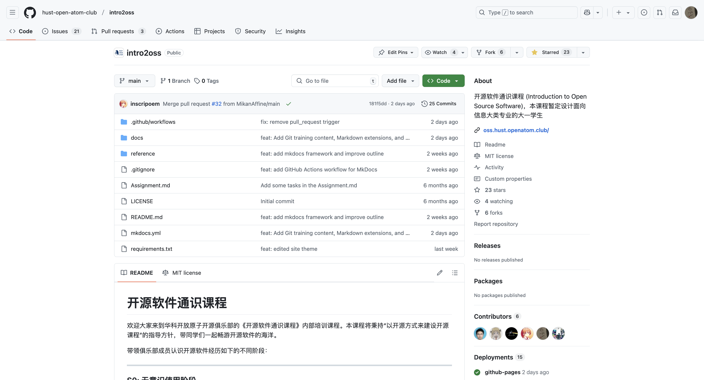

# 代码托管平台简介

> 本子节旨在让学生了解如何使用代码托管平台（如 GitHub、Gitee 等）进行代码管理与协作，掌握平台的基本功能和常用操作。

---

## 什么是代码托管平台

代码托管平台是一种基于云服务的开发协作工具，主要用于存储、管理和协同开发代码项目。它通过集成版本控制系统（如 Git）、协作工具和自动化流程，为开发者提供全生命周期的代码管理支持，是现代软件开发和开源生态的核心基础设施。

!!! note "云存档：理解代码托管的本质"

    **核心价值类比**：代码托管平台的核心功能类似于游戏的**云存档**系统：
    
    | 游戏场景             | 代码托管场景                | 解决的问题               |
    |----------------------|---------------------------|--------------------------|
    | 本地存档易丢失       | 本地代码无备份             | 数据安全                 |
    | 多设备同步存档       | 多电脑开发无缝切换         | 开发连续性               |
    | 创建多个存档点       | 版本控制 (commit 历史)       | 版本回溯                 |
    | 多人联机协作         | 团队协同开发               | 协作冲突管理             |
    
    **实际案例**：当你在开发游戏时：  
    1. 本地开发 → 相当于单机游戏  
    2. 上传至 GitHub → 启用云存档  
    3. 队友克隆 (clone) 项目 → 多人联机加入世界  
    4. 提交 Pull Request → 申请将你的建筑加入主世界

## 平台基本功能与操作

### 仓库以及其浏览与搜索

#### 什么是仓库

仓库（Repo）就像是一个**共享的游戏存档文件夹**，里面包含项目的所有内容（代码/素材/文档）。与本地文件夹不同：

- 🌩️ **云端存储**：代码永不丢失，多设备可访问
- 🕰️ **历史记录**：每次修改自动生成存档点（版本）
- 👥 **多人协作**：支持多人同时编辑（自动合并修改）

仓库是你的项目在云端的"家"：


#### 浏览仓库

如果你想浏览平台上的仓库（比如 GitHub 或 Gitee），可以按照以下步骤操作：

1. **打开平台网站**：首先，访问 GitHub 或 Gitee 的官方网站。
2. **查找感兴趣的仓库**：在首页或搜索栏中输入你感兴趣的关键词，比如项目名称或编程语言。
3. **进入仓库详情页面**：点击你感兴趣的仓库名称，进入仓库详情页面。在这里，你可以查看代码、问题、拉取请求等内容。

#### 界面速览（GitHub 示例）


#### 搜索仓库

如果你想更精准地找到某个仓库，可以使用搜索功能：

1. **输入关键词**：在搜索栏中输入关键词，比如项目名称、编程语言等。
2. **使用过滤器**：为了缩小搜索范围，你可以使用过滤器，比如按语言、星标数、更新时间等进行筛选。
3. **查看搜索结果**：点击搜索结果中的仓库名称，进入仓库详情页面，查看详细信息。

### 其他常见术语

!!! tip "核心概念速记"

    掌握这些基础术语即可开始使用（后续课程会深入讲解）：
    
    | 术语           | 作用                  | 相当于        |
    | :------------ | :-------------------- | :------------ |
    | **Fork**      | 创建独立副本          | 项目另存为    |
    | **Star**      | 收藏项目              | 添加书签      |
    | **Watch**     | 订阅更新              | 开启提醒      |
    | **Issues**    | 问题追踪              | 任务清单      |
    | **Pull Request** | 提交修改           | 方案提案      |

#### 1。**复制仓库（Fork）**

- **是什么**：将别人的仓库复制到自己的账户下，就像你在微博上“转发”一条动态到自己的主页一样。
- **为什么重要**：让你可以自由修改代码，就像你可以在转发的内容上加自己的评论或修改。同时，你还可以将改进贡献回原项目。
- **使用场景**：参与开源项目、实验性修改，就像你看到一篇有趣的文章，想自己试试修改后再分享给别人。

---

#### 2。**点赞/收藏（Star）**

- **是什么**：对仓库点赞，表示支持或收藏，就像你在小红书或微博上给喜欢的帖子点个赞或收藏起来。
- **为什么重要**：方便你快速找到喜欢的项目，同时也是对开发者的鼓励，就像你收藏了一篇好文章，以后可以随时翻出来看。
- **使用场景**：收藏优质项目、支持开发者，比如你看到一个很棒的工具库，点个 Star 表示支持。

---

#### 3。**关注仓库（Watch）**

- **是什么**：关注仓库，接收更新通知，就像你在虎扑或贴吧上关注一个话题，每次有新回复都会提醒你。
- **为什么重要**：让你随时了解项目的动态，比如新功能发布或 Bug 修复，就像你关注的博主发了新内容，你会第一时间知道。
- **使用场景**：跟踪感兴趣的项目、参与社区讨论，比如你关注了一个开源项目，想随时了解它的进展。

---

#### 4。**问题跟踪（Issues）**

- **是什么**：用于报告 Bug、提出新功能或讨论任务，就像你在 Steam 社区或贴吧里发帖提问或反馈问题。
- **为什么重要**：是项目管理和协作的核心工具，帮助开发者沟通和解决问题，就像你在论坛上发帖后，其他人可以回复并提供解决方案。
- **使用场景**：报告问题、提出改进建议、讨论技术细节，比如你发现了一个 Bug，可以在 Issues 里提出来。

---

#### 5。**代码合并请求（Pull Request/Merge Request）**

- **是什么**：请求将你的代码修改合并到原项目，就像你在贴吧或论坛上写了一篇长文，希望版主把它加进精华帖里。
- **为什么重要**：是开源贡献的核心方式，让开发者可以协作改进代码，就像你写了一篇好文章，希望更多人看到并认可。
- **使用场景**：提交代码改进、修复 Bug、添加新功能，比如你修复了一个问题，可以提交 Pull Request 让原作者合并你的修改。

---

#### 6。**自动化工作流（CI/CD）**

- **是什么**：自动化测试、构建和部署的工具，就像你在 Steam 上设置了自动更新游戏，每次有新版本都会自动下载安装。
- **为什么重要**：提升开发效率，确保代码质量，就像你设置了自动回复，不用每次手动处理重复的事情。
- **使用场景**：自动化测试、持续集成/持续交付，比如每次提交代码后，自动运行测试并发布新版本。
- **案例**:[开源操作系统训练营的自动化测评](https://github.com/LearningOS/template-2024a-rcore/blob/ch8/.github/workflows/build.yml)，[本教程](https://github.com/hust-open-atom-club/intro2oss/actions)

---

## 常用代码托管平台

| **平台**      | **核心特点**                                                       | **适用场景**               |
| ------------------- | ------------------------------------------------------------------------ | -------------------------------- |
| **GitHub**    | 全球最大开源社区，功能全面，CI/CD（GitHub Actions），私有仓库有限        | 开源项目、个人开发者、企业项目   |
| **GitLab**    | 一体化 DevOps，内置 CI/CD，支持私有部署，免费版功能强大                  | 企业级 DevOps、私有部署          |
| **Gitee**     | 国内访问快，中文支持好，适合国内开发者，CI/CD 国内优化                   | 国内开发者、企业项目、开源项目   |
| **AtomGit**   | 新兴平台，简洁易用，国内访问较快                                         | 个人开发者、小型团队             |
| **Bitbucket** | 与 Atlassian 工具集成（Jira、Trello），CI/CD（Pipelines），私有仓库有限  | 企业团队、Atlassian 工具用户     |
| **GitLink**   | CCF 官方支持，专注科研开源生态，符合国内合规标准，支持项目孵化与学术协作 | 学术研究、国内开源项目、教育领域 |

**一句话总结**：

- **GitHub**：全球开源标杆。
- **GitLab**：企业 DevOps 首选。
- **Gitee**：国内开发者的好选择。
- **AtomGit**：简洁易用的新兴平台。
- **Bitbucket**：Atlassian 生态集成。
- **GitLink**：学术开源新阵地。

### ❓ 新手常见问题

Q：一定要用 Git 命令吗？  
A：**不需要！** 平台提供网页操作（上传/下载/编辑），入门可不学命令

Q：私有项目收费吗？  
A：主流平台（GitHub/Gitee/GitLink）**免费提供私有仓库**

Q：代码被看到会泄密吗？  
A：创建时选择 🔒**Private**（私有）选项即可隐藏代码

## 总结

!!! summary "学习目标"
    - 了解常见的代码托管平台（如 GitHub、Gitee 等）及其基本功能。
    - 学会在浏览器中浏览和搜索仓库。
    - 掌握平台的基本概念，如 Fork、Star、Watch 等。  

!!! tip "下一步学习"
    - [Git 十分钟入门](https://try.github.io)
    - [GitHub 官方新手教程](https://docs.github.com/zh/get-started)
    - [Gitee 帮助中心](https://gitee.com/help)

这些技能将为后续的代码开发、团队协作和开源贡献打下坚实的基础。

# 实践：注册并熟悉代码托管平台

> 学生注册代码托管平台账户并熟悉其功能。注册 GitHub、Gitee 等平台的账号。了解平台的主要功能界面，并做出一些尝试。

## 具体步骤

在开始动手注册之前，先简单了解一下：**GitHub 是什么？为什么要注册它？**

GitHub 是全球最大的开源代码托管平台，开发者可以在上面托管代码、协作开发、参与项目和展示作品。就像“程序员的朋友圈 + 代码仓库”。

注册账号后，你可以：

- 创建自己的项目仓库，记录代码和笔记；
- 浏览其他人公开的项目，学习优秀代码；
- 提交贡献，积累开源经验；
- 用它提升简历竞争力。

接下来，我们就一步步完成注册 👇

### 1。注册账号

1. **访问平台网站**：
   - GitHub: [https://github.com](https://github.com)
   - Gitee: [https://gitee.com](https://gitee.com)
2. **创建账户**：
   - 点击“Sign up”或“注册”按钮，按照提示填写信息完成注册。

??? tip "注册之后可以做的事"

    完成 GitHub 注册后，可以做这些事：  

    1. **安全**：启用两步验证（2FA），绑定备用邮箱，生成 SSH 密钥；  
    2. **个人品牌**：设置简短易记的 ID、自己喜欢头像、技术向简介（Bio）；  
    3. **主页优化**：创建同名仓库写 Profile README（技术栈/项目展示），Pin 6 个优质仓库；  
    4. **学生福利**：认证 GitHub Student Pack 免费解锁 Pro 功能；  
    意义：提升账户安全，建立专业形象，增加曝光机会，融入开发者社区，为求职或协作积累信用资产。

### 2。熟悉 github 平台功能

#### Dashboard 页面

注册之后登录首先看到的应该是你的 Dashboard 界面，就像下图这样，不过你的可能比较空白（😁）


图 1。Dashboard
{： 。caption}

???+ node "Dashboard 的介绍"

    GitHub Dashboard 是用户登录后的主工作界面，集中显示关注仓库的动态更新、推荐项目、待处理通知（Issues/PR）、近期代码提交记录，以及个人仓库列表和团队动态，支持快速跳转到代码审查、仓库管理等功能模块。

#### repository 页面

注册之后就可以做一些操作了，比如说收藏一个仓库，就是给这个仓库一颗 ⭐️，可以点击[这里](https://github.com/hust-open-atom-club/intro2oss)去送出你的第一颗 ⭐️



图 2。Repository
{： 。caption}

???+ node "repository 的介绍"

    在 GitHub 仓库页面中，您会看到代码文件列表、README 文件、顶部导航栏（包括 Issues、Pull Requests、Actions、Projects、Wiki）、右侧功能栏（About、Releases、Packages、Contributors），以及 Issue 页面的左侧栏（Assignees、Labels、Projects、Milestone、Development）。此外，还有 Star、Fork、Watch、Code 等功能。建议从 README 文件开始，逐步熟悉 Issues 和 Pull Requests 等协作功能。

## 总结

!!! summary "学习目标"
    - 掌握代码托管平台（如 GitHub、Gitee）的注册与基本操作流程
    - 熟悉 GitHub 的核心功能界面，包括 Dashboard、Repository
    - 尝试使用 Star、Fork、Watch 等功能参与开源项目

# 创建并管理仓库 (Repository)

> 本实验旨在帮助学生掌握如何创建并管理云端代码仓库，并建立本地与云端仓库的同步连接。我们将通过两种不同的途径实现这一目标：一种是从 GitHub 网站开始操作，另一种是从本地计算机开始操作。

---

## 远程和本地

在开发和协作时，我们经常需要区分两个重要概念：

- **本地**：指你手头的电脑环境，包括你正在编写的代码、运行的测试工具等。比如你笔记本上的代码文件就是本地文件。
- **远程**：指网络上的共享空间，比如 GitHub 这类代码托管平台。就像云盘一样，你可以把代码存上去与他人共享。

理解这两个概念的区别和联系非常重要：

- **本地**是你个人工作的起点，所有代码和修改最初都是在本地完成的。
- **远程**是团队协作和共享的基础，通过将本地的更改推送到远程，你可以与他人共享代码、协同开发，并确保代码的安全备份。

这两个概念配合使用：

- 你在**本地**完成代码修改
- 把改动推送到**远程**仓库分享给团队
- 队友从**远程**拉取最新代码到他们本地

在 Git 中，**本地**通常指你的本地仓库，而**远程**指远程仓库（如 GitHub）。你需要通过 `git push` 将本地的更改同步到远程，或通过 `git pull` 将远程的更新拉取到本地。这种“本地 - 远程”协作模式是现代开发的核心实践之一。


随着经验积累，你会发现这种**本地修改 - 云端同步**的模式无处不在：

- 本地开发环境 vs 远程部署环境
- 本地数据库 vs 远程数据库
- 本地测试 vs 远程持续集成（CI）

掌握这种思维方式，将帮助你更好地理解开源的工作流程。

---

## 准备工作

在开始前，请确保：

1. 已安装 [Git](https://git-scm.com/downloads)
2. 已注册 [GitHub 账号](https://github.com/signup)
3. 已配置 Git 用户名和邮箱（首次使用需要）：

```bash
git config --global user.name "你的名字"
git config --global user.email "你的邮箱"
```

---

## 从 GitHub 网站开始

- **创建远程仓库**：登录 GitHub 并点击“New repository”按钮。填写仓库名称、描述并选择公开或私有。点击“Create repository”完成创建。


- **克隆仓库到本地**：复制新仓库的克隆 URL。在终端中使用以下命令将仓库克隆到本地：

```bash
$ git clone https://github.com/ywh555hhh/MyFirstRepo.git #这就是你要输入的命令，你要输入的网址和这个会不一样
Cloning into 'MyFirstRepo'...
remote: Enumerating objects: 4, done.
remote: Counting objects: 100% (4/4), done.
remote: Compressing objects: 100% (4/4), done.
remote: Total 4 (delta 0), reused 0 (delta 0), pack-reused 0 (from 0)
Receiving objects: 100% (4/4), 4.79 KiB | 4.79 MiB/s, done.
```

!!! tip "不喜欢命令行？试试 GitHub Desktop！"

    1. [下载 GitHub Desktop](https://desktop.github.com/)  
    2. 登录你的 GitHub 账号  
    3. 创建仓库：File → New repository  
    4. 点击"Publish repository"同步到 GitHub
  
- **进行更改并提交**：在本地仓库中进行一些更改，例如添加新文件或修改现有文件。

使用以下命令提交更改：

```bash
git add .
git commit -m "Your commit message"
```

- 在添加文件前，可使用 `git status` 查看当前文件状态：

```bash
git status
# 会显示红色的"Untracked files"（未跟踪文件）
# 这些文件需要先添加到暂存区才能提交
```

- **推送更改**：使用以下命令将更改推送到远程仓库：

```bash
git push origin main
```

---

## 从本地开始

### 初始化本地仓库

> 📌 为什么要初始化？  
> 这就像给你的项目文件夹装上"记忆芯片"，Git 才能开始记录你的每一次修改

- 打开终端或命令行工具（Windows 用户可以使用 Git Bash，macOS 和 Linux 用户可以使用 Terminal）。

- 使用 `cd` 命令导航到你希望创建仓库的文件夹：

```bash
cd /path/to/your/project-folder
```

- 使用 `git init` 初始化一个新的 Git 仓库，这会创建一个隐藏的 `.git` 文件夹，Git 就能在这个文件夹中管理你的项目版本了：

```bash
git init
```

执行后会显示：

```bash
Initialized empty Git repository in /path/to/your/project-folder/.git/
```

💡 这个提示说明你的仓库已成功创建！

- **意义**：这一步告诉 Git 你要开始在这个文件夹中跟踪文件的更改，形成版本控制。

### 创建初始文件

- 在项目文件夹中，创建一些初始文件，例如 `README.md`（用于项目描述）和 `.gitignore`（用于忽略不需要版本控制的文件，如临时文件、日志文件等）。
- 使用文本编辑器打开这些文件并添加内容。比如在 `README.md` 中写一些项目的基本信息。
- 使用以下命令将这些文件添加到 Git 的暂存区：

```bash
git add .
```

**解释**：`git add .` 会将当前文件夹中的所有更改文件（包括新建的文件）添加到暂存区，准备提交。

- 使用 `git commit` 命令提交这些文件，`-m` 后面跟着的是提交说明：

```bash
git commit -m "Initial commit"
```

- **意义**：提交记录了你对文件的更改，并为后续的版本控制奠定基础。提交信息 `"Initial commit"` 是用来描述这次提交的内容。

- **这样做的好处**：相当于给当前代码拍个快照，以后随时可以回退到这个版本。提交信息就是给这个快照写的备注。

### 连接到远程仓库

- 打开 GitHub 或其他 Git 托管服务，创建一个新的空仓库。无需勾选“Initialize this repository with a README”选项，因为我们已经在本地创建了一个 `README.md` 文件。
- 复制新仓库的远程 URL，通常会是 `https://github.com/yourusername/yourrepository.git`。
- 在本地仓库中使用以下命令将本地仓库与远程仓库关联：

```bash
git remote add origin https://github.com/yourusername/yourrepository.git
```

✅ 验证是否添加成功：

```bash
git remote -v
```

应该显示：

```bash
origin  https://github.com/yourusername/yourrepository.git (fetch)
origin  https://github.com/yourusername/yourrepository.git (push)
```

- **意义**：这一步把本地仓库和远程仓库连接起来，告诉 Git 在远程仓库中保存你的代码。

### 推送更改到远程仓库

- 使用 `git push` 命令将本地的提交推送到远程仓库。首次推送时需要加上 `-u` 参数，表示设置远程仓库为默认的推送目标：

```bash
git push -u origin main
```

- **意义**：`git push` 是将本地的提交上传到远程仓库，`main` 是你本地分支的名字。如果是第一次推送，它会将本地的 `main` 分支推送到远程仓库。

推送成功后，你应该看到类似提示：

```bash
Enumerating objects: 3, done.
Writing objects: 100% (3/3), 240 bytes | 240.00 KiB/s, done.
To https://github.com/yourname/yourrepo.git
 * [new branch]      main -> main
Branch 'main' set up to track remote branch 'main' from 'origin'.
```

---

## 💡 遇到问题怎么办？

1. 权限错误：检查远程 URL 是否正确 `git remote -v`
2. 分支冲突：首次推送尝试 `git push -u origin HEAD`
3. 认证失败：更新 Git 凭证 `git config --global credential.helper cache`
4. 总是先拉取更新：`git pull --rebase` 避免冲突

---

## 私人仓库和公共仓库

当前内容主要关注如何创建和管理**私人仓库**，即仅你自己或指定的合作者可以访问的仓库。这种类型的仓库适合用于存放个人项目、学习代码或敏感数据。

> 🆓 小贴士：GitHub 现在提供无限免费私人仓库！创建时只需选择"Private"选项即可

如果你计划创建和管理**公共仓库**（即所有人都可以访问的仓库），需要注意以下几点：

1. **许可证选择**：公共仓库通常需要明确项目的开源许可证（如 MIT、GPL 等），以便告知他人如何使用你的代码。
2. **文档完善**：在公共仓库中，良好的文档是关键，包括 `README.md` 详细描述项目、`CONTRIBUTING.md` 说明贡献流程。
3. **代码规范**：保持清晰的代码结构和风格，方便其他开发者理解和参与项目。
4. **安全检查**：确保提交到公共仓库的代码中没有敏感信息（如 API 密钥、配置文件等），以免造成不必要的风险。

如果你有兴趣进一步了解公共仓库的管理，可以专门针对这些注意事项进行深入学习！

## ✅ 学习进度自查

阅读本教程后，你应该能够：

- [ ] 在 GitHub 创建新仓库
- [ ] 将仓库克隆到本地
- [ ] 在本地初始化 Git 仓库
- [ ] 添加文件并提交更改
- [ ] 连接本地与远程仓库
- [ ] 推送更改到 GitHub  

# GitHub Fork 简明解析

## 什么是 Fork？

**Fork** 是 GitHub 上的一项功能，允许你将别人的项目仓库完整复制到自己的 GitHub 账户下。
  相当于你获得了该项目的独立副本，可以自由查看、修改，且不会影响原项目。

  ---

## Fork 的核心作用（开源场景下）

  1. **独立实验**
     在自己的副本中测试代码、修改功能，无需担心破坏原项目。
     *示例：你想尝试给某个开源工具添加新功能，但不确定是否可行，Fork 后即可安全实验。*

  2. **保存代码快照**
     将某个时间点的项目状态保存为你的副本，便于后续参考或恢复。
     *示例：原项目可能更新版本后删除了某些旧功能，你可以通过 Fork 保留旧版代码。*

  3. **二次开发基础**
     基于原项目创建自己的新版本（需遵守开源协议）。
     *示例：著名的 Linux 系统有众多衍生版本（如 Ubuntu、Debian），均通过 Fork 机制发展而来。*

  ---

## 如何在 GitHub 上 Fork？

  1. **找到目标仓库**
     登录 GitHub，访问你想复制的项目页面（以[华科开放原子俱乐部的开源镜像站项目](https://github.com/hust-open-atom-club/hust-mirrors)为例）。

  2. **点击 Fork 按钮**
     在页面右上角找到 **Fork** 按钮（通常位于“Star”按钮旁），点击后选择你的账户。

     

     然后点击 Creat fork 即可：

     

  3. **完成复制**
     等待几秒钟，系统会自动生成你的副本仓库，地址为：
     `https://github.com/你的用户名/仓库名`

  ---

## 重要注意事项

- **副本独立性**：Fork 后的仓库与原项目完全隔离，你的修改仅影响自己的副本。
- **开源协议**：若原项目有开源协议（如 MIT、GPL），你的副本仍需遵守其规则。
- **无需权限**：任何人都可以 Fork 公开仓库，无需原作者批准。
