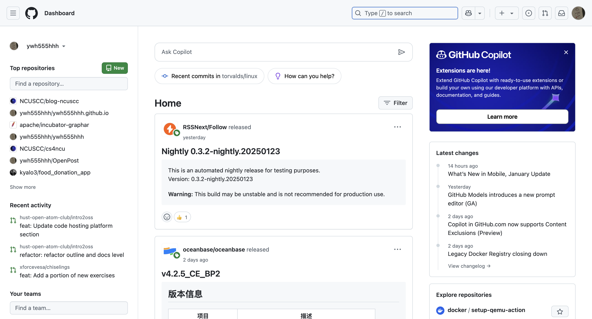
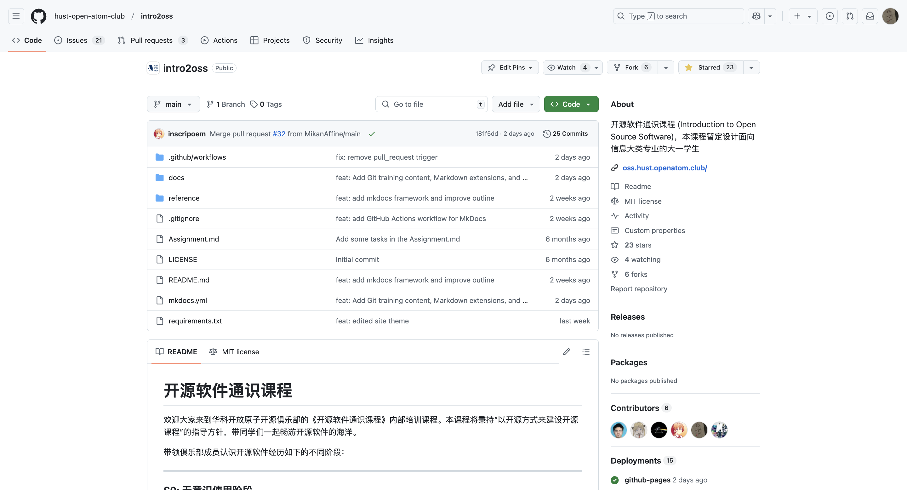

# 实践：注册并熟悉代码托管平台

> 学生注册代码托管平台账户并熟悉其功能。注册 GitHub、Gitee 等平台的账号。了解平台的主要功能界面，并做出一些尝试。

## 具体步骤

在开始动手注册之前，先简单了解一下：**GitHub 是什么？为什么要注册它？**

GitHub 是全球最大的开源代码托管平台，开发者可以在上面托管代码、协作开发、参与项目和展示作品。就像“程序员的朋友圈 + 代码仓库”。

注册账号后，你可以：

- 创建自己的项目仓库，记录代码和笔记；
- 浏览其他人公开的项目，学习优秀代码；
- 提交贡献，积累开源经验；
- 用它提升简历竞争力。

接下来，我们就一步步完成注册 👇

### 1。注册账号

1. **访问平台网站**：
   - GitHub: [https://github.com](https://github.com)
   - Gitee: [https://gitee.com](https://gitee.com)
2. **创建账户**：
   - 点击“Sign up”或“注册”按钮，按照提示填写信息完成注册。

??? tip "注册之后可以做的事"

    完成 GitHub 注册后，可以做这些事：  

    1. **安全**：启用两步验证（2FA），绑定备用邮箱，生成 SSH 密钥；  
    2. **个人品牌**：设置简短易记的 ID、自己喜欢头像、技术向简介（Bio）；  
    3. **主页优化**：创建同名仓库写 Profile README（技术栈/项目展示），Pin 6 个优质仓库；  
    4. **学生福利**：认证 GitHub Student Pack 免费解锁 Pro 功能；  
    意义：提升账户安全，建立专业形象，增加曝光机会，融入开发者社区，为求职或协作积累信用资产。

### 2。熟悉 github 平台功能

#### Dashboard 页面

注册之后登录首先看到的应该是你的 Dashboard 界面，就像下图这样，不过你的可能比较空白（😁）

图 1。Dashboard
{： 。caption}

???+ node "Dashboard 的介绍"

    GitHub Dashboard 是用户登录后的主工作界面，集中显示关注仓库的动态更新、推荐项目、待处理通知（Issues/PR）、近期代码提交记录，以及个人仓库列表和团队动态，支持快速跳转到代码审查、仓库管理等功能模块。

#### repository 页面

注册之后就可以做一些操作了，比如说收藏一个仓库，就是给这个仓库一颗 ⭐️，可以点击[这里](https://github.com/hust-open-atom-club/intro2oss)去送出你的第一颗 ⭐️

图 2。Repository
{： 。caption}

???+ node "repository 的介绍"

    在 GitHub 仓库页面中，您会看到代码文件列表、README 文件、顶部导航栏（包括 Issues、Pull Requests、Actions、Projects、Wiki）、右侧功能栏（About、Releases、Packages、Contributors），以及 Issue 页面的左侧栏（Assignees、Labels、Projects、Milestone、Development）。此外，还有 Star、Fork、Watch、Code 等功能。建议从 README 文件开始，逐步熟悉 Issues 和 Pull Requests 等协作功能。

## 总结

!!! summary "学习目标"
    - 掌握代码托管平台（如 GitHub、Gitee）的注册与基本操作流程
    - 熟悉 GitHub 的核心功能界面，包括 Dashboard、Repository
    - 尝试使用 Star、Fork、Watch 等功能参与开源项目
