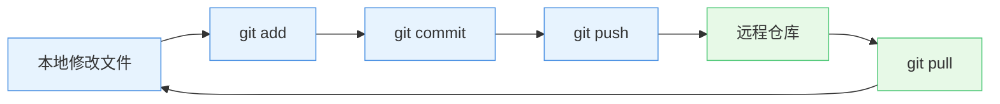
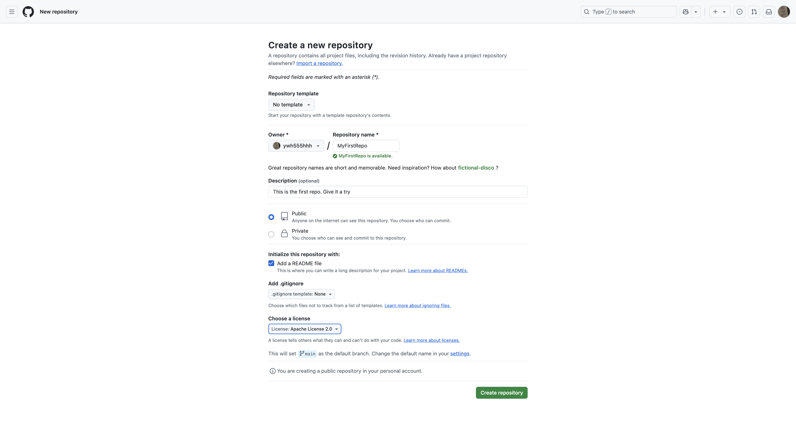

# 创建并管理仓库 (Repository)

> 本实验旨在帮助学生掌握如何创建并管理云端代码仓库，并建立本地与云端仓库的同步连接。我们将通过两种不同的途径实现这一目标：一种是从 GitHub 网站开始操作，另一种是从本地计算机开始操作。

---

## 远程和本地

在开发和协作时，我们经常需要区分两个重要概念：

- **本地**：指你手头的电脑环境，包括你正在编写的代码、运行的测试工具等。比如你笔记本上的代码文件就是本地文件。
- **远程**：指网络上的共享空间，比如 GitHub 这类代码托管平台。就像云盘一样，你可以把代码存上去与他人共享。

理解这两个概念的区别和联系非常重要：

- **本地**是你个人工作的起点，所有代码和修改最初都是在本地完成的。
- **远程**是团队协作和共享的基础，通过将本地的更改推送到远程，你可以与他人共享代码、协同开发，并确保代码的安全备份。

这两个概念配合使用：

- 你在**本地**完成代码修改
- 把改动推送到**远程**仓库分享给团队
- 队友从**远程**拉取最新代码到他们本地

在 Git 中，**本地**通常指你的本地仓库，而**远程**指远程仓库（如 GitHub）。你需要通过 `git push` 将本地的更改同步到远程，或通过 `git pull` 将远程的更新拉取到本地。这种“本地 - 远程”协作模式是现代开发的核心实践之一。



随着经验积累，你会发现这种**本地修改 - 云端同步**的模式无处不在：

- 本地开发环境 vs 远程部署环境
- 本地数据库 vs 远程数据库
- 本地测试 vs 远程持续集成（CI）

掌握这种思维方式，将帮助你更好地理解开源的工作流程。

---

## 准备工作

在开始前，请确保：

1. 已安装 [Git](https://git-scm.com/downloads)
2. 已注册 [GitHub 账号](https://github.com/signup)
3. 已配置 Git 用户名和邮箱（首次使用需要）：

```bash
git config --global user.name "你的名字"
git config --global user.email "你的邮箱"
```

---

## 从 GitHub 网站开始

- **创建远程仓库**：登录 GitHub 并点击“New repository”按钮。填写仓库名称、描述并选择公开或私有。点击“Create repository”完成创建。



- **克隆仓库到本地**：复制新仓库的克隆 URL。在终端中使用以下命令将仓库克隆到本地：

```bash
$ git clone https://github.com/ywh555hhh/MyFirstRepo.git #这就是你要输入的命令，你要输入的网址和这个会不一样
Cloning into 'MyFirstRepo'...
remote: Enumerating objects: 4, done.
remote: Counting objects: 100% (4/4), done.
remote: Compressing objects: 100% (4/4), done.
remote: Total 4 (delta 0), reused 0 (delta 0), pack-reused 0 (from 0)
Receiving objects: 100% (4/4), 4.79 KiB | 4.79 MiB/s, done.
```

!!! tip "不喜欢命令行？试试 GitHub Desktop！"

    1. [下载 GitHub Desktop](https://desktop.github.com/)  
    2. 登录你的 GitHub 账号  
    3. 创建仓库：File → New repository  
    4. 点击"Publish repository"同步到 GitHub
  
- **进行更改并提交**：在本地仓库中进行一些更改，例如添加新文件或修改现有文件。

使用以下命令提交更改：

```bash
git add .
git commit -m "Your commit message"
```

- 在添加文件前，可使用 `git status` 查看当前文件状态：

```bash
git status
# 会显示红色的"Untracked files"（未跟踪文件）
# 这些文件需要先添加到暂存区才能提交
```

- **推送更改**：使用以下命令将更改推送到远程仓库：

```bash
git push origin main
```

---

## 从本地开始

### 初始化本地仓库

> 📌 为什么要初始化？  
> 这就像给你的项目文件夹装上"记忆芯片"，Git 才能开始记录你的每一次修改

- 打开终端或命令行工具（Windows 用户可以使用 Git Bash，macOS 和 Linux 用户可以使用 Terminal）。

- 使用 `cd` 命令导航到你希望创建仓库的文件夹：

```bash
cd /path/to/your/project-folder
```

- 使用 `git init` 初始化一个新的 Git 仓库，这会创建一个隐藏的 `.git` 文件夹，Git 就能在这个文件夹中管理你的项目版本了：

```bash
git init
```

执行后会显示：

```bash
Initialized empty Git repository in /path/to/your/project-folder/.git/
```

💡 这个提示说明你的仓库已成功创建！

- **意义**：这一步告诉 Git 你要开始在这个文件夹中跟踪文件的更改，形成版本控制。

### 创建初始文件

- 在项目文件夹中，创建一些初始文件，例如 `README.md`（用于项目描述）和 `.gitignore`（用于忽略不需要版本控制的文件，如临时文件、日志文件等）。
- 使用文本编辑器打开这些文件并添加内容。比如在 `README.md` 中写一些项目的基本信息。
- 使用以下命令将这些文件添加到 Git 的暂存区：

```bash
git add .
```

**解释**：`git add .` 会将当前文件夹中的所有更改文件（包括新建的文件）添加到暂存区，准备提交。

- 使用 `git commit` 命令提交这些文件，`-m` 后面跟着的是提交说明：

```bash
git commit -m "Initial commit"
```

- **意义**：提交记录了你对文件的更改，并为后续的版本控制奠定基础。提交信息 `"Initial commit"` 是用来描述这次提交的内容。

- **这样做的好处**：相当于给当前代码拍个快照，以后随时可以回退到这个版本。提交信息就是给这个快照写的备注。

### 连接到远程仓库

- 打开 GitHub 或其他 Git 托管服务，创建一个新的空仓库。无需勾选“Initialize this repository with a README”选项，因为我们已经在本地创建了一个 `README.md` 文件。
- 复制新仓库的远程 URL，通常会是 `https://github.com/yourusername/yourrepository.git`。
- 在本地仓库中使用以下命令将本地仓库与远程仓库关联：

```bash
git remote add origin https://github.com/yourusername/yourrepository.git
```

✅ 验证是否添加成功：

```bash
git remote -v
```

应该显示：

```bash
origin  https://github.com/yourusername/yourrepository.git (fetch)
origin  https://github.com/yourusername/yourrepository.git (push)
```

- **意义**：这一步把本地仓库和远程仓库连接起来，告诉 Git 在远程仓库中保存你的代码。

### 推送更改到远程仓库

- 使用 `git push` 命令将本地的提交推送到远程仓库。首次推送时需要加上 `-u` 参数，表示设置远程仓库为默认的推送目标：

```bash
git push -u origin main
```

- **意义**：`git push` 是将本地的提交上传到远程仓库，`main` 是你本地分支的名字。如果是第一次推送，它会将本地的 `main` 分支推送到远程仓库。

推送成功后，你应该看到类似提示：

```bash
Enumerating objects: 3, done.
Writing objects: 100% (3/3), 240 bytes | 240.00 KiB/s, done.
To https://github.com/yourname/yourrepo.git
 * [new branch]      main -> main
Branch 'main' set up to track remote branch 'main' from 'origin'.
```

---

## 💡 遇到问题怎么办？

1. 权限错误：检查远程 URL 是否正确 `git remote -v`
2. 分支冲突：首次推送尝试 `git push -u origin HEAD`
3. 认证失败：更新 Git 凭证 `git config --global credential.helper cache`
4. 总是先拉取更新：`git pull --rebase` 避免冲突

---

## 私人仓库和公共仓库

当前内容主要关注如何创建和管理**私人仓库**，即仅你自己或指定的合作者可以访问的仓库。这种类型的仓库适合用于存放个人项目、学习代码或敏感数据。

> 🆓 小贴士：GitHub 现在提供无限免费私人仓库！创建时只需选择"Private"选项即可

如果你计划创建和管理**公共仓库**（即所有人都可以访问的仓库），需要注意以下几点：

1. **许可证选择**：公共仓库通常需要明确项目的开源许可证（如 MIT、GPL 等），以便告知他人如何使用你的代码。
2. **文档完善**：在公共仓库中，良好的文档是关键，包括 `README.md` 详细描述项目、`CONTRIBUTING.md` 说明贡献流程。
3. **代码规范**：保持清晰的代码结构和风格，方便其他开发者理解和参与项目。
4. **安全检查**：确保提交到公共仓库的代码中没有敏感信息（如 API 密钥、配置文件等），以免造成不必要的风险。

如果你有兴趣进一步了解公共仓库的管理，可以专门针对这些注意事项进行深入学习！

## ✅ 学习进度自查

阅读本教程后，你应该能够：

- [ ] 在 GitHub 创建新仓库
- [ ] 将仓库克隆到本地
- [ ] 在本地初始化 Git 仓库
- [ ] 添加文件并提交更改
- [ ] 连接本地与远程仓库
- [ ] 推送更改到 GitHub  
