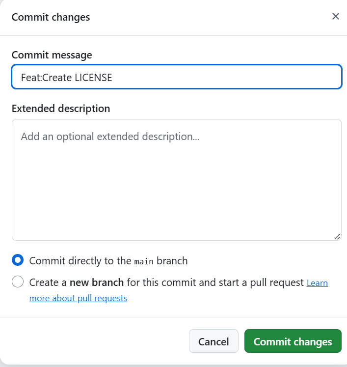

# 开源许可证选择指南：为你的项目穿上法律防护衣

## 什么是开源许可证？

简单说：就像你去图书馆借书需要遵守借阅规则一样，开源许可证就是代码世界的“借阅规则”，明确告诉大家怎么使用、修改和分享你的代码。

## 第一章：开源许可证的三大作用

### 1． 法律防护说明书

- 明确哪些能做（比如商用、修改）
- 哪些不能做（比如隐藏源代码）
- 保护作者不被“白嫖”（要求署名/注明修改）

### 2． 社区合作备忘录

- 规定修改代码后要不要回馈社区
- 建立开发者之间的信任规则
- 就像开源社区的“交通法规”

### 3． 常见误区扫盲

- ❌ 开源 ≠ 随便用（很多协议要求署名）
- ❌ 没加许可证 ≠ 无主代码（默认受法律保护）
- ✅ 选错协议可能“锁死”你的项目（兼容性问题）

## 第二章：五大主流许可证怎么选

| 许可证    | 核心要求             | 商用友好 | 修改后要开源吗？  | 适合场景          |
| --------- | -------------------- | -------- | ----------------- | ----------------- |
| MIT       | 保留我的大名字         | ✔️        | ❌                 | 工具库/小插件     |
| GPL       | 衍生品必须继续开源   | ❌        | ✔️                 | 操作系统/核心组件 |
| Apache2.0 | 不能用我的专利告我   | ✔️        | ❌（但要说明修改） | 企业级项目        |
| BSD       | 别用我的名义打广告   | ✔️        | ❌                 | 科研项目          |
| LGPL      | 只改库文件才需要开源 | ✔️        | ✔️（仅修改部分）   | 共享库            |

## 特别章节：GPL 的传奇故事与自由精神

### 自由软件运动简史

1983 年，理查德·斯托曼发起“自由软件运动”，提出四大自由：

1. 随便用的自由
2. 研究修改的自由
3. 分发的自由
4. 改进后分享的自由

GPL 协议就是实现这些自由的“法律武器”，它像“开源病毒”一样，确保每个使用 GPL 代码的项目都必须继续开源，防止大公司“偷走”开源成果变成闭源软件。

### 开源文化的守护者

- 保障知识共享不中断
- 强制回馈社区形成良性循环
- 著名的 Linux 内核就采用 GPL 协议

## 第三章：选择合适的许可证

### 选择流程图

来源：<https://www.ruanyifeng.com/blog/2011/05/how_to_choose_free_software_licenses.html>

### 额外补充

如果你还是没办法选出适合自己的开源许可证，你可以通过[开放源代码许可证选择器](https://open-source-license-chooser.toolsnav.top/)来帮助你选择。

## 第四章：添加许可证指南

### 刚创建仓库（repository）时

若我们想在刚创建仓库时候便添加许可证，可观察到创建页面下方的 **Choose a license**，从这便可在创建仓库时候添加上许可证

### 对已有仓库添加许可证

转到 GitHub 上项目的主页。然后单击**添加文件**（Add file）并选择**创建新文件** (Creat new file) 选项。

接下来在文件名字段中填写“LICENSE”或“LICENSE.md”，然后单击选择许可证模板。

接着查看可用的许可证并选择最适合您的项目的许可证，点击**审核并提交**，如下图：

最后，为您的许可证编写一条提交消息，并选择是否要将其直接提交到主分支或创建一个新分支并打开拉取请求。然后，按提交新文件按钮将许可证添加到您的项目中，如下图所示。

如果您创建了拉取请求以将许可证添加到您的项目，请合并该拉取请求，您应该会在 GitHub 上的项目主页上看到 LICENSE 文件。

到这里你就成功添加了开源许可证，Congratulations！
