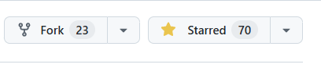

# GitHub Fork 简明解析

## 什么是 Fork？

**Fork** 是 GitHub 上的一项功能，允许你将别人的项目仓库完整复制到自己的 GitHub 账户下。
  相当于你获得了该项目的独立副本，可以自由查看、修改，且不会影响原项目。

  ---

## Fork 的核心作用（开源场景下）

  1. **独立实验**
     在自己的副本中测试代码、修改功能，无需担心破坏原项目。
     *示例：你想尝试给某个开源工具添加新功能，但不确定是否可行，Fork 后即可安全实验。*

  2. **保存代码快照**
     将某个时间点的项目状态保存为你的副本，便于后续参考或恢复。
     *示例：原项目可能更新版本后删除了某些旧功能，你可以通过 Fork 保留旧版代码。*

  3. **二次开发基础**
     基于原项目创建自己的新版本（需遵守开源协议）。
     *示例：著名的 Linux 系统有众多衍生版本（如 Ubuntu、Debian），均通过 Fork 机制发展而来。*

  ---

## 如何在 GitHub 上 Fork？

  1. **找到目标仓库**
     登录 GitHub，访问你想复制的项目页面（以[华科开放原子俱乐部的开源镜像站项目](https://github.com/hust-open-atom-club/hust-mirrors)为例）。

  2. **点击 Fork 按钮**
     在页面右上角找到 **Fork** 按钮（通常位于“Star”按钮旁），点击后选择你的账户。

     

     然后点击 Creat fork 即可：

     

  3. **完成复制**
     等待几秒钟，系统会自动生成你的副本仓库，地址为：
     `https://github.com/你的用户名/仓库名`

  ---

## 重要注意事项

- **副本独立性**：Fork 后的仓库与原项目完全隔离，你的修改仅影响自己的副本。
- **开源协议**：若原项目有开源协议（如 MIT、GPL），你的副本仍需遵守其规则。
- **无需权限**：任何人都可以 Fork 公开仓库，无需原作者批准。
