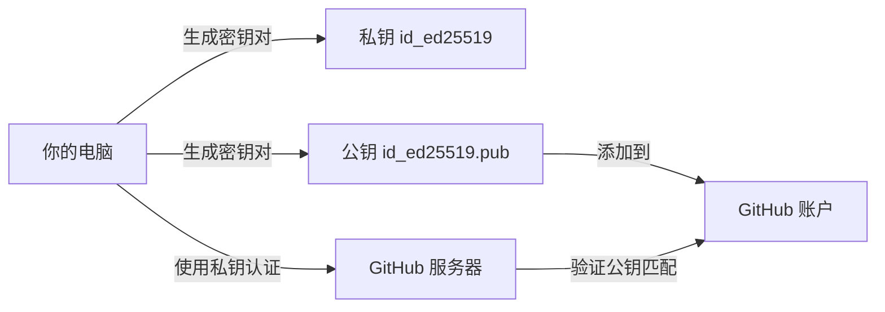
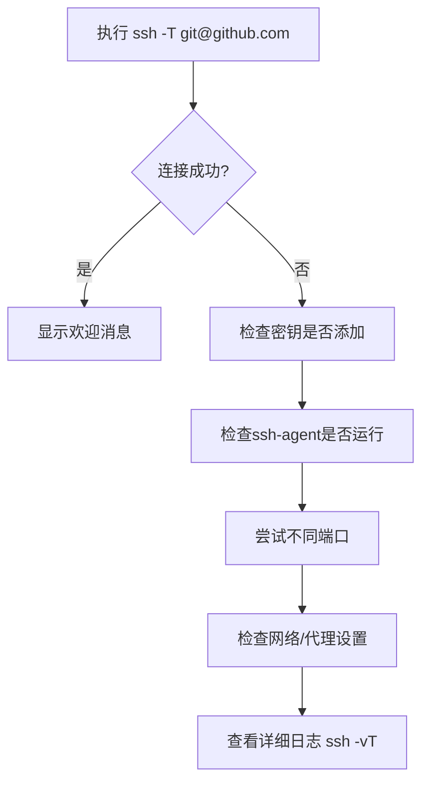
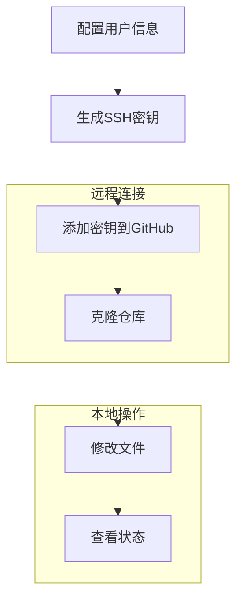

# Git 基础配置

> 让学生掌握 Git 的基本配置与命令。

---

## 1. 配置 Git

在使用 Git 之前，首先需要进行一些基本的配置，包括设置用户名和邮箱。这些信息会与每次提交（Commit）关联，用于标识代码的贡献者。

### 打开终端（Terminal）

如果你使用的是 Windows：

- 推荐安装 [Git for Windows](https://git-scm.com/download/win)，安装后你会获得一个名为 **Git Bash** 的终端工具，点击即可使用。

如果你使用的是 macOS 或 Linux：

- 打开自带的 **Terminal** 应用程序即可。

安装完成后，就可以输入下面步骤的命令进行 Git 的基础配置

### 配置用户名和邮箱

- **命令**：

  ```bash
  git config --global user.name "你的用户名"
  git config --global user.email "你的邮箱"
  ```

  ```bash
  # 正确示例
  git config --global user.name "John Doe"
  git config --global user.email "john.doe@example.com"
  # 错误示例（缺少引号会导致问题）
  git config --global user.name John Doe  # 错误！用户名中有空格必须加引号
  ```

- **作用**：
  - `user.name`：设置提交代码时显示的作者名称。
  - `user.email`：设置提交代码时显示的作者邮箱。
  - `--global`：表示全局配置，适用于当前用户的所有仓库。如果只想为某个仓库单独配置，可以去掉 `--global` 参数。

- **提示**
  - 如果你不希望暴露自己的真实邮箱，可以使用 GitHub 提供的隐私邮箱（形如 `用户名@users.noreply.github.com`）
  - 查看方法：登录 GitHub，进入 **Settings -> Emails**，可以找到你的隐私邮箱地址。

### 查看配置信息

- **命令**：

  ```bash
  git config --list
  ```

- **作用**：查看当前 Git 的所有配置信息，包括用户名、邮箱等。

### 查看帮助

- **比如我想看看 merge 是个什么玩意**：

  ```bash
  git help merge 
  git merge --help
  man git-merge
  ```

---

## 2. 使用 SSH 连接远程仓库

SSH（Secure Shell）是一种加密的网络协议，用于安全地访问远程服务器。通过 SSH 连接 Git 远程仓库，可以避免每次操作时输入用户名和密码，同时提高数据传输的安全性。

### 生成 SSH 密钥

#### 什么是 SSH 密钥？

SSH 密钥是一个由“私钥 + 公钥”组成的安全认证方式，类似于“锁和钥匙”。你将公钥添加到 GitHub 账户后，GitHub 就知道“这个钥匙是你自己的”，从而允许你访问代码仓库，无需每次都输入用户名密码。



1. **检查是否已有 SSH 密钥**：
  
    打开终端，输入以下命令：

    ```bash
    ls ~/.ssh/
    ```

    如果看到 id_ed25519 和 id_ed25519.pub 文件，说明已有密钥

    在文件管理器中查看路径：C:/Users/你的用户名/.ssh/ (Windows) 或 /home/你的用户名/.ssh/ (macOS/Linux)

2. **生成新的 SSH 密钥**：

    如果不存在 SSH 密钥，可以使用以下命令生成：

     ```bash
     ssh-keygen -t ed25519 -C "你的邮箱"
     ```

    按提示选择保存路径和设置密码（可选）。

    生成成功后，会在 `~/.ssh/` 目录下生成两个文件：

    - `id_ed25519`：私钥，切勿泄露。

    - `id_ed25519.pub`：公钥，用于添加到远程仓库。

3. **添加到 ssh-agent**：

     ```bash
     eval "$(ssh-agent -s)"
     ssh-add ~/.ssh/id_ed25519
     ```

### 添加 SSH 密钥到远程仓库

1. **复制公钥**：

    使用以下命令复制公钥内容：

    ```bash
     cat ~/.ssh/id_ed25519.pub
    ```

    复制输出的全部内容。

2. **添加到 GitHub**：

    1.登录 GitHub，进入 **Settings** -> **SSH and GPG keys**

    2.点击 **New SSH key**

    3.在 Title 中输入设备名称（如 "My Laptop"）

    4.在 Key 字段粘贴公钥内容

    5.点击 **Add SSH key**

### 测试 SSH 连接

- 使用以下命令测试 SSH 连接是否成功：

  ```bash
  ssh -T git@github.com
  ```

  - 如果显示 `Hi 用户名! You've successfully authenticated ...`，说明 SSH 配置成功。



#### 如果测试失败怎么办？

- 确保你生成了 SSH 密钥并添加到了 GitHub。
- 检查是否执行了 `ssh-add ~/.ssh/id_ed25519`。
- 有时 Git Bash 或 WSL 可能未自动启动 ssh-agent，可以先执行：

  ```bash
  eval "$(ssh-agent -s)"
  ```

- 如果还是失败，可以在终端中运行以下命令查看调试信息：

  ```bash
  ssh -vT git@github.com
  ```

### 使用 SSH 克隆仓库

- 使用 SSH 地址克隆远程仓库：

  ```bash
  git clone git@github.com:用户名/仓库名.git
  ```

- **两种克隆方式对比**：

  ```bash
  # HTTPS 方式（需要每次输入密码）
  git clone https://github.com/用户名/仓库名.git
  
  # SSH 方式（配置密钥后无需密码）
  git clone git@github.com:用户名/仓库名.git
  ```

### 将现有仓库切换为 SSH 连接

- 如果已经使用 HTTPS 克隆了仓库，可以通过以下命令切换为 SSH：

  ```bash
  git remote set-url origin git@github.com:用户名/仓库名.git
  ```

- 使用 `git remote -v` 查看远程仓库地址，确认是否切换成功。

- 如果你的网络环境比较特殊（如不能访问 GitHub，或 22 端口被屏蔽），你可以配置 SSH 客户端。

- 首先，打开（或创建）`~/.ssh/config` 文件：

  ```bash
  nano ~/.ssh/config
  ```

- 然后粘贴如下配置（按实际情况调整代理或端口）：

  ```bash
  Host github.com
      Hostname ssh.github.com
      Port 443
      User git
      ProxyCommand nc -v -x 127.0.0.1:10808 %h %p  # 如果你使用代理访问 GitHub
  ```

- 保存后再次测试 SSH 连接。

---

## 3. Git 最为基础的命令

以下是 Git 中最基础且常用的命令，掌握这些命令是使用 Git 进行版本控制的第一步。

### 初始化仓库（`git init`）

- **命令**：

  ```bash
  git init
  ```

- **作用**：在当前目录中创建一个新的 Git 仓库。执行该命令后，Git 会在当前目录下生成一个隐藏的 `.git` 文件夹，用于存储版本控制所需的元数据和对象。
- **使用场景**：当你需要从头开始创建一个新项目时，可以使用 `git init` 初始化仓库。

### 克隆远程仓库（`git clone`）

- **命令**：

  ```bash
  git clone <远程仓库地址>
  ```

- **作用**：从远程服务器（如 GitHub、Gitee 等）克隆一个已有的仓库到本地。克隆操作会将远程仓库的所有文件、分支和历史记录复制到本地。
- **示例**：

  ```bash
  git clone https://github.com/example/project.git
  ```

- **使用场景**：当你需要参与一个已有的项目时，可以使用 `git clone` 将项目代码下载到本地。

### 查看仓库状态（`git status`）

- **命令**：

  ```bash
  git status
  ```

- **作用**：查看当前仓库的状态，包括哪些文件被修改、哪些文件已暂存（Staged）、哪些文件未跟踪（Untracked）等。
- **输出示例**：

  ```plaintext
  On branch main
  Changes not staged for commit:
    (use "git add <file>..." to update what will be committed)
    (use "git restore <file>..." to discard changes in working directory)
      modified:   README.md

  Untracked files:
    (use "git add <file>..." to include in what will be committed)
      new-file.txt

  no changes added to commit (use "git add" and/or "git commit -a")
  ```

- **使用场景**：在提交代码之前，使用 `git status` 检查当前工作目录的状态，确保没有遗漏或误操作。

---

## Git 工作流程概览图



---

## 总结

1. 如何配置 Git 的用户名和邮箱，以便正确标识代码贡献者。
2. 如何使用 `git init` 初始化一个新的 Git 仓库。
3. 如何使用 `git clone` 克隆远程仓库到本地。
4. 如何使用 `git status` 查看仓库的当前状态。

## 🧪 实践任务

1. 配置用户名和邮箱

   ```bash
   git config --global user.name "你的名字"
   git config --global user.email "你的邮箱"
   git config --list | grep user  # 检查配置是否正确
   ```

2. 创建并添加 SSH 密钥

   ```bash
   ssh-keygen -t ed25519 -C "你的邮箱"  # 按三次回车
   cat ~/.ssh/id_ed25519.pub  # 复制输出的所有内容
   # 添加到 GitHub 后测试：
   ssh -T git@github.com
   ```

3. 在 GitHub 上找到一个开源仓库（如 [https://github.com/octocat/Hello-World](https://github.com/octocat/Hello-World)），用 SSH 方式克隆它到本地：

   ```bash
   git clone git@github.com:octocat/Hello-World.git
   ```

4. 进入该项目文件夹，执行以下命令：

   ```bash
   cd Hello-World
   git status
   # 应该看到："nothing to commit, working tree clean"
   ```

如果你成功完成以上步骤，恭喜你！已经具备基本的 Git 配置与使用能力。
