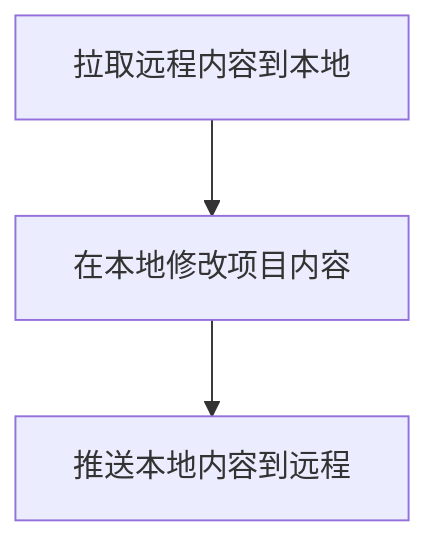
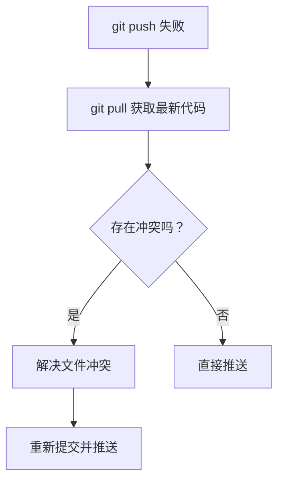

# 远程仓库操作与 Push 冲突

> 本子节旨在让学生掌握远程仓库的基础操作，能够处理 Push Conflict 等常见问题。

---

## 导学
在前面的学习中，我们已经学习了**远程仓库**和**本地仓库**的区别，了解了这种 “本地-远程” 协作模式带来的好处，并在 Github 上创建了一个远程仓库。

在本节课中，我们将学习操作 Git 远程仓库的基础操作，包括如何将本地仓库推送到远程仓库、如何从远程仓库拉取代码，以及如何解决推送冲突的问题。

---

## 获取一个与远程仓库的本地仓库

运用 Git 的 “本地-远程” 协作模式来修改托管在云端的项目分为三步：



但以上操作都要在一个 git 仓库里进行，我们首先要在本地有一个与远程仓库对应的仓库。

如果本地本来没有仓库，我们可以把远程仓库直接克隆到本地，使用的命令是 `git clone <远程仓库的 URL>`。git 会自动为克隆的本地仓库设置与远程仓库的对应关系。

例如，假设你准备把远程仓库 `https://github.com/username/repository.git` 的内容克隆到 `/home/username/projects` 下面，我们可以执行以下命令：
```bash
cd /home/username/projects
git clone https://github.com/username/repository.git
# 输出示例
Cloning into 'repository'...
remote: Enumerating objects: 10, done.
remote: Counting objects: 100% (10/10), done.
remote: Compressing objects: 100% (8/8), done.
remote: Total 10 (delta 1), reused 10 (delta 1), pack-reused 0
Receiving objects: 100% (10/10), done.
```

这样，就会在 `/home/username/projects` 下建立一个文件夹 `repository`，并把仓库内容克隆到其中。

而如果本地本来就有一个与远程仓库对应的仓库，你也可以直接建立本地仓库与远程仓库的连接关系。假设我们本地仓库的路径是 `/home/username/projects/repository/`，我们可以执行以下命令：

```bash
cd /home/username/projects/repository
git remote add origin https://github.com/username/repository.git
```

---

## 拉取远程仓库的更改

你可能注意到，修改仓库内容的第一步是 “拉取远程内容到本地”，这是因为在修改仓库内容之前，如果本地仓库与远程仓库不同步，协作可能会出现问题。例如，假设你在参与小组合作实践，你的同学已经完成了项目的某个功能，而你因为没有同步本地代码而不知道，就有可能重复地再写一遍这个功能，浪费了时间与精力。所以，在协作开放中做修改前，要先将远程修改同步到本地。

我们可以用 `git pull` 命令同步远程仓库的修改到本地：
```bash
git pull
# 输出示例
remote: Enumerating objects: 5, done.
remote: Counting objects: 100% (5/5), done.
remote: Compressing objects: 100% (3/3), done.
remote: Total 3 (delta 2), reused 0 (delta 0), pack-reused 0
Unpacking objects: 100% (3/3), done.
From https://github.com/username/repository
    abc1234..def5678  main       -> origin/main
Updating abc1234..def5678
Fast-forward
 file1.txt | 2 +-
 file2.txt | 4 ++--
 2 files changed, 3 insertions(+), 3 deletions(-)
```

---

## 推送本地仓库到远程仓库

在本地仓库作出修改之后，我们就可以用 `git push` 操作把本地的修改同步到远程仓库。

首先，我们对仓库内容进行一些修改，例如添加一个文件 `a.txt`，并写入一行字 `hello world`，然后提交 commit：
```bash
echo "hello world" > a.txt
git add a.txt
git commit -m "add new file"
```

接下来，我们就用 `git push` 命令将本地仓库的修改同步到远程仓库。
```bash
git push
# 输出示例
Enumerating objects: 5, done.
Counting objects: 100% (5/5), done.
Delta compression using up to 4 threads
Compressing objects: 100% (3/3), done.
Writing objects: 100% (3/3), 292 bytes | 292.00 KiB/s, done.
Total 3 (delta 2), reused 0 (delta 0), pack-reused 0
To https://github.com/username/repository.git
    abc1234..def5678  main -> main
```

---

## 处理推送冲突（Push Conflict）

如果你在远程仓库修改了文件，但在开始修改本地仓库文件之前忘记拉取远程更改了，你可能会 push 失败：
```bash
git push
To https://github.com/username/repository.git
 ! [rejected]        main -> main (fetch first)
error: failed to push some refs to 'https://github.com/username/repository.git'
hint: Updates were rejected because the remote contains work that you do
hint: not have locally. This is usually caused by another repository pushing
hint: to the same ref. You may want to first integrate the remote changes
hint: (e.g., 'git pull ...') before pushing again.
hint: See the 'Note about fast-forwards' in 'git push --help' for details.
```

### 为什么会发生冲突？

直接翻译以上的输出：
```bash
错误：未能将部分引用推送到 'https://github.com/username/repository.git'
提示：更新被拒绝，因为远程仓库包含您本地尚不存在的提交。这通常是因为另
提示：一个仓库已向该引用进行了推送。您需要先整合远程变更（如 'git pull ...'）
提示：详见 'git push --help' 中的 'Note about fast-forwards' 章节。
```

当远程仓库存在本地没有的新提交时（可能是其他协作者推送的代码），Git 会拒绝你的 push，以防协作者们的代码互相覆盖。

### 如何解决冲突？



首先，用 `git pull` **拉取最新代码**：
```bash
git pull
remote: Enumerating objects: 5, done.
remote: Counting objects: 100% (5/5), done.
remote: Total 3 (delta 0), reused 0 (delta 0), pack-reused 0 (from 0)
Unpacking objects: 100% (3/3), 884 bytes | 126.00 KiB/s, done.
From https://github.com/username/repository.git
   1234abc..5678def  main       -> origin/main
Auto-merging a.txt
CONFLICT (content): Merge conflict in a.txt
Automatic merge failed; fix conflicts and then commit the result.
```

在 pull 后，git 会自动合并远程仓库的更改到本地仓库的更改历史上。如果本地与远程修改的文件是不重叠的，就可以直接 `git push`。

但如果本地与远程修改了同一个文件，就可能会发生合并冲突，比如最后三行显示了：
```bash
Auto-merging a.txt
CONFLICT (content): Merge conflict in a.txt
Automatic merge failed; fix conflicts and then commit the result.
```

我们可以根据该提示打开冲突文件，git 会在文件中用 `<<<<<<< HEAD` 和 `>>>>>>>` 标识出本地与远程修改的重叠部分，例如：
```
 <<<<<<< HEAD
 本地更改
 =======
 远程更改
 >>>>>>> 6daf9f4bc600f0ed655f70f4e92fc0a3f488e0da
```

我们需要手动选择要保留的代码段，然后删除冲突标记，即可**解决冲突**：
```
本地更改（选择了一份修改，并删除了冲突标记）
```

接下来，**重新提交并推送**即可。
```bash
git add a.txt
git commit -m "解决合并冲突"
git push
```
