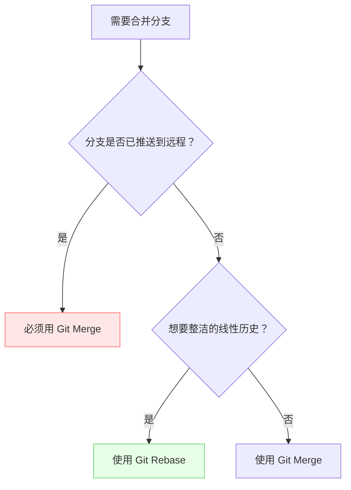

# Git Rebase vs. Git Merge：选哪个？🤔

**目的：**搞懂 Git 这两种合并分支的酷炫方式，以后合并代码不再纠结！

**内容：**

咱们先不讲那些复杂的理论，直接上例子，保证你一看就明白！

## 先懂两个基础概念 🔍

**分支 (Branch)**：就像游戏里的存档点，你可以独立开发功能而不影响主线  
**提交 (Commit)**：每次代码变动的存档记录，包含作者/时间/修改内容

## 场景模拟：团队合作开发新功能 🚀

假设你和小伙伴们正在一起开发一个超酷炫的新功能，每个人负责一部分：

* **你：**负责开发用户登录界面 (在 `feature/login` 分支)
* **小伙伴 A：**负责开发商品展示页面 (在 `feature/product` 分支)
* **主分支：**`main` 分支，是大家共同的基础

### Git Merge：简单粗暴，历史全记录 📖

1. **你完成了登录界面的开发，想要把代码合并到 `main` 分支：**

    ```bash
    git checkout main  # 切换到 main 分支
    git merge feature/login  # 把 feature/login 分支合并到 main 分支
    ```

    * **结果：**Git 会创建一个新的合并提交（merge commit），把你的 `feature/login` 分支和 `main` 分支的最新代码合并在一起。

    * **特点：**简单！`main` 分支的历史记录会完整保留所有分支的开发过程，就像一本详细的日记。

2. **小伙伴 A 也完成了商品展示页面的开发，同样合并到 `main` 分支：**

    ```bash
    git checkout main
    git merge feature/product
    ```

    * **结果：**又多了一个合并提交！

    * **潜在问题：**如果很多人都在不同的分支上开发，`main` 分支的历史记录可能会变得很乱，像蜘蛛网一样 🕸️。

### Git Rebase：乾坤大挪移，历史更清晰 ✨

1. **你完成了登录界面的开发，这次咱们用 `rebase`：**

    ```bash
    git checkout feature/login  # 切换到 feature/login 分支
    git rebase main  # 把 main 分支的最新代码“垫”到你的 feature/login 分支下面
    git checkout main
    git merge feature/login # 快速向前合并
    ```

    * **结果：**
        * `rebase` 会把你的 `feature/login` 分支上的提交“移动”到 `main` 分支的最新提交之后。就像是把你的分支“嫁接”到了 `main` 分支上。
        * 然后再次在 `main` 进行 `merge` 时，由于 `feature/login` 是直接从 `main` 分支“生长”出来的，所以可以直接快速合并（fast-forward），不会产生额外的合并提交。

    * **特点：**干净！`main` 分支的历史记录会是一条直线，非常清晰。

2. **小伙伴 A 也用 `rebase` 合并：**

    ```bash
    git checkout feature/product
    git rebase main
    git checkout main
    git merge feature/product #快速向前合并
    ```

    * **结果：**同样，`main` 分支的历史记录依然保持一条直线。

    * **潜在问题：**`rebase` 会改写提交历史，如果你已经把 `feature/login` 分支推送到远程仓库，并且其他人在这个分支上工作，就不要用 `rebase` 了，否则会造成混乱。

> **图解变基**：
> 主分支：A — B — C  
> 你的分支：A — D — E  
> `git rebase main` 后：  
> 主分支：A — B — C  
> 你的分支变为：A — B — C — D' — E'  
> (你的提交被"搬"到最新主干之后)

## **💡 遇到代码冲突怎么办？**  

两种方式都会出现冲突，解决方式不同：

**Merge 冲突**：解决一次冲突，生成合并提交  
**Rebase 冲突**：可能需多次解决（每个被移动的提交都可能冲突）

推荐新手先用 `git mergetool` 可视化工具处理冲突

## 常用命令速查 🚦

| 场景                | Merge 方案               | Rebase 方案                 |
|---------------------|-------------------------|---------------------------|
| 个人本地分支合并     | `git merge feature`     | `git rebase main`         |
| 推送共享分支         | ✅ 安全                 | ❌ 禁止 (会改写历史)        |
| 更新本地分支         | `git pull` (默认 merge)  | `git pull --rebase`       |
| 放弃当前操作         | `git merge --abort`     | `git rebase --abort`      |

## 总结：选哪个？

| 特性         | Git Merge                                                                                             | Git Rebase                                                                                                                  |
| :----------- | :---------------------------------------------------------------------------------------------------- | :------------------------------------------------------------------------------------------------------------------------ |
| 历史记录     | 完整，包含所有分支的开发过程                                                                                    | 简洁，一条直线                                                                                                                |
| 操作难度     | 简单                                                                                                 | 稍复杂，需要理解“变基”的概念                                                                                                          |
| 适用场景     | 适合小型团队，或者希望保留完整开发历史的情况                                                                            | 适合个人开发，或者希望保持主分支历史清晰的情况                                                                                              |
| **注意事项** | **如果分支已经推送到远程仓库，并且其他人在这个分支上工作，不要用 `rebase`！**                                                | **如果分支已经推送到远程仓库，并且其他人在这个分支上工作，不要用 `rebase`！**                                                                |
| **比喻**   | **像一本详细的日记，记录了所有发生的事情**                                                                           | **像一棵树，主干清晰，分支从主干生长出来**                                                                                                |
| **口诀**   | **`merge`虽乱心不乱，`rebase`虽直易出错**                                                                     | **`merge`虽乱心不乱，`rebase`虽直易出错**                                                                                  |



## 趣味小练习 🎮

   1. **创建实验环境**：

      ```bash
      git init test-project && cd test-project
      echo "Hello" > file.txt && git add . && git commit -m "Initial commit"
      git checkout -b feature  # 创建新分支
      echo "New feature" >> file.txt && git commit -am "Add feature"
      git checkout main        # 切换回主分支
      ```

   2. **分别执行**：

      ```bash
      # 方案 A：merge
       git merge feature
      # 方案 B：rebase
      git checkout feature
      git rebase main
      git checkout main
      git merge feature
      ```  

   3. **查看历史差异**：

      ```bash
      git log --graph --oneline  # 对比两种历史线
      ```

思考一下，在你的团队项目中，哪种合并方式更适合？

希望这个文档能帮助你更好地理解 Git Rebase 和 Git Merge！记住，实践出真知，多动手试试，你会发现 Git 其实很有趣！😉
