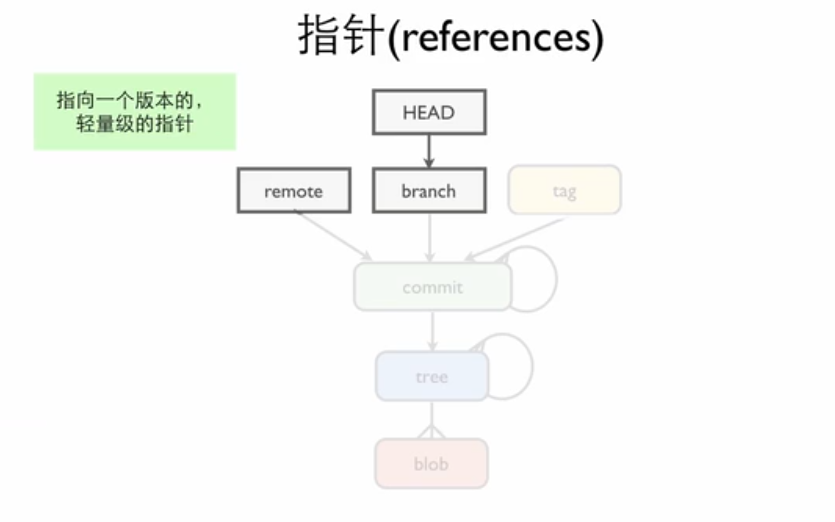

# Git 的进阶理论

!!! note "本节概览"
    本小节内容主要来自 github 联合创始人 [Scott Chacon](https://github.com/schacon) 在 2008年关于 Git 的演讲，主要从更底层的角度去了解 Git,我们会介绍 GIT 实际对象，blob 等东西，git 底层发生了什么，你会理解到为什么说 Git branch 本质上是一个指针，git rebase 为什么会改变 commit 的 hash 值。在基于 Scott Chacon 的演讲的基础上，添加了一些更小白的内容。
    本节作者：[ywh555hhh](https://github.com/ywh555hhh)

## 什么是 Git

在训练营里面，我们一直在和 Git 打交道，但是如今真有其他人问你，“Git 是什么东西？”这时候你能做出合适的回答吗？Git 的定义肯定不是单一的，他在不同的视角下，有着不同的角色。而在 Scott Chacon 的演讲中，他给出了一个非常棒的定义：

> Git is a directory content management system,a tree history storage system,a stupid content tracker,and a toolkit.

翻译成中文就是：

> Git 是一个文件夹内容管理系统，一个文件树历史存储系统，一个傻瓜式内容跟踪器，一个工具箱。

让我们逐个分析这四个定义：

### 文件夹内容管理系统

Git 是一个文件夹内容管理系统，这意味它是以文件夹为单位，管理着文件夹的内容。

- **具体表现**：
  - 记录文件夹中每个文件/子文件夹的**增删改**操作。
  - 保存文件夹的**完整快照**（每次提交都是一次完整状态记录）。

### 文件树历史存储系统

文件树历史存储系统，意味着 Git 不仅仅记录了文件夹的内容，还记录了文件夹内容的变化历史。而且是以“树”的形式记录的。想必学过数据结构的同学都知道，树是表示有向无环图的一种数据结构。但你可能很难立马把“树”和“Git”联系起来，没关系往后读，我们会详细介绍。

### 傻瓜式内容跟踪器

Git 的设计哲学是"做一件事并做好它"，它不试图成为一个万能的工具，而是专注于内容跟踪这一核心功能。“傻瓜”意味着它不需要你了解太多的专业知识，就可以使用 Git 来管理你的文件夹，之前一路走来，你肯定没被它难倒，对吧。正如 Linus Torvalds 所说，Git 的名字本身就是自嘲，意为"愚蠢"，但它的简单性恰恰是其最大的优势。

### 工具箱

而说 Git 是一个工具箱，意味着是提供多种工具，你可以根据自己的需求选择合适的工具。就像我们之前学的 `fetch` `pull` `push` 就可以看做一个个的工具。很像瑞士军刀，在不同的场景下，可以用不同的命令来解决问题。

## 管道与陶瓷

看到这个部分的标题，你肯定会很疑惑，“管道与陶瓷”？这和 Git 有什么关系？

实际上这是很“厕所”的一个概念，在英语中，管道（plumbing）指的是厕所的下水道和阀门，而陶瓷（porcelain）指的是厕所的马桶，面盆等内容。

而在这里，管道与陶瓷，分别指代了 Git 的俩类命令，像我们之前学的 `git add` 和 `git push` 以及 `git fetch` 都是陶瓷命令。而有些不太常见的如 `git hash-object` 和 `git cat-file` 这样的命令，就是管道命令。陶瓷命令其实就是管道命令的封装，而管道命令才是 Git 的底层命令。

管道命令往往是直接操作 Git 的底层数据结构，通常用于脚本编写、自动化任务或解决复杂问题。它们比陶瓷命令更灵活，但使用起来也更复杂。

## 版本控制软件的家谱

Scott Chacon 在演讲中提到了一个常见的误区，很多人认为 Git 是 SVN 的线性升级，其实不然。

**Git 与 SVN 完全走的是不同的路线。**

这里我们将简单介绍版本控制软件的家谱，以帮助你理解 Git 在其中的定位。版本控制软件主要可以根据两个标准进行分类：一是存储方式，分为快照（snapshot）和增量（incremental）；二是存储架构，分为本地（local）、集中（centralized）和分布式（distributed）。


图 1. 版本控制软件的家谱
{： .caption}

???+ note "消失在历史中的其他版本控制软件"
    在 Git 出现之前，还有很多版本控制软件，比如图中的 CVS、SVN 等。但是随着 Git 的出现，这些版本控制软件都逐渐退出了历史舞台。Git 凭借分布式架构、强大的分支管理、高效性能、数据安全性、强大社区支持及适应现代开发需求等优势，逐渐取代了 CVS、SVN 等传统版本控制系统，成为全球开发者首选的版本控制工具。

??? tip "BitKeeper 与 Linux 的爱恨情仇"
    ### BitKeeper 与 Linux 的传奇故事

    BitKeeper 与 Linux 社区的故事充满传奇色彩，见证了开源与商业之间的权力较量，并催生了如今广泛使用的 Git 版本控制系统。

    #### 蜜月期
    BitKeeper 是由 Larry McVoy 于2000年发布的分布式版本控制系统。2002年，Linux 内核开发团队开始使用 BitKeeper 来管理日益庞大的代码库。传统的邮件列表和文件 diff 方式已无法满足需求，而 BitKeeper 以其高效性和稳定性，完美契合了 Linux 的分布式开发模式，极大提高了开发效率。Linus Torvalds 对 BitKeeper 赞誉有加，认为它是当时最适合 Linux 内核开发的工具，BitMover 公司也慷慨地授权 Linux 社区免费使用，形成了开源与商业的双赢局面。

    #### 许可纠纷与分手
    然而，这种合作并未持续太久。2005年，BitKeeper 的免费使用许可引发争议，限制开发者在使用期间及一年内不得参与竞争工具的开发。这一条款激怒了 Linux 社区，尤其是在开发者 Andrew Tridgell 试图逆向工程 BitKeeper 时，BitMover 公司认为这违反了协议。尽管 Linus 最初支持 Larry，但随着争议升级，Linux 社区对 BitKeeper 的商业限制愈发不满。最终，BitMover 收回了 Linux 社区的免费使用权，促使 Linus 决定开发一个完全开源的版本控制系统——Git。

    #### Git 的诞生与 BitKeeper 的落幕
    Linus 在短短两周内完成了 Git 的初步开发，并于2005年4月8日发布了第一个版本。Git 不仅继承了 BitKeeper 的分布式设计理念，还进一步简化和优化了功能，完美适应 Linux 内核的开发需求。从 Linux-2.6.12-rc2开始，Linux 内核正式迁移到 Git 上。随着 Git 的迅速普及，BitKeeper 逐渐失去了在开源社区的影响力。2016年，BitKeeper 宣布开源，但此时 Git 已成为全球最主流的版本控制系统。

    BitKeeper 与 Linux 的故事是一场开源与商业的博弈。尽管 BitKeeper 曾为 Linux 内核开发提供强大支持，但其商业限制最终导致了与开源社区的决裂。这一事件不仅催生了 Git，也深刻改变了开源社区的未来。

## `.git` 文件夹

Scott Chacon 在演讲中提到，在 Git 中，`.git` 文件夹是 Git 仓库的核心目录，包含了 Git 仓库的全部信息。它是一个隐藏文件夹，位于仓库的根目录下。`.git` 文件夹是存储 Git 仓库所有核心数据和配置的地方。

你可以在任何一个 `git init` 初始化过的文件夹中找到 `.git` 文件夹。用 `ls -a` 命令就可以看到。你可以`cd .git` 之后再 `ls -a` 看看，你会发现里面有很多文件和文件夹：

```zsh
.           FETCH_HEAD  branches    description index       logs        packed-refs
..          HEAD        config      hooks       info        objects     refs
```

这里简单解释一下：

- **`HEAD`**：指向当前分支的引用。  
- **`config`**：存储本地仓库的配置信息，如用户名和邮箱。  
- **`index`**：暂存区文件，记录即将提交的文件状态。  
- **`objects/`**：存储 Git 对象（blob、tree、commit）的目录。  
- **`refs/`**：存放分支、标签和远程分支的引用路径。  
- **`logs/`**：记录分支和标签的更新日志。  
- **`hooks/`**：存放 Git 钩子脚本，用于自动化任务。  
- **`info/`**：存储全局信息，如全局忽略规则。

其中最值得讲的是 `objects` 文件夹，它存储了 Git 仓库的所有对象。被成为对象数据库。

**理解 Git 对象是理解 Git 底层原理的关键。**

## 对象数据库

### 对象的类型和格式

Git 对象分为四种类型：

- `blob`：存储文件内容。binary large object 二进制大对象。代表着文件内容。`.cpp`, `.py`, `.txt` ,`.jpg` 等文件都是 blob 对象。  
- `tree`：存储目录结构和文件路径。
- `commit`：存储提交历史。
- `tag`：存储标签信息。

### 对象的格式

上面的四种对象有着统一的格式：

``` txt
<object type> <content length>\0<content>
```

- `<object type>`：对象类型，如 `blob`、`tree`、`commit` 或 `tag`。
- `<content length>`：内容长度，以字节为单位。
- `\0`：一个空字节，用于分隔对象类型和内容。
- `<content>`：对象的内容，根据对象类型不同而不同。

#### Blob（二进制大对象）

假设你有一个文件 `README.md`，内容如下：

```markdown
# Hello, Git!
This is a sample README file.
```

当你将这个文件提交到 Git 仓库时，Git 会为这个文件内容创建一个 `blob` 对象。这个 `blob` 的内容就是文件的文本内容：

```md
# Hello, Git!
This is a sample README file.
```

你可以通过以下命令查看仓库中的 `blob` 对象：

```bash
git cat-file -p <blob_hash>
```

其中 `<blob_hash>` 是 `blob` 对象的 SHA-1 哈希值。

---

#### Tree（树）

`tree` 是用来存储目录结构的对象。它记录了每个文件和子目录的路径、权限以及对应的 `blob` 或 `tree` 对象的哈希值。

示例：
假设你的项目目录结构如下：

```md
project/
├── README.md
└── src/
    └── main.py
```

Git 会为这个目录结构创建一个 `tree` 对象，其内容可能类似于以下格式：

```md
100644 blob <blob_hash_for_README.md>    README.md
040000 tree <tree_hash_for_src>          src
```

- `100644` 表示文件的权限（普通文件）。
- `040000` 表示目录的权限。
- `<blob_hash_for_README.md>` 是 `README.md` 文件内容对应的 `blob` 对象的哈希值。
- `<tree_hash_for_src>` 是 `src` 目录对应的 `tree` 对象的哈希值。

你可以通过以下命令查看 `tree` 对象的内容：

```bash
git cat-file -p <tree_hash>
```

???+ note "Blob 不存文件名，tree 存文件名"
    如果你仔细观察，会发现 `blob` 对象不存文件名，而是由`tree` 对象存文件名。因此在你修改文件名的时候，实际上需要重新生成 `tree` 对象。

---

#### Commit（提交）

`commit` 是用来记录版本快照的对象。它包含一个指向 `tree` 对象的引用，表示当前提交的目录结构，以及父提交的引用（用于记录历史关系）。

示例：
假设你提交了一个包含上述目录结构的版本，提交信息为 `"Initial commit"`，提交者是 `John Doe`。

Git 会创建一个 `commit` 对象，其内容可能类似于以下格式：

```md
tree <tree_hash>
parent <parent_commit_hash>  # 如果是首次提交，可能没有父提交
author John Doe <john@example.com> 1640995200 +0800
committer John Doe <john@example.com> 1640995200 +0800

Initial commit
```

- `tree <tree_hash>`：指向当前提交的 `tree` 对象。
- `parent <parent_commit_hash>`：指向父提交的哈希值（如果有）。
- `author` 和 `committer`：记录提交者和提交时间。
- 提交信息：`Initial commit`。

你可以通过以下命令查看 `commit` 对象的内容：

```bash
git cat-file -p <commit_hash>
```

---

#### Tag（标签）

`tag` 是用来标记特定提交的对象。它可以是轻量级标签（直接指向提交的哈希值），也可以是注释标签（包含额外信息）。

假设你为某个提交创建了一个注释标签 `v1.0`，标签信息为 `"First release"`。

Git 会创建一个 `tag` 对象，其内容可能类似于以下格式：

```md
object <commit_hash>
type commit
tag v1.0
tagger John Doe <john@example.com> 1640995200 +0800

First release
```

- `object <commit_hash>`：指向被标记的提交对象。
- `type commit`：说明被标记的对象是提交。
- `tag v1.0`：标签名称。
- `tagger`：记录创建标签的人和时间。
- 标签信息：`First release`。

你可以通过以下命令查看 `tag` 对象的内容：

```bash
git cat-file -p <tag_hash>
```

#### 对象的关系

总结性的说，一个 tag 指向一个 commit，一个 commit 指向一个 tree(根目录) 和多个 parent commit，一个 tree 指向多个 blob 和 tree 一起构成目录结构，一个 blob 存储文件内容。


图 2. 对象关系图
{： .caption}

### 对象哈希

在上面的内容中，有个词汇我们一直没有解释，那就是 `哈希`。

哈希（hash）是一种将任意长度的数据映射为固定长度值的函数。在 Git 中，哈希值是对象的唯一标识，用于唯一标识对象的内容。这意味着，只要对象的内容不变，它的哈希值就不会变。在 Git 中，使用的是 SHA-1 算法来生成哈希值。

SHA-1 是一种哈希算法，它将任意长度的数据映射为一个 40 个字符的哈希值。SHA-1 的哈希值长度为 40 个字符，通常表示为 40 个十六进制字符。

所以我们只要有一个 commit 的哈希，就可以找到这个 commit 的内容。而 commit 的哈希发生了变化，

### 对象的存储过程

#### new_content 的生成

原本的 contene 在加上一些元数据后，就变成了 new_content。

``` bash
new_content = type + '    ' + content.size.to_s + "\\0" + content
```

#### 计算 new_content 的哈希值

对 new_content 进行 SHA-1 哈希计算，得到这个对象的哈希值。

``` bash
sha = Digest::SHA1.hexdigest(new_content)
```

???+ note "为什么 rebase 会改变 commit 的哈希值"
    此时，我们终于明白了，为什么 rebase 会改变 commit 的哈希值。因为 rebase 后的 commit 因为 parent 的改变，导致 new_content 的改变，从而导致哈希值的改变。因此，虽然文件的内容没有变，但是哈希值变了，在 Git 看来，这就是一个不一样的对象。

#### 压缩对象内容

对 new_content 进行压缩，得到压缩后的对象内容。

``` bash
compressed = Zlib::Deflate.deflate(new_content)
```

#### 存储对象

在这里，哈希值就派上用场了。Git 会取哈希值的前两位，作为文件夹名，然后取哈希值的后面部分，作为文件名。假如哈希值是 `1234567890……`，那么文件夹名就是 `12`，文件名就是 `34567890……`。

``` bash
path = ".git/objects/#{sha[0..1]}/#{sha[2..]}"
File.open(path, 'wb') { |f| f.write(compressed) }
```

#### 松散对象

一个 content 在经过上述处理后，就会被存储到 `.git/objects` 文件夹中。被称为松散对象。

#### 打包对象

当 Git 仓库中存储了大量松散对象时，磁盘空间和性能问题会变得非常突出。为了解决这个问题，Git 使用了打包机制。

Git 的打包机制会将多个松散对象打包成一个打包对象，并存储到 `.git/objects/pack` 文件夹中。包含以下文件：

- `.pack` 文件：
  存储打包后的对象数据，包含多个对象的压缩内容。
- `.idx` 文件：
  索引文件，记录对象的哈希值、位置和元数据，用于快速查找

## 引用（reference）

Scott Chacon 在演讲中提到，**引用**也是 Git 需要好好理解的内容

引用是 Git 中用于指向特定对象的标识符。它是一个指向对象的指针，可以是分支、标签或特定的提交。引用在 Git 中扮演着非常重要的角色，它们是连接不同提交和分支的桥梁。它本质上是一个 标识符，用于帮助 Git 和用户更方便地访问和操作仓库中的对象。



图 3. 引用
{： .caption}

比如我们之前学过的 `HEAD` 就是一个引用，它指向当前的工作分支或是当前的提交。

???+ note "Branch 是指针"
    此时，你终于明白为什么有人说 `branch` 是指针了吧。在你创建分支的时候，Git 会创建一个指向当前提交的引用，并将其命名为分支名。因此，创建分支并不会复制任何内容，只是创建了一个新的引用。而在进行 `git checkout` 切换分支的时候，Git 只会更新 `HEAD` 引用，使其指向新的分支。

## Git 的底层运作

在介绍了上面的概念性的内容后，我们终于可以开始介绍 Git 的底层运作了。

### 提交操作的步骤

假设你对项目进行了修改并运行了 `git commit`，Git 会执行以下步骤：

#### 检测文件变化

Git 首先会检查工作目录中的文件是否发生了变化。Git 使用**索引（Index）**来跟踪文件的状态。索引是一个暂存区，记录了当前工作目录中文件的快照。

- 如果某个文件被修改，Git 会计算其新的内容哈希值。
- 如果文件未被修改，Git 会使用之前已经存储的对象哈希值。

#### 创建新的 Blob 对象

对于每个修改过的文件，Git 会：

- 计算文件内容的 SHA-1 哈希值。
- 如果这个哈希值在 `.git/objects/` 中不存在，Git 会创建一个新的 Blob 对象，并将其存储到对象数据库中。
- 如果这个哈希值已经存在，Git 会复用已有的 Blob 对象。

#### 创建新的 Tree 对象

Git 会根据当前的目录结构创建一个新的 Tree 对象：

- Tree 对象记录了目录结构，包括文件名、权限和对应的 Blob 或 Tree 对象的哈希值。
- 如果某个文件或子目录未发生变化，Git 会直接复用之前对应的 Tree 或 Blob 对象的哈希值。
- 如果某个文件或子目录发生了变化，Git 会使用新的 Blob 或 Tree 对象的哈希值。

#### 创建新的 Commit 对象

最后，Git 会创建一个新的 Commit 对象：

- Commit 对象包含一个指向新创建的 Tree 对象的引用。
- 它还包含提交信息、作者信息、提交时间戳等元数据。
- Commit 对象还会引用父提交（如果有）的哈希值。

#### 更新分支引用

Git 会更新当前分支的引用，使其指向新的 Commit 对象的哈希值。例如：
如果当前分支是 `main`，Git 会更新 `.git/refs/heads/main` 文件的内容，使其指向新的 Commit 对象的哈希值。


图 4. Git 的底层运作
{： .caption}

我们可以看到图四，它展示了 Git 的底层运作。一次 commit 运作，只会新创建那些哈希值发生变化的对象。而其他没有变化的对象，会被复用。

!!! question "你能看出图四的运作过程吗？"
    图四中，有三个 commit 对象，你能看出每个 commit 对象所代表的完整目录结构吗？

??? answer "参考"
    在每个 commit ，我们只需要观察的 单向箭头 传递下去的一颗树，就可以知道这个 commit 的完整目录结构。

此时我们就能明白原来每一次 commit 的都实现了**快照**的效果，并且不会占用过多的磁盘空间。

!!! note "总结"
    在本小节中，我们顺着 Scott Chacon 的思路，从对象的类型和格式，到对象的存储过程，再到对象的引用，最后到 Git 的底层运作，一步步深入地了解了 Git 的底层原理。我们能透过现象看到本质，从而对 Git 有一个更深入的理解。本小节的图片参考了 [UP 主好奇猫学院的视频](https://space.bilibili.com/357799727?spm_id_from=333.337.search-card.all.click),有兴趣的同学可以去看一看。
