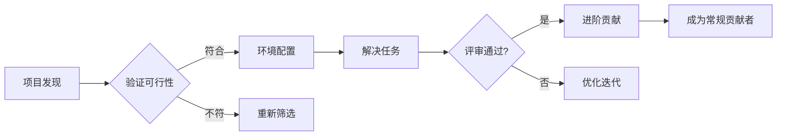
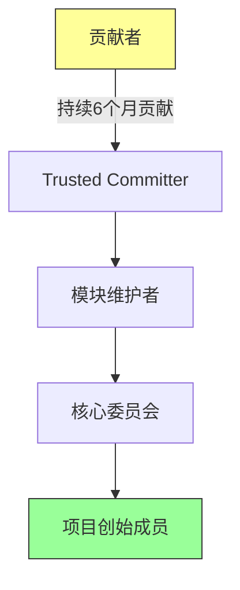

# 4.1.3.7 参与开源项目

!!! note "本节目标"
    通过实际参与开源项目，掌握 GitHub 协作开发的核心技能。本节将介绍从零开始参与开源项目的完整路径，包括项目发现、环境配置、贡献流程及社区互动规范，帮助开发者跨越首次贡献的心理门槛，建立可持续的开源贡献习惯。

---

## 开源参与价值矩阵

参与开源不仅是技术实践，更是职业发展的战略投资：

| 维度         | 技术收益                          | 职业价值                          | 社区影响                  |
|--------------|----------------------------------|-----------------------------------|--------------------------|
| 技能提升     | 接触工业级代码规范与架构设计        | 构建可验证的技术履历              | 获得同行技术认可          |
| 协作能力     | 掌握分布式团队协作工具链（Git/CI） | 建立全球开发者人脉网络            | 提升跨文化沟通能力        |
| 技术视野     | 洞察前沿技术实现方案               | 获得知名项目维护者推荐信          | 影响技术生态演进方向      |
| 问题解决     | 复杂场景调试能力强化               | 提升技术决策能力                  | 贡献解决方案惠及全球用户  |

---

## 标准化参与路径

遵循渐进式贡献模型降低参与门槛：



### 1. 项目发现策略

定位适合自身技能水平的项目：

**活跃度筛选**  

   1.查看`Insights > Contributors`图表确认持续开发  
   2.检查最近项目发版时间（建议 ≤ 3 个月）  
   3.典型指标：每月 50+ commits / 20+ PR 合并  

**新手友好标识**  

   1.寻找标有 `good-first-issue` 标签的任务  
   2.确认存在 `CONTRIBUTING.md` 指南文档  
   3.案例项目：  
    1）[VS Code](https://github.com/microsoft/vscode) 专设`beginner`分类  
    2）[Rustlings](https://github.com/rust-lang/rustlings)  
    3）[First Contributions](https://github.com/firstcontributions/first-contributions)  

**社区健康度**  

   1.观察 Issue 响应速度（维护者 24 小时内回复）  
   2.检查 Discord/Slack/Matrix 在线成员数量  
   3.验证[OpenSSF Scorecard](https://securityscorecards.dev)安全评分 ≥7.0
   确认存在新人引导机制  

### 2. 环境配置规范

建立符合项目要求的开发环境：

| 环境类型     | 配置要点                          | 验证工具                  |
|--------------|----------------------------------|---------------------------|
| 版本控制     | 安装 Git ≥2.37 并配置 SSH 密钥       | `git --version`           |
| 运行时       | 按`.tool-versions`安装指定版本    | `asdf install` / `nvm use`|
| 依赖管理     | 执行`npm ci --audit` / `poetry install` | `dependency-check`        |
| 预提交钩子   | 启用`pre-commit`自动化检查        | `pre-commit run -a`       |
| 安全扫描     | 配置 secret-detection 和 CVE 检查     | `trivy`, `gitleaks`       |

### 3. 环境验证示例

验证开发环境配置是否达标：

```bash
# 检查核心工具链
git --version && node --version && python --version

# 运行健康检查脚本（若项目提供）
curl -sL https://raw.githubusercontent.com/项目名/main/healthcheck.sh | bash

# 构建验证（以Go项目为例）
go build -v ./... && go test -short ./...
```

### 4. 贡献流程详解

GitHub 标准协作工作流：

1. **任务认领**  
    * 在 Issue 评论区声明解决方案思路  
    * 维护者分配任务后执行`/assign`命令  

2. **分支管理**  
    * 基于最新 main 分支创建：  

      ```bash
      git checkout -b fix/issue-123
      ```  

    * 命名规范：`类型/描述-issue号`  
    * 注意：变基操作仅适用于未合并的个人分支，禁止对共享分支执行变基

3. **代码提交**  
    * 原子化提交（单次提交解决单一问题）  
    * 遵循[Conventional Commits](https://www.conventionalcommits.org/)规范  

4. **本地验证**  
    * 执行完整测试套件：`make test`  
    * 关键项目覆盖率要求：  

      ```bash
      pytest --cov=src --cov-report=html --cache-clear
      open htmlcov/index.html  # 验证≥80%
      ```

5. **PR 创建**  
    * 关联原始 Issue：  

        ```markdown
        Fixes #123  # 修复错误
        Resolves #456  # 解决问题
        Part of #789  # 部分解决
        ```  

    * 填写 PR 模板描述技术方案和测试结果  

6. **持续改进**  
    * 使用`git rebase -i HEAD~3`整理提交历史  
    * 通过`git push -f`更新远程分支  

### 5. PR 生命周期管理

| 阶段            | 时间要求          | 行动指南                                     |
|-----------------|------------------|---------------------------------------------|
| 初始评审        | ≤48 小时          | 添加`needs-review`标签提醒维护者             |
| 评审中          | 每周更新         | 使用`@maintainer friendly ping`温和提醒      |
| 变更请求        | ≤72 小时响应      | 针对每条评论单独回复并标记`Done`             |
| 合并前          | CI 必须通过       | 本地复现 CI 错误：`act -j build`               |
| 归档            | 30 天无更新       | 自动关闭并添加`stale`标签                    |

---

## 贡献类型全景图

开源参与不限于代码提交：

| 贡献类型     | 适用阶段        | 典型任务                                                                 | 工具支持                  |
|--------------|---------------|-------------------------------------------------------------------------|--------------------------|
| 文档改进     | 首次贡献        | 修复 API 文档错误<br>添加代码示例<br>编写用户指南                         | ReadTheDocs, Diátaxis    |
| 测试开发     | 初级进阶        | 编写边界测试用例<br>完善 CI 流水线<br>性能基准测试                        | Jest, Playwright, JMH    |
| 缺陷修复     | 能力验证        | 复现社区报告 Bug<br>定位核心问题<br>提交 CVE 补丁                          | GDB, Wireshark, Sentry   |
| 功能开发     | 核心贡献        | 实现 RFC 提案功能<br>设计扩展 API<br>优化核心算法                          | Swagger, UML Designer    |
| 社区运营     | 长期参与        | 组织线上会议<br>管理社交媒体<br>新手导师计划                           | Zoom, Discourse, Luma    |
| 生态建设     | 战略影响        | 开发 IDE 插件<br>创建语言 SDK<br>构建工具链集成                           | VSCode Extensions, Rust Crates |

---

## 协作避坑指南

规避常见新手错误：

??? danger "高频失误点"

    **环境差异：**
      未锁定依赖版本导致本地/CI 行为不一致  
      解决方案：使用 `package-lock.json` 或 `poetry.lock`
    
    **沟通缺失：**
      未讨论方案直接提交大体积 PR  
      最佳实践：先提交 RFC 提案或技术原型
    
    **规范违反：**
      忽略代码风格检查（如 Python 的 black）  
      自动化方案：配置 pre-commit 钩子
    
    **范围蔓延：**
      单次 PR 解决多个无关问题  
      原则：1 PR = 1 Issue = 1 功能点

???+ tip "高效协作技巧"

    **精准提问：**
      错误示例："这个功能为什么报错？"  
      *专业格式：*
      ```markdown
      ## 环境
      OS: Ubuntu 22.04 LTS
      Runtime: Python 3.11.4
      
      ## 复现步骤
      1. `pip install -e .`
      2. `import lib; lib.run_example()`
      
      ## 预期行为
      应输出 "Hello World"
      
      ## 实际结果
      Segmentation fault (core dumped)
      ```
    
    **评审优化：**
      主动标记修改完成：`@maintainer PTAL`  
      使用 GitHub 建议块 (Suggested changes)
    
    **通用原则：**
      使用事实 + 数据的客观表述  
      避免文化预设，关注项目 CONTRIBUTING.md 中的沟通指南

---

## 进阶成长路线

从贡献者到维护者的蜕变路径：



* **1.阶段跃迁条件**  
  → Trusted Committer：合并 20+ PR 且涉及 3 个核心模块  
  → 模块维护者：主导模块 RFC 设计并通过社区投票  
  → 核心委员会：连续参与 2 个 LTS 版本发布管理  

* **2.权限升级标志**  
  1.获得代码仓库写入权限  
  2.参与技术路线图讨论  
  3.拥有 Issue 分类标记权限  
  4.代表项目出席技术会议  
