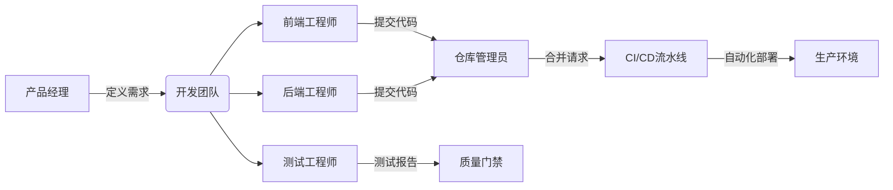
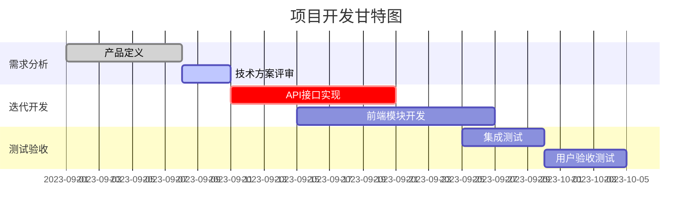

# 4.1.4.2 团队项目合作

!!! note "项目目标"
    通过团队协作开发实践，掌握现代软件工程核心技能：  
    - 使用 Git 实现高效版本控制与分布式协作  
    - 建立自动化项目管理与质量监控体系  
    - 培养技术沟通、代码评审与冲突解决能力  
    - 理解开源社区协作范式与工作流程  

---

## 项目背景与实施策略

开源项目合作实践不仅是一种编码能力的锻炼，更是对现代开发协同理念的深度体验。项目通常以小组为单位展开，需在限定时间内完成以下目标：

- 明确项目选题与功能边界，进行任务拆解
- 搭建项目初始结构，配置协作与 CI 工具
- 通过 Issue、PR 驱动协作流程，完成多人并行开发
- 借助机器人工具实现自动化打分与进度监控

### 项目选题建议

可选项目类型包括：

- 开源工具增强插件（如 Markdown 工具、IDE 插件）
- 教学型框架组件（如前端组件库、数据可视化模块）
- 社区服务类项目（如知识问答平台、留言系统）

选题应具备以下特征：

- 技术可行性：符合课程技术栈，具备清晰的技术实现路径
- 协作可能性：任务可拆分，有利于多人协同并行推进
- 教学价值高：有助于掌握 CI/CD、Git 协作、团队管理等核心能力

## 团队协作框架

### 协作工具矩阵

现代团队开发需集成标准化工具链：

| 工具类型       | 核心功能                          | 推荐工具                          | 关键实践要点                     |
|----------------|----------------------------------|-----------------------------------|----------------------------------|
| 版本控制       | 代码托管/分支管理/历史追踪         | GitHub, GitLab, Gitee             | 遵循 GitFlow 工作流              |
| 持续集成       | 自动化构建/测试/部署              | Jenkins, GitHub Actions, Travis CI| 每次提交触发完整测试链           |
| 项目管理       | 任务分配/进度跟踪/里程碑管理       | Jira, Trello, Taiga               | 每日站会同步任务状态             |
| 代码评审       | 在线评审/注释讨论/质量门禁         | Gerrit, Crucible, Pull Request    | 至少两人 LGTM 方可合并           |
| 文档协作       | 实时协同/版本管理/知识沉淀         | Confluence, Notion, Markdown Wiki | 代码与文档同步更新               |

### 团队角色分工

高效团队需明确责任边界：



## Git 协作实战

### 标准化工作流（GitFlow 增强版）

#### 初始化配置

```bash
git config --global user.name "团队ID-姓名"
git config --global core.editor vim  # 统一编辑器
```

#### 分支管理策略

- `main`：受保护主干分支（仅允许合并）  
- `develop`：集成测试分支  
- `feature/`：功能开发分支（按 JIRA 编号命名）  
- `hotfix/`：紧急修复分支  

#### 代码提交规范

```plaintext
[类型] 模块名：简明描述（关联Issue号）

详细说明（可选）

# 类型标签包括：
# feat, fix, docs, refactor, test, chore
```

### 协作冲突解决方案

当出现合并冲突时：

```bash
# 拉取最新目标分支
git checkout develop
git pull origin develop

# 变基重构提交历史
git checkout feature/login-module
git rebase develop

# 手动解决冲突后继续
git add resolved-file.js
git rebase --continue

# 强制推送更新分支
git push -f origin feature/login-module
```

---

## 自动化评分系统

### 监控机器人配置

使用 GitHub Actions 实现自动化评估：

```yaml
name: Contribution Tracker
on: [push, pull_request]

jobs:
  score-calculator:
    runs-on: ubuntu-latest
    steps:
      - uses: actions/checkout@v3
      - name: Calculate Contribution
        uses: ossf/scorecard-action@v2
        with:
          repo_token: ${{ secrets.GITHUB_TOKEN }}
          output_format: json
          output_file: results.json
      - name: Upload Report
        uses: actions/upload-artifact@v3
        with:
          name: contribution-report
          path: results.json
```

### 评分维度与权重

| 指标           | 权重  | 评估标准                         | 检测工具                          |
|----------------|--------|----------------------------------|-----------------------------------|
| 代码贡献量     | 25%   | 有效代码行数 / 提交频率          | git-quick-stats                   |
| 问题解决能力   | 30%   | 关闭 Issue 数 / 缺陷修复率       | GitHub Issues API                 |
| 代码质量       | 20%   | 测试覆盖率 / 静态扫描通过率      | SonarQube, Codecov                |
| 文档贡献       | 15%   | API 文档更新 / README 完善度     | Markdown-Lint                     |
| 协作参与度     | 10%   | 代码评审次数 / 设计讨论参与      | GitHub GraphQL API                |

---

## 项目执行流程

### 阶段里程碑规划

每个项目最好有一个清晰的规划图来指导进度 (如下图所示):



### 质量保障机制

#### 预提交检查（Git Hooks）

```bash
# .git/hooks/pre-commit
#!/bin/sh
npm run lint && npm test
```

#### 分支保护规则

- 禁止直接推送 main 分支  
- 必须通过 Pull Request 合并  
- 需通过全部 CI 检查项  

#### 自动化代码扫描

```yaml
# .github/workflows/codecheck.yml
- name: Security Scan
  uses: shiftleftsecurity/scan-action@v2
  with:
    output: reports/
```

???+ tip "最佳实践提示"
    - 每日同步机制：团队使用 stand-up meeting 同步阻塞问题  
    - 原子化提交：单次提交仅解决一个逻辑问题  
    - 文档即代码：所有设计文档随代码库版本化管理  
    - 自动化优先：人工操作环节需逐步替换为脚本  
    - 贡献透明化：通过 GitHub Insights 可视化成员贡献  

???+ example "学习资源推荐"
    - **Git 大师课**：[Pro Git 中文版](https://git-scm.com/book/zh/v2)
    - **协作规范**：[Google 工程实践指南](https://google.github.io/eng-practices/)
    - **CI/CD 实战**：[GitLab CI 模板库](https://docs.gitlab.com/ee/ci/examples/)
    - **开源项目**：[First Contributions 新手训练](https://github.com/firstcontributions/first-contributions)
