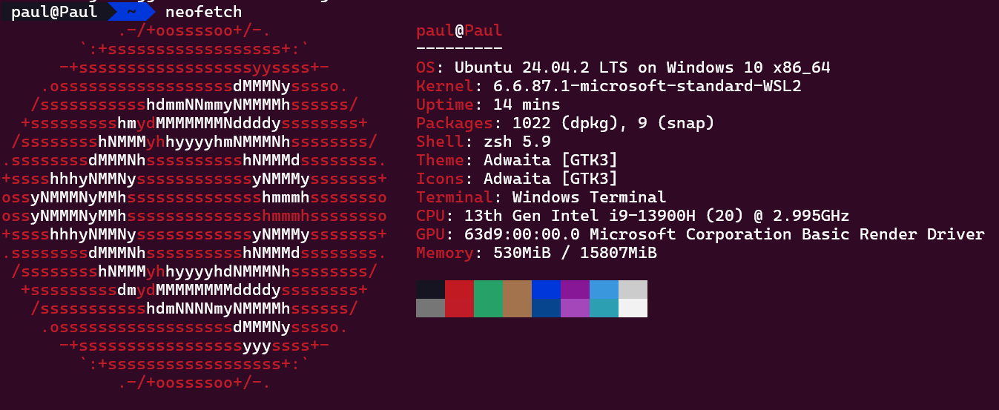

# 一些常用的 Linux 工具

!!! note "主要作者"

    [@Paulkm2006](https://github.com/Paulkm2006)

## 目的

让使用 Linux 变得像使用 Windows 一样简单！

本文只是作为一些常用工具的常用方法的介绍。有很多工具都具有更加高级的使用方法，因篇幅限制无法在本文中展开描述。若对某一个工具感兴趣，最简单的办法就是阅读他的 man 手册。同时，[runoob 网站](https://www.runoob.com/linux/linux-command-manual.html)也覆盖了很多本文没有提及的工具。

## 快速开始（新手建议）

如果你是第一次接触 Linux，建议按以下顺序阅读内容，逐步掌握基础工具的使用：

1. 先学习如何查阅命令的用法，掌握基本帮助命令的使用方法（可参见第 0 节“如何查看命令的帮助”）。
2. 再了解如何查看和关闭进程，熟悉任务管理相关操作（可参见第 1 节“任务管理器系列”）。
3. 接着学习如何查看磁盘、CPU、USB 等硬件资源的使用情况（详见第 2 节“资源管理器系列”）。
4. 最后学习查看和编辑文件内容、搜索关键词等基本文件操作（请参考第 3 节“文本和文件操作类”）。

建议配合实际操作边学边练，更容易理解和记忆。

## 编写格式

很多工具都可以接受一些可选参数和开关。但同时，也有部分应用要求一些输入才能运行。在本文中，通常用如下的格式来描述命令
`command [optional_parameters] required_input`
其中：

- `[optional_parameters]` 为可选的输入
- `required_input` 为必须的开关和输入

一些开关（以`- -- /`等开头的参数）可能会要求额外的输入。此时其将会表示为`-flag <input>`，代表必须输入 input

!!! warning
    请注意！Linux 系统是大小写敏感的！若执行命令时出现了错误的结果或提示无法识别参数，请检查一下自己的大小写是否正确。

!!! note
    什么是“终端”或“命令行”？  
    简单理解，它是一个可以输入命令并看到执行结果的窗口。在 Ubuntu 中你可以使用 Ctrl+Alt+T 打开它。也叫 shell 或终端窗口。

## 内容

### 0. 如何查看命令的帮助

Linux 中的命令数不胜数。很显然，一下子把他们的用法和命令全部记住是一件不现实的事情。
那么有什么能帮助我们在忘记用法的时候快速查看命令的帮助呢？当然有！他的名字是 man（manual 的缩写）

man 可以被称为 Linux 系统的百科全书。从命令使用到操作系统的 API，都可以从这个工具中查阅。一般，我们会使用`name(section)`的格式来提示用户，这个工具的相关信息存在 man 手册中`section`片段的`name`条目下。一般来说，`section`的确定遵循以下编号：

- 1 用户命令（即大部分软件的文档）
- 2 系统调用（系统提供的 API 接口）
- 3 运行库调用（第三方运行库提供的 API 接口）
- 4 特殊文件/设备（如果你对某个位于`/dev`的东西很感兴趣，他大概率位于这个章节）
- 5 文件格式与配置（用于配置应用/服务的配置文件格式）
- 6 游戏
- 7 概览与杂项
- 8 系统管理命令（需要 root 执行的，可以改变系统信息的命令，如`mount`）

别慌！一般来说，作为用户的我们是不需要记住这些编号的。如果你想查看一个东西的文档，最简单的办法就是直接运行`man name`。man 会自动找到含有这个条目的章节并展示给你。

!!! note
      一般来说，我们无需指定章节号。但是对于某些可能存在于多个章节的条目（比如`printf`既是一个位于章节 1 的工具，也是一个位于章节 3 的 API 函数），要想跳到其他章节，这个编号就是必须的。此时，命令的结构为 `man [section] name`

!!! info
    对于绝大部分人类来说，man pages 的文档还是有些过于晦涩了。别担心！我们可以使用一个叫`tldr`的开源工具来阅读更加实用、通俗易懂的说明。关于这个工具的详情，请参考下一节的“[常用的开源工具](../sec5/1-useful-oss.md)”篇目。

### 1. 任务管理器系列

在 Windows 中，我们可以很方便的使用任务管理器（taskmgr）实时查看后台及前台的程序列表，监视其资源占用，并强制结束掉一些无响应/不愿意自己退出的程序。
在 Linux 中，同样有很多可以实现相同功能的命令，这里选择以下几个介绍：

- **ps**

    ps 命令全名为 Process Status。顾名思义，他可以监测后台正在运行的程序。

    用法：`ps [options]`

    当没有参数时，ps 默认输出以调用用户身份运行的全部进程。

    如果指定参数`-e`，则可以输出本机全部用户运行的所有进程。

    一个更常用的参数为`aux`，能够输出用户、pid、CPU 和内存占用、启动命令等信息

- **top**

    top 命令是动态版的 ps。可以实时刷新显示后台程序及其资源占用

    用法：`top [options]`

    当没有参数时，top 默认每 3 秒刷新一次后台情况，并在收到用户终端`Ctrl+C`前保持开启

    当指定`-d <seconds>`、`-n <times>`时，会每隔 seconds 刷新一次，直到刷新了 times 次

    当指定`-u <username>`时，会显示指定用户的进程

    在 top 运行时输入`k`，会跳转到结束进程的会话，此时输入进程 pid 和信号代码即可结束。

    top 是一个相对底层（也更加难以使用）的工具。虽然它可以展示绝大多数的系统状态信息，但是这些信息过于杂乱，不是很适合人类阅读。这就引出了下一个要介绍的工具

    !!! tip
        如果你出于某些原因只能使用 top，那么可以在启动 top 后输入命令`xtm4z`，以获得一个相对友好的界面

    在 top 中常见字段说明：

    `PID`：进程 ID  
    `USER`：所属用户  
    `%CPU`：CPU 使用率  
    `%MEM`：内存使用率  
    `TIME+`：累计使用的 CPU 时间  
    `COMMAND`：命令名  

- **htop**

    htop 是 top 的（超级）增强版。除了可以显示进程外，它还可以以图标的方式展现系统负载和资源利用情况，并提供了方便的快捷操作

    用法：`htop`

    启动后，htop 的界面一目了然：最上方为系统负载显示，中间区域列出后台进程，最下方为操作按钮。

    !!! tip
        是的，“按钮”是可以使用鼠标点击的——事实上，类似于 htop 这样的可以使用鼠标操作的命令行程序有个专门的名字，tui（terminal ui）

    htop 的功能非常丰富。除了可以对进程进行筛选、排序外，我们还能直接向一个进程发送中断。

    选中你想操作的进程（使用方向键或直接用鼠标点击），按`F9`，最左边会出现一长串以`SIG`开头的命令。一般来说，我们保持默认的`SIGTERM`即可。但是，如果一个程序不回应我们的`SIGTERM`，我们也可以使用更加强制的`SIGKILL`强制结束它。

    如果向了解更多有关 Linux 中各个信号的意义，可以参考[这篇文章](https://prateeksrivastav598.medium.com/understanding-Linux-signals-a-comprehensive-guide-339ecc2d16d4)

    !!! warning
        如果系统提示找不到 `htop` 命令，可以使用以下命令安装（根据你的系统选择）：

        ```bash
        # Debian/Ubuntu
        sudo apt install htop

        # CentOS/RHEL
        sudo yum install htop

        # Arch Linux
        sudo pacman -S htop
        ```

- **kill killall 和 pkill**

    我们除了可以使用 htop 与 top 来结束任务，还能直接使用命令行工具进行。

    kill 工具用于根据进程 pid 结束进程。进程的 pid 可以通过上述三个工具获取。

    用法：`kill [flags] pid`

    当指定`-s <signal>`时，会使用指定的信号结束进程。否则默认为`15 SIGTERM`

    选中你想操作的进程（使用方向键或直接用鼠标点击），按`F9`，最左边会出现一长串以`SIG`开头的命令：

    `SIGTERM` (15)：**安全终止**，允许进程清理后退出（推荐首选）
    `SIGKILL` (9)：**强制终止**，立即结束进程（用于无响应进程）

    killall 工具用于根据进程名称结束进程。注意若有多个进程拥有相同的名字，killall 将会杀死所有同名的进程。

    用法：`killall [flags] process_name`

    当指定`-i`时，killall 会在结束进程之前与用户二次确认。

    pkill 工具可以用来模糊匹配需要结束的进程。例如，执行`pkill fire`既会结束`firefox`，也会结束`firebird`。

    用法：`pkill [flags] fuzzy_name`

    当指定`-x`时，pkill 只会结束名称**完全匹配**的进程

### 2. 资源管理器系列

Windows 里，我们可以使用设备管理器（devmgmt.msc）、磁盘管理器（diskmgmt.msc）和系统控制面板查看系统中内存、磁盘和外接设备的状态。
同理，Linux 也包含很多实用程序，帮你管理系统的各种资源

- **lsblk 与 df**

    介绍这两个工具之前，我们先了解一些操作系统知识

    在操作系统的眼中，通俗意义上的“磁盘”其实包含了两层意思——物理存储数据的设备，和规定如何存储数据的文件系统。前者是底层的、一般不可改变的硬件属性，而后者（大部分是）操作系统管理的，可进行一定操作的软件抽象。

    lsblk 命令用于查看前者的属性。

    用法：`lsblk`

    这个命令输出的是原始**磁盘和分区**的大小和位置。你可以方便的看到系统连接的物理硬盘，以及它的分区情况。

    df 用于查看文件系统的属性。

    用法：`df [options]`

    当指定`-h`时，命令将输出人类可读的数据单位（MB GB 等）而非字节

    当指定`-i`时，命令将输出文件系统`inode`的使用状况。[何为 inode？](https://www.redhat.com/en/blog/inodes-Linux-filesystem)

    这个命令输出的是物理和虚拟**文件系统**的使用情况。

- **lscpu**

    lscpu 输出系统 CPU 的信息。

    用法：`lscpu`

    输出包含 CPU 型号、核心数、频率和支持的指令集等信息

- **lspci 和 lsusb**

    lspci 输出所有通过 PCI 总线连接的设备的信息。这包括显卡、多数硬盘、网络接口、USB 控制器等等设备。lsusb 显示所有插入的 USB 设备。

    用法：`lspci` `lsusb`

    注意，wsl 环境中不存在这两个命令

- **/proc 目录**
!!! tip "什么是/proc?"
    Linux中`/proc`是**虚拟文件系统**，不占用磁盘空间，实时反映系统状态
    你可以像查看普通文件一样查看这些特殊文件

    是的，这是一个目录，而并非一个工具。Linux 遵循“万物皆文件”的原则，故我们也可以从一个个“文件”中读取到相应的系统信息。

    以下几个文件是比较常用的

  - `/proc/cpuinfo`: 显示 CPU 信息
  - `/proc/meminfo`: 显示内存信息
  - `/proc/swaps`: 显示交换分区信息 [何为 swap？](https://docs.redhat.com/en/documentation/red_hat_enterprise_Linux/7/html/storage_administration_guide/ch-swapspace#ch-swapspace)

    通常，我们使用`cat`命令查看这些文件

- **du**

    du 命令用于查看目录的大小。

    用法：`du [options]`

    当指定`-h`时，将会以人类友好的单位输出数据

    当指定`-d <size>`时，将以深度为 size 的目录作为一个条目

    当指定`-s`时，将统计当前目录占用的空间

???+ tip 更加直观的工具

    如果你想要一个酷炫的工具来展示你的配置信息，那不妨试试`neofetch`或者`inxi`。这两个工具并非系统自带，所以你需要使用包管理器安装一下。
    

### 3. 文本和文件操作类

- **cat**

    cat 命令用于将一个文件的内容输出到标准输出（stdout，也就是命令行里显示的东西）。

    用法：`cat [options] [filename]`

    当指定`-n`时，cat 将会为输出加上行号

    若未指定`filename`，cat 将会重定向标准输入（stdin，也就是你输入命令行的东西）到标准输出。具体来说，他会变成一个复读机，显示任何你输入的内容。

- **grep**

    grep 用于对文本进行提取和筛选。

    用法：`grep [options] pattern [file]`

    当指定`-i`时，grep 将忽略大小写进行匹配

    当指定`-v`时，grep 将进行反向查找，只输出不符合`pattern`的行

    当指定`-n`时，grep 将会为输出加上行号

    `pattern`参数代表需要查询的字符串或正则表达式。

    当没有指定`file`时，grep 将从命令管道中读取数据并进行查找。有关管道的使用和定义，请参考本章的上一篇目。

    当`file`为一个目录且指定`-r`时，grep 将遍历该目录下所有文件。

    可以毫不夸张的说，grep 是 Linux shell 中绝大多数应用必不可少的帮助工具。例如，我们常用 grep 和 cat 筛选并列出日志中感兴趣的条目，或使用 grep 和 ps 查找一个进程的 pid。

- **nano，vi 和 vim**

    这三个工具都是 Linux 环境下的文本编辑器。

    对于初学者（但是并不局限于初学者）来说，nano 是其中最友好也最方便的一个。

    用法：`nano [options] filename`

    当指定`-B`时，nano 将自动为编辑的文件创建一份备份（文件名为`filename~`）

    nano 的界面非常友好，可以进行的操作一目了然。以下几个快捷键是比较常用的：

  - `Ctrl+X` 退出
  - `Ctrl+O` 保存
  - `Ctrl+W pattern` 查找
  - `Ctrl+\ pattern replace` 替换
  - `Ctrl+/ n` 跳转到第 n 行

    vi 和 vim 是有悠久历史的 Linux 文件编辑器。它们的操作方式比较复杂，但是对于熟练掌握的用户来说非常方便。本文在此对其高级用法不过多的赘述，若感兴趣可以阅读[Vim Cheat Sheet](https://vim.rtorr.com/)

    用法：`vi/vim filename`

    打开文件后：

    1. 按下 `i` 进入**编辑模式**（底部显示 `-- INSERT --`）
    2. 编辑完成后按 `ESC` 返回**命令模式**
    3. 在命令模式下输入：
        - `:w` 保存
        - `:q` 退出
        - `:wq` 保存并退出
        - `:q!` 强制退出不保存（注意是英文感叹号）

    !!! tip
        若编辑时卡住，连续按 `ESC` 确保返回命令模式再输入指令。

    !!! info
        多数系统自带的 vim 都是`vim-tiny`而非完整的`vim`。若你在更改他的配置时发现了一些不对劲的地方，可以试试安装完整版的 vim。

- **more 和 less**

    在使用 shell 时，我们经常遇到输出过长，一页屏幕装不下的情况。这时，我们可以使用 more 和 less 来实现输出的分页。通常来说，我们会更倾向于使用 less

    more 与 less 的用法非常相似，故在此一并叙述

    用法：`more/less [+line] [+/pattern] [filename]`

    当指定`+line`时，工具将会从`line`行以后开始显示

    当指定`+/pattern`时，工具将会从符合`pattern`的位置开始显示

    当未指定`filename`时，工具将会读取标准输入作为数据源

    在进入了分页界面后，我们可以使用以下命令操作

  - `Enter` 向下一行
  - `Down/Up` 注意，在 more 中这两个按键的作用是向下/上一页，而在 less 中是向下/上一行
  - `q` 退出
  - `h` 查看帮助信息

!!! example
    你可以使用 `cat` 命令输出内容并通过管道 `|` 传给 `less` 实现分页：

    ```bash
    cat largefile.txt | less
    ```

    或直接打开文件：

    ```bash
    less largefile.txt
    ```

- **tail**

    我们有时只想查阅文件最末尾的内容，或实时显示文件的最新输出。此时，tail 工具就能派上用场。

    用法：`tail [options] [+from] [filename]`

    当指定`-f`时，tail 将进行循环读取，也就是实时更新文件内容

    当指定`-n <num>`时，将会输出末尾`num`行的内容。若无此参数，默认输出末尾 10 行

    当指定`+from`时，将会从第`from`行开始输出内容

- **touch**

    touch 命令用于修改文件的时间属性或创建文件。顾名思义，被 touch 的命令就像被“摸”过，其读取或修改时间会变为命令执行的时间。

    用法：`touch [options] filename`

    当指定`-a`时，则只会改变读取时间

    当指定`-m`时，则只会改变修改时间

    当指定`-t <stamp>`时，则会使用 stamp 指定的时间。stamp 的格式为`[[CC]YY]MMDDhhmm[.ss]`

    当未指定`-c`且`filename`不存在时，touch 会创建该文件

- **diff**

    diff 用于比较两个文件不同的地方。

    用法：`diff [options] filename1 filename2`

    当指定`-y`时，将会以并排的方式显示两个文件。若同时指定`-W <width>`则会使用指定的宽度作为一栏

    当指定`-u`时，将会高亮输出差异的部分，并合并相同的部分

    当指定`-q`时，仅会输出两个文件是否有差异，而不输出他们的差异详情

    当文件较大时，通常会指定`-H`参数以加速比对

    !!! tip
        我们可以使用`vimdiff`工具进行可视化、交互的文件对比

### 4. 网络操作类

- **wget 和 curl**

    wget 和 curl 都被用于发起网络请求。他们的区别在于 wget 主要用于下载文件（然而 curl 其实也可以），curl 主要用来发起请求。

    用法：`wget [options] url`

    当指定`-O <filename>`时，会将下载的文件重命名为`filename`。当`filename`为`-`时，将会将获得的内容输出到标准输出

    当指定`--no-check-certificate`时，会忽略证书错误

    用法：`curl [options] url`

    当指定`-X <method>`时，将使用`method`方法发送请求。

    当指定`-H <header>`时，将会使用`header`作为请求头

    当指定`-o <filename>`时，将会把回应输出为文件。若没有指定这个选项，将会输出到标准输出

    当指定`-L`时，将会跟随重定向

    当指定`-d <data>`时，将会把`data`的数据作为请求体发送。特别的，`data`中可以指定`@filename`，此时将会上传文件

    **常用场景示例：**

    ```bash
    # 下载文件并重命名
    wget -O logo.png https://example.com/image.png
    
    # 快速测试 API（JSON 格式美化）
    curl -s https://api.example.com/data | jq  
    
    # 带身份验证的请求
    curl -u user:password https://api.example.com
    ```

| 功能           | wget                         | curl                            |
|----------------|------------------------------|----------------------------------|
| 默认行为       | 下载文件                      | 显示网页内容或发起请求           |
| 支持协议       | HTTP, HTTPS, FTP             | 支持协议更多（HTTP, FTP, SMTP 等）|
| 文件上传       | 不支持                       | 支持（`-d` 或 `--upload-file`） |
| 是否默认安装   | 多数系统已内置               | 多数系统已内置                   |

- **ftp**

    ftp 用于从或向服务器传输文件。注意！`ftp`，`ftps`，`sftp`是三个不同的协议！`ftps`是加密的`ftp`协议，而`sftp`是基于`ssh`协议传输。

    用法：`ftp [[user[:password]@]host[:port]]`

    当在执行程序时没有指定服务器时，可以在打开工具后执行命令`open [[user[:password]@]host[:port]]`进行连接

    连接后，使用`put local remote`上传文件，`get remote`下载文件。

- **ssh 和 sftp**

    ssh 协议是一种加密的数据传输协议。通常，我们使用这个协议来远程登录服务器。

    用法：`ssh [options] [user@]host`

    当指定`-p <port>`时，ssh 将通过`port`连接

    当指定`-i <filename>`时，使用`filename`指定的私钥进行鉴权。若没有指定这个选项，ssh 默认使用位于`~/.ssh/id_{rsa,ecdsa,ed25519}`的文件中的密钥

    当指定`-L <[bind_address:]port:host:hostport>`时，将会把远程服务器上`host:hostport`的端口转发到本机`bind_address:port`上

    sftp 的用法与 ftp 与 ssh 非常相似，故在此不多赘述。

- **ping**

    ping 命令用于向服务器发送 ICMP 数据包以检测网络连通性与延迟。注意，目前多数公共服务阻断了 ICMP 连接，所以无法 ping 通并不意味着无法使用该服务。

    用法：`ping [options] host`

    当指定`-c <count>`时，将会进行`count`次检测。若无此参数，ping 将一直检测直到按下`Ctrl+C`

    当指定`-i <interval>`时，将会在两次检测之间延迟`interval`秒

- **ip**

    ip 工具用于配置 Linux 系统上几乎全部的与网络相关的设置。出于简洁需要，本文只对其中一小部分常用功能进行叙述。若想了解更多，可以使用 man 命令查看其手册

    用法：`ip object [command]`

    当指定`object`为`a`（或`addr`，`address`），会输出网络端口的地址信息

    当指定`object`为`link`，会输出网络端口的状态信息

### 5. 杂项

- **压缩与解压缩**

  - `.tar.*`文件

      初次使用 Linux 下的压缩文件时，你会发现很多文件的后缀都有两个部分。这是因为，`tar`是一种文件**归档**格式，作用是将多个文件、目录集中到一个文件中；`xz`，`gz`和`bz2`等是**压缩**格式，用于减小归档文件的体积。

      无论使用了何种压缩格式，我们都能使用`tar`工具对其解压

      用法：`tar [options]f filename [options2]`

      注意，如果你是对文件进行操作，则在任意`option`的末尾必须加上这个`f`，代表文件操作

      一些常用的方法为：

      `tar xvf filename -C dir` 解压并展开`filename`中的文件和路径到`dir`目录中，并显示详细信息

      `tar czvf archive.tar.gz file1 file2 dir1 ...` 将`file1`，`dir1`等文件和目录归档并压缩到`archive.tar.gz`文件中

  - `7z`和`rar`

      这两种文件的压缩与解压需要使用工具`p7zip`。这个工具在多数系统中并不会被自动安装，所以需要你使用包管理器安装一下。

      用法：`p7zip [options] file1 file2 ...`

      当指定`-d`，且文件均为压缩文件时，则操作是解压相应的文件。否则，p7zip 会将文件压缩至一个`7z`压缩包中

    !!! warning
        注意！p7zip 默认会**删除**任何成功操作的输入文件。

      当指定`-k`时，将会保留被压缩的文件或原压缩包。

  - `zip`

      zip 文件是日常生活中最常见的压缩格式。在 Linux 中，我们可以选择使用`p7zip`或`unzip`与`zip`来操作。`p7zip`的使用方法参考上一条

      用法：`unzip [options] file.zip`

      当指定`-d dir`时，将会解压到`dir`目录中

      用法：`zip archive file1 file2 ...`

- **计划任务**

    有时，我们会希望某个命令被按一定的时间执行，例如每天 9 点自动更新软件包。此时，我们可以使用 crontab 工具

    用法：`crontab [options]`

    当指定`-e`，该命令会使用你的默认文本编辑器打开一个配置文件。这个配置文件的详细格式可以参考[这篇文章](https://linux.fasionchan.com/zh_CN/latest/administration/service/cron/crontab-conf.html)

    **时间格式图解：**

    ```bash
    ┌── 分钟 (0-59)
    │ ┌── 小时 (0-23)
    │ │ ┌── 日 (1-31)
    │ │ │ ┌── 月 (1-12)
    │ │ │ │ ┌── 星期 (0-7, 0 和 7=周日)
    │ │ │ │ │
    * * * * * command
    ```

    !!! example "示例"
        `0 9 * * 1-5 command` → 每周一到周五 9:00 执行  
        `*/10 * * * * command` → 每 10 分钟执行

- **服务**

    我们会希望一些服务（如 web 服务器、数据库等）能够在系统启动的时候也一起启动，并能够不被干扰的在后台运行。这时，我们就会用到`systemd`

    对于 systemd 的使用可以参考[这篇文章](https://www.ruanyifeng.com/blog/2016/03/systemd-tutorial-commands.html)

    一般来说，通过包管理器安装的应用都为我们配置了`systemd`服务，我们可以直接对其进行操作

    用法：`systemctl verb [options] [object]`

    其中，verb 可以是以下这几个。注意除特殊说明外，object 均是**必须包含**的参数

    ```bash
    - start 启动
    - stop 停止
    - enable 设置开机启动。若同时附带`--now`参数相当于同时执行`start`
    - disable 取消开机启动
    - restart 重启
    - reload（对于支持的应用）重载配置
    - status 查看状态
    - daemon-reload 当更改过服务的配置文件后，需要运行这个命令让 systemd 读取更新的文件。这个命令无需指定`object`
    - ...
    ```

    !!! note
        严格意义上来说，`systemd`其实是一整套工具，能够让我们管理 Linux 系统的方方面面。
    !!! warning
        对于 Alpine Linux 用户：Alpine 发行版使用的并不是`systemd`而是`OpenRC`。若需要了解更多信息，请参考[Alpine wiki](https://wiki.alpinelinux.org/wiki/Writing_Init_Scripts)

- **nohup 与 screen**
    在 ssh 会话结束后，我们运行的所有前台应用都将会被销毁。若需要将会话长时间保持后台运行，我们可以使用 nohup 或 screen 工具
    nohup 的作用是让应用不受 ssh 会话终止的影响，继续在后台运行。
    用法：`nohup [command]`

    通常，我们使用指令`nohup command > log.log 2>&1 &`，意义为：在后台运行`command`，将其的标准错误输出（`stderr`）合并到标准输出，并重定向到文件`log.log`，并让终端继续接受后续命令

    **基础用法：**

    ```bash
    # 后台运行脚本并忽略关闭信号
    nohup python myscript.py &
    
    # 查看实时输出
    tail -f nohup.out
    ```

    screen 的作用是相当于一个虚拟终端。我们可以随时切换回到这个终端，或从这个终端分离。分离后，其将继续在后台运行
    用法：`screen [options] [command]`
    当指定`-ls`时，会显示所有运行的 screen 会话
    当指定`-d`时，会以分离的模式运行这个会话
    当指定`-S <name>`时，会将会话命名为`name`，方便后续管理
    当指定`-r <id/name>`时，会切换到相应终端
    当指定`-XS <id/name> <command>`时，会在对于会话中执行命令
    若想从终端中分离，可以同时按下`Ctrl+A+D`按键
    若想结束一个终端，可以执行`screen -XS <session-id> quit`
    !!! note
        screen 工具由于维护不佳，导致出现了[许多漏洞](https://security.opensuse.org/2025/05/12/screen-security-issues.html)。在可能的情况下，我们更加推荐使用 tmux。关于这个工具的详情，请参考下一节的“[常用的开源工具](../sec5/1-useful-oss.md)”篇目

## 🧪 小练习

1. 用 `ps aux` 命令查看所有进程，并使用 `grep` 查找包含关键词 "ssh" 的进程。
2. 使用 `top` 命令，观察当前哪个进程占用 CPU 最高。
3. 使用 `kill` 命令终止某个你启动的测试进程（比如 `gedit`）。
4. 尝试用 `ss -tunlp` 查看当前系统监听的端口。

## 小贴士

- 想更深入学习这些工具？推荐查看 [https://explainshell.com](https://explainshell.com)
- 遇到不会用的命令？试试 `man <命令>` 或 `<命令> --help`
- 多实践！Linux 学习最好的方式是——动手敲命令

## 附录：推荐安装的常用工具（适合新手）

| 工具      | 作用简述                     | 安装命令（Ubuntu/Debian）       |
|-----------|------------------------------|----------------------------------|
| tldr      | 简洁版 man 手册              | `sudo apt install tldr`         |
| htop      | 图形化任务管理器              | `sudo apt install htop`         |
| neofetch  | 显示系统信息图               | `sudo apt install neofetch`     |
| inxi      | 全面展示硬件/系统信息         | `sudo apt install inxi`         |
| unzip     | 解压 zip 文件                 | `sudo apt install unzip`        |
| p7zip     | 解压 7z 文件（完整功能）      | `sudo apt install p7zip-full`   |
