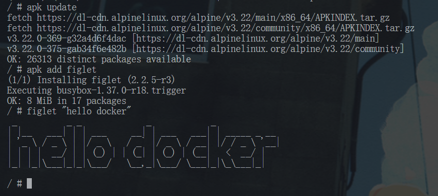
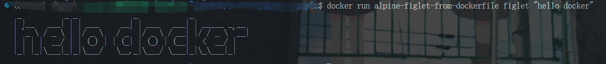

# 自定义镜像之 Dockerfile 详解

Docker 生态之所以如此繁荣，是因为有许许多多的组织或者开发者贡献了大量的功能不同的镜像，这些镜像被用在各种场景中，比如软件分发，CI/CD，云原生应用部署，可观测性等等。

我们将从最简单的镜像创建方式开始，只需将一个 commit 容器实例作为镜像即可。然后，我们将探索一种更强大、更实用的镜像创建方法：Dockerfile。

## 从容器创建镜像

首先使用交互式运行一个 alpine 容器。

``` shell
docker run -it alpine
```

然后我们在容器中执行一些命令，比如安装一个软件，然后退出容器。

```shell
apk update
apk add figlet
figlet "hello docker"
exit
```

如图所示：

这样，我们就在 alpine 容器中安装了 figlet 工具，当然，之后我们会安装一些更加有用的软件，
比如 git，nginx 等等。然后我们需要将这个新的容器环境跟其他人分享，我们可以通过 commit 命令将容器保存为一个镜像。

```shell
docker ps -a #查看容器
docker commit <container_id>
```

这样，我们就创建了一个装有 figlet 的镜像，我们可以通过 docker image 命令查看。

``` shell
docker image ls
```

从上一个命令中，获取新创建镜像的 ID，将其重新 tag 为 alpine-figlet。

```shell
docker tag <image_id> alpine-figlet
```

然后我们就可以使用这个新的镜像了。

```shell
docker run alpine-figlet figlet "hello docker"
```

最后我们也可以使用 `docker push` 命令将镜像推送到镜像仓库中，其他人便可以使用 `docker pull` 来使用这个镜像了。

## Dockerfile 详解

上述从容器创建镜像的方式虽然简单易懂，但是如果涉及版本迭代的时候，
比如下次我需要再额外安装一个 git 命令，就需要重新 commit 一个容器，然后重新 tag 一个镜像，
这样比较麻烦，而且容易出错。因此，我们需要一种更加灵活的镜像创建方式，这就是 Dockerfile。
我们来使用 Dockerfile 来完成上述的同样的事情：

```dockerfile
FROM alpine:latest
RUN apk update &&\
    apk add figlet &&\
    apk add git
```

最后使用 `docker build` 命令来构建镜像：

``` shell
docker build -t alpine-figlet-from-dockerfile .
```

同样可以使用这个镜像

``` shell
docker run alpine-figlet-from-dockerfile figlet "hello docker"
```



这样当我们需要安装 git 的时候，只需要修改 Dockerfile 中的命令后重新构建镜像即可。

```shell
docker build -t alpine-figlet-from-dockerfile .
docker run alpine-figlet-from-dockerfile git
```

## 使用 Dockerfile 构建一个 jupyter notebook 镜像

接下来让我们使用 Docker 来构建一个真实可用的镜像，比如 jupyter notebook 镜像。为了更好的演示，我们再预置一个 sample-notebook.ipynb。
创建 dockerfile 和 sample-notebook.ipynb 两文件于 jupyter_sample 文件夹目录下。

dockerfile:

```dockerfile
FROM python:3.10-slim

# 安装系统依赖
RUN apt-get update && \
    apt-get install -y --no-install-recommends \
    curl \
    && rm -rf /var/lib/apt/lists/*

# 安装 Python 包
RUN pip install --no-cache-dir \
    jupyterlab==4.4.3 \
    pandas==2.3.0 \
    numpy==1.26.2 \
    matplotlib==3.8.2

# 安装 Jupyter 内核
RUN pip install --no-cache-dir \
    ipykernel==6.29.0 \
    && python -m ipykernel install --name python3

# 设置工作目录并初始化笔记本
WORKDIR /notebooks
COPY sample-notebook.ipynb .

# 暴露 Jupyter 端口
EXPOSE 8888

# 启动命令
CMD ["jupyter", "lab", "--ip=0.0.0.0", "--allow-root", "--no-browser", "--NotebookApp.token=''", "--NotebookApp.disable_check_xsrf=True"]
```

sample-notebook.ipynb:

```json
{
 "cells": [
  {
   "cell_type": "code",
   "execution_count": null,
   "id": "637fd6d7",
   "metadata": {
    "vscode": {
     "languageId": "plaintext"
    }
   },
   "outputs": [],
   "source": [
    "import pandas as pd\n",
    "df = pd.DataFrame(\n",
    "    {\n",
    "        \"Name\": [\n",
    "            \"Braund, Mr. Owen Harris\",\n",
    "            \"Allen, Mr. William Henry\",\n",
    "            \"Bonnell, Miss. Elizabeth\",\n",
    "        ],\n",
    "        \"Age\": [22, 35, 58],\n",
    "        \"Sex\": [\"male\", \"male\", \"female\"],\n",
    "    }\n",
    ")\n",
    "df[\"Age\"]"
   ]
  }
 ],
 "metadata": {
  "language_info": {
   "name": "python"
  }
 },
 "nbformat": 4,
 "nbformat_minor": 5
}
```

以下命令的作用是根据 jupyter_sample 目录下的 Dockerfile 构建一个名为 jupyter - sample 的镜像。

```shell
docker build -t jupyter-sample jupyter_sample/
```

该镜像使用 RUN 指令来安装 jupyter notebook，使用 WORKDIR 指令设置工作目录，
使用 COPY 指令将代码复制到镜像中，使用 EXPOSE 指令来暴露端口，
最后使用 CMD 指令来启动 jupyter notebook 服务。

使用上述镜像来启动 jupyter notebook 服务。

```shell
docker run -d -p 8888:8888  jupyter-sample
```

我们使用了 -p 参数来将容器内的 8888 端口映射到宿主机的 8888 端口，在 vscode 上我们可以通过添加一个端口映射来实现外网访问。


点击这个浏览器图标，就可以访问 jupyter notebook 服务了。
