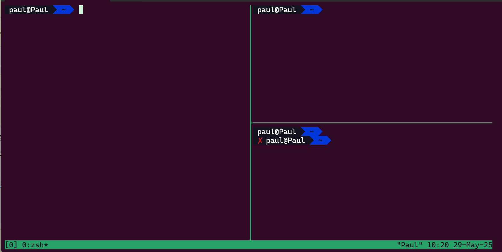

# 常用的开源工具

!!! note "主要作者"

    [@Paulkm2006](https://github.com/Paulkm2006)

## 目的

介绍一些非常实用、能极大提升开发效率的开源软件，方便我们日常使用 Linux。

## 内容

### 1. [tmux：会话管理魔法](https://github.com/tmux/tmux)

1. 前置知识：窗口与会话

 简单来说，无论是使用 SSH 还是 Linux 桌面自带的命令行，你所看到的那个黑色的“框框”便是一个窗口；在窗口中，运行了一个 shell 解释器（bash，sh，zsh 等等）或者其他应用程序，每个运行的程序进程被称为一个“会话”。

 !!! note
  何为"解释器"？解释器是一个交互的，实时运行的命令环境。解释器可以使用很多语言，如 shell、powershell 和 python。

  很多同学可能会认为"解释器是操作系统的一部分"，这实际上是不准确的：在 Linux 中，各发行版通常都预装了一个解释器，但我们也完全可以自行安装更好的解释器。在 Windows 中，系统的确提供了一个底层解释器 cmd，但用户也可以选择使用 PowerShell、Git Bash 等其他解释器。

2. tmux 的作用

 tmux（terminal multiplexer）是一个终端复用器，它允许你在一个窗口中创建和管理多个会话。这意味着你可以：

- 在同一个窗口中同时运行多个 shell 会话
- 在会话之间快速切换
- 分离会话并在稍后重新连接，即在后台运行任务
- 创建分屏布局，同时查看多个会话

3. tmux 的基本概念

 tmux 有三个重要概念：

- **会话（Session）**：一个工作环境，包含一个或多个窗口。会话的切换只能在退出 tmux 环境的条件下，使用命令执行。
- **窗口（Window）**：类似于浏览器的标签页，每个窗口包含一个或多个窗格
- **窗格（Pane）**：窗口的分割部分，每个窗格运行一个 shell

 当我们使用不带任何参数的`tmux`时，tmux 会为我们创建一个新的**会话**，这个会话中有一个**窗口**，窗口中有一个**窗格**。

 我们可以通过 tmux 会话下方的信息条查看该会话中**窗口**的数量和名称。

4. tmux 的基本使用

 安装 tmux：

 ```bash
 # Ubuntu/Debian
 sudo apt install tmux

 # CentOS/RHEL
 sudo yum install tmux
 ```

 基本命令：

 ```bash
 # 创建新会话
 tmux new-session -s session_name

 # 列出所有会话
 tmux list-sessions

 # 连接到指定会话
 tmux attach-session -t session_name

 # 分离当前会话（在 tmux 内按 Ctrl+b，然后按 d）
 tmux detach
 ```

 以下是对**窗格**的操作快捷键：

- `Ctrl+b + %`：垂直分屏
- `Ctrl+b + "`：水平分屏
- `Ctrl+b + 方向键`：在窗格间切换
- `Ctrl+b + x`：关闭当前窗格
- `Ctrl+b + !`：将当前窗格拆分为一个窗口
- `Ctrl+b + z`：将当前窗格临时设置为全屏，再次执行此命令时将会取消全屏

 以下是对**窗口**的操作快捷键：

- `Ctrl+b + c`：创建新窗口
- `Ctrl+b + n`：切换到下一个窗口
- `Ctrl+b + p`：切换到上一个窗口
- `Ctrl+b + ,`：重命名窗口
- `Ctrl+b + &`：关闭当前窗口

 !!! example
  如果我们想创建一个如下布局的窗口，我们需要执行以下操作：
  

  ```bash
  tmux # 进入 tmux 环境

  # Ctrl+b % 创建垂直分屏
  # Ctrl+b " 创建水平分屏
  # Ctrl+b ← 返回最初始的分屏

  ```

### 2. [Oh My Zsh：实用的 shell 解释器框架](https://ohmyz.sh/)

Oh My Zsh 是一个开源的、社区驱动的框架，用于管理 Zsh 配置。它提供了数百个插件和主题，让你的命令行体验更加强大和美观。

1. Oh My Zsh 的作用

 Oh My Zsh 能够：

- 提供丰富的主题，美化命令行界面
- 集成大量实用插件，提升工作效率
- 简化 Zsh 配置过程
- 提供智能补全和语法高亮

2. 安装和基本配置

 安装 Zsh（如果尚未安装）：

 ```bash
 # Ubuntu/Debian
 sudo apt install zsh

 # CentOS/RHEL
 sudo yum install zsh
 ```

 安装 Oh My Zsh：

 ```bash
 sh -c "$(curl -fsSL https://raw.github.com/ohmyzsh/ohmyzsh/master/tools/install.sh)"
 ```

 设置 Zsh 为默认 shell：

 ```bash
 chsh -s $(which zsh)
 ```

3. 实用插件推荐

 ```bash
 omz plugin list # 查看插件列表

 omz plugin info <name> # 查看插件详情

 omz plugin enable <name> # 启用插件
 ```

 常用插件介绍：

- **git**：提供 git 命令的别名和补全
- **sudo**：双击 ESC 键自动在命令前添加 sudo
- **z**：快速跳转到常访问的目录
- **extract**：智能解压各种格式的压缩文件
- **autojump**：基于历史记录的目录跳转

4. 主题配置

 ```bash
 omz theme list # 查看主题列表

 omz theme set <name> # 设置主题
 ```

 一些受欢迎的主题：

- `robbyrussell`（默认）
- `agnoster`
- `powerlevel10k`（需要额外安装）

5. 实用技巧

- **别名设置**：在`~/.zshrc`中添加常用别名

 ```bash
 alias ll="ls -la"
 alias grep="grep --color=auto"
 alias ..="cd .."
 ```

- **历史命令搜索**：使用`Ctrl+R`进行反向搜索
- **Tab 补全**：支持文件名、命令、参数的智能补全
- **目录补全**：输入目录名的一部分，按 Tab 键自动补全

 !!! tip
  配置完成后，重新加载配置文件：

  ```bash
  source ~/.zshrc
  ```

### 3. [uv：Python 包管理利器](https://github.com/astral-sh/uv)

uv 是一个极快的 Python 包管理器和项目管理工具，由 Rust 编写，旨在替代或补充 pip、pipenv 等传统工具。

1. uv 的优势

 uv 相比传统 Python 包管理工具有以下优势：

- **速度极快**：比 pip 快 10-100 倍的安装速度
- **内存效率**：占用更少的磁盘空间和内存
- **兼容性强**：与 pip 和 pipenv 语法兼容
- **依赖解析**：更智能的依赖冲突解决

2. 安装和基本使用

 安装 uv：

 ```bash
 # 使用 curl 安装（推荐）
 curl -LsSf https://astral.sh/uv/install.sh | sh

 # 或使用 pip 安装
 pip install uv
 ```

 基本命令：

 ```bash
 # 创建虚拟环境
 uv venv

 # 激活虚拟环境
 source .venv/bin/activate  # Linux/macOS
 # .venv\Scripts\activate   # Windows

 # 安装包
 uv add requests numpy

 # 从 requirements.txt 安装
 uv sync

 # 运行 Python 脚本
 uv run script.py
 ```

3. 项目管理功能

 uv 不仅是包管理器，还提供完整的项目管理功能：

 ```bash
 # 初始化新项目
 uv init my-project

 # 添加开发依赖
 uv add --dev pytest

 # 构建项目
 uv build

 # 发布到 PyPI
 uv publish
 ```

### 4. [btop：全面的系统监控](https://github.com/aristocratos/btop)

btop 是一个漂亮且功能丰富的系统资源监视器，用于显示处理器、内存、磁盘、网络和进程的使用情况。

1. btop 的特点

 btop 提供了以下功能：

- **美观的界面**：现代化的终端 UI 设计
- **实时监控**：CPU、内存、磁盘、网络实时状态
- **进程管理**：查看、排序、终止进程
- **可定制**：支持主题和布局自定义
- **跨平台**：支持 Linux、macOS、FreeBSD

2. 安装 btop

 ```bash
 # Ubuntu/Debian
 sudo apt install btop

 # CentOS/RHEL (需要 EPEL 仓库)
 sudo dnf install btop

 # 通过 snap 安装
 sudo snap install btop

 # 编译安装
 git clone https://github.com/aristocratos/btop.git
 cd btop
 make
 sudo make install
 ```

3. 基本使用

 ```bash
 # 启动 btop
 btop

 # 显示帮助
 btop --help

 # 使用配置文件启动
 btop -c /path/to/config
 ```

4. 常用快捷键

- `q`：退出 btop
- `h`：显示帮助
- `↑/↓`：在进程列表中导航
- `F5`：选择排序方式
- `t`：切换进程树视图
- `k`：终止选中的进程
- `+/-`：增加/减少更新间隔

### 5. [tldr：通俗易懂的 man](https://github.com/tldr-pages/tldr)

tldr（Too Long; Didn't Read）是一个社区维护的帮助页面集合，旨在提供比传统 man 页面更简洁、更实用的命令使用示例。

1. tldr 的优势

 相比传统的 man 页面，tldr 有以下特点：

- **简洁明了**：去除冗长的描述，直接展示常用用法
- **示例丰富**：提供实际的使用示例而非抽象描述
- **快速查找**：快速找到你需要的命令用法
- **社区维护**：由全球开发者共同维护和更新

2. 安装 tldr

 ```bash
 # 使用 npm 安装
 npm install -g tldr

 # 使用 pip 安装
 pip install tldr

 # Ubuntu/Debian
 sudo apt install tldr

 # 使用 cargo 安装（Rust 版本）
 cargo install tealdeer
 ```

3. 基本使用

 ```bash
 # 查看命令的 tldr 页面
 tldr ls
 tldr grep
 tldr find

 # 更新 tldr 数据库
 tldr --update

 # 列出所有可用的页面
 tldr --list

 # 搜索相关命令
 tldr --search "compress"
 ```

4. 实用示例

 ```bash
 # 查看 tar 命令的简洁用法
 tldr tar
 # 输出：创建压缩包、解压文件等常用示例

 # 查看 curl 命令
 tldr curl
 # 输出：下载文件、发送 POST 请求等实用示例

 # 查看 git 命令
 tldr git
 # 输出：基本的 git 操作示例
 ```

 !!! tip
  当你忘记某个命令的具体用法时，先试试`tldr`，它通常能比`man`更快地给你想要的答案。

### 6. [better-commits：优雅的 Git 提交助手](https://github.com/Everduin94/better-commits)

better-commits 是一个交互式的 Git 提交工具，帮助开发者编写更规范、更有意义的提交信息。它遵循约定式提交（Conventional Commits）规范，让项目的提交历史更加清晰易读。

1. better-commits 的优势

 better-commits 提供了以下功能：

- **交互式界面**：通过友好的命令行界面引导用户输入
- **规范化提交**：自动生成符合约定式提交规范的消息
- **类型选择**：预设的提交类型（feat、fix、docs 等）
- **作用域管理**：支持自定义和预设的变更作用域
- **破坏性变更**：清晰标记不兼容的 API 变更

2. 安装 better-commits

 ```bash
 # 使用 npm 全局安装
 npm install -g better-commits

 # 使用 yarn 安装
 yarn global add better-commits

 # 使用 pnpm 安装
 pnpm add -g better-commits
 ```

3. 基本使用

 ```bash
 # 在项目根目录使用
 bc

 # 或者使用完整命令
 better-commits

 # 跳过 git add，直接提交已暂存的文件
 bc --no-add
 ```

4. 交互式流程

 运行 `bc` 后，工具会引导你完成以下步骤：

- **选择提交类型**：feat（新功能）、fix（修复）、docs（文档）等
- **输入作用域**：变更影响的模块或组件（可选）
- **编写描述**：简洁明了的变更描述
- **详细说明**：更详细的变更内容（可选）
- **破坏性变更**：是否包含不兼容变更（可选）

5. 配置自定义

 在项目根目录创建 `.better-commits.json` 配置文件：

 ```json
 {
   "check_status": true,
   "commit_type": {
  "enable": true,
  "initial_value": "feat",
  "infer_type_from_branch": true
   },
   "commit_scope": {
  "enable": true,
  "custom_scopes": ["api", "ui", "db", "auth"]
   },
   "check_ticket": {
  "enable": true,
  "title": "Ticket Number",
  "description": "Enter ticket number"
   }
 }
 ```

 !!! tip
  使用 better-commits 可以让团队的 Git 提交历史更加规范，便于生成变更日志和版本发布说明。

## 参考资料

- [Tmux 使用教程](https://www.ruanyifeng.com/blog/2019/10/tmux.html)
