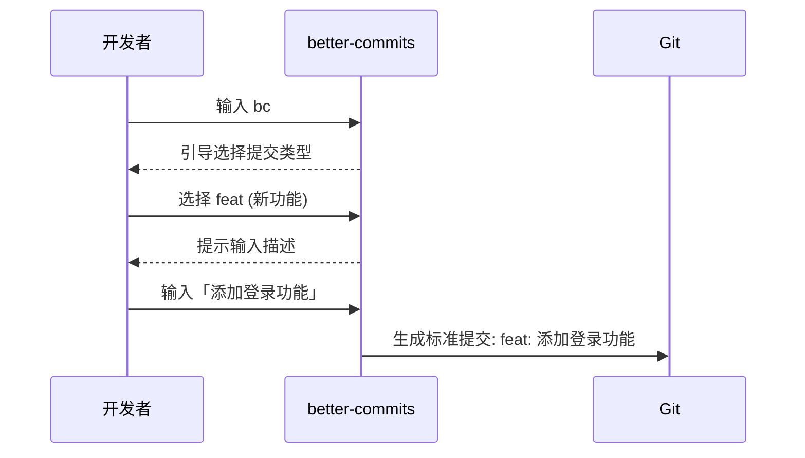
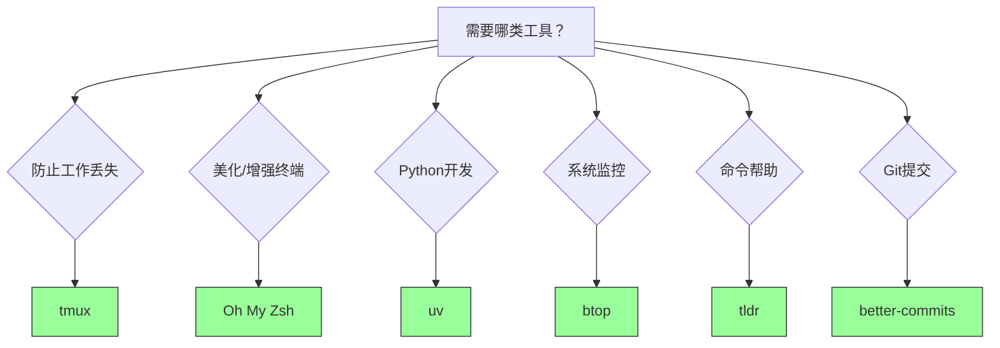

# 常用的开源工具

!!! note "主要作者"

    [@Paulkm2006](https://github.com/Paulkm2006)

## 目的

介绍一些非常实用、能极大提升开发效率的开源软件，方便我们日常使用 Linux。

## 内容

### 1. [tmux：会话管理魔法](https://github.com/tmux/tmux)

**适用场景**：当你在服务器上工作时突然断网，所有任务都会丢失？tmux 能解决这个问题！

1. 前置知识：窗口与会话
  
  许多初学者容易混淆终端、控制台、shell 和解释器这几个概念。我们来简单区分一下：  

  **终端（Terminal）**：是你看到的黑色窗口，允许你输入命令的界面。  
  **Shell（壳程序）**：是一个命令解释器，运行在终端内，比如常见的 `bash`、`zsh`。  
  **会话（Session）**：是 shell 或程序运行的实例，比如你登录系统后打开一个终端窗口，它就是一个会话。

!!! note
    Shell 本身是一个程序，它负责解析你输入的命令并交由系统执行。不同的 shell 功能略有差异，比如 `bash` 是默认的，`zsh` 更强大。

!!! note
    何为"解释器"？解释器是一个交互的，实时运行的命令环境。解释器可以使用很多语言，如 shell、powershell 和 python。

  很多同学可能会认为"解释器是操作系统的一部分"，这实际上是不准确的：在 Linux 中，各发行版通常都预装了一个解释器，但我们也完全可以自行安装更好的解释器。在 Windows 中，系统的确提供了一个底层解释器 cmd，但用户也可以选择使用 PowerShell、Git Bash 等其他解释器。

2. tmux 的作用

 tmux（terminal multiplexer）是一个终端复用器，它允许你在一个窗口中创建和管理多个会话。这意味着你可以：

- 在同一个窗口中同时运行多个 shell 会话
- 在会话之间快速切换
- 分离会话并在稍后重新连接，即在后台运行任务
- 创建分屏布局，同时查看多个会话

   ```mermaid
   graph LR
   A[SSH 连接] --> B[tmux 会话]
   B --> C[关闭 SSH]
   C --> D[重新连接]
   D --> E[恢复工作状态]
   ```

3. tmux 的基本概念

 tmux 有三个重要概念：

- **会话（Session）**：一个工作环境，包含一个或多个窗口。会话的切换只能在退出 tmux 环境的条件下，使用命令执行。
- **窗口（Window）**：类似于浏览器的标签页，每个窗口包含一个或多个窗格
- **窗格（Pane）**：窗口的分割部分，每个窗格运行一个 shell

!!! tip "新手理解"
    想象你正在用浏览器：  

    **窗口** = 浏览器窗口  
    **标签页** = tmux 的窗口 (Window)  
    **分屏浏览** = tmux 的窗格 (Pane)  
    **会话** = 保存所有标签页和分屏的完整工作状

 当我们使用不带任何参数的`tmux`时，tmux 会为我们创建一个新的**会话**，这个会话中有一个**窗口**，窗口中有一个**窗格**。

 我们可以通过 tmux 会话下方的信息条查看该会话中**窗口**的数量和名称。

4. tmux 的基本使用

 安装 tmux：

 ```bash
 # Ubuntu/Debian
 sudo apt install tmux

 # CentOS/RHEL
 sudo yum install tmux
 ```

 基本命令：

 ```bash
 # 创建新会话
 tmux new-session -s session_name

 # 列出所有会话
 tmux list-sessions

 # 连接到指定会话
 tmux attach-session -t session_name

 # 分离当前会话（在 tmux 内按 Ctrl+b，然后按 d）
 tmux detach
 ```

!!! tip "什么是分离会话？"
    想象你在办公室工作到一半需要离开：  
    1. 把文件留在桌上（分离会话）= `Ctrl+b d`  
    2. 下班回家（断开SSH）  
    3. 第二天回来（重新连接SSH）  
    4. 坐回桌前继续工作（连接会话）= `tmux attach`  
    你的工作状态完全保留，就像从未离开过！

!!! tip "重要提示"
    tmux 的所有快捷键都需要先按**前缀键**（默认是`Ctrl+b`），然后松开，再按功能键。例如：  
    - 分屏：先按`Ctrl+b`，松开，再按`%`（垂直）或`"`（水平）  
    - 切换窗口：先按`Ctrl+b`，松开，再按数字键`0-9`  

    记忆技巧：把`Ctrl+b`想象成"告诉tmux我要发命令了"

 以下是对**窗格**的操作快捷键：

- `Ctrl+b + %`：垂直分屏
- `Ctrl+b + "`：水平分屏
- `Ctrl+b + 方向键`：在窗格间切换
- `Ctrl+b + x`：关闭当前窗格
- `Ctrl+b + !`：将当前窗格拆分为一个窗口
- `Ctrl+b + z`：将当前窗格临时设置为全屏，再次执行此命令时将会取消全屏

 以下是对**窗口**的操作快捷键：

- `Ctrl+b + c`：创建新窗口
- `Ctrl+b + n`：切换到下一个窗口
- `Ctrl+b + p`：切换到上一个窗口
- `Ctrl+b + ,`：重命名窗口
- `Ctrl+b + &`：关闭当前窗口

!!! example
    如果我们想创建一个如下布局的窗口，我们需要执行以下操作：
    

    ```bash
    tmux # 进入 tmux 环境

    # Ctrl+b % 创建垂直分屏
    # Ctrl+b " 创建水平分屏
    # Ctrl+b ← 返回最初始的分屏
    ```

!!! bug "新手常见问题"
    断开后如何恢复？

    ```bash
    # 列出所有会话
    tmux ls
    # 重新连接
    tmux attach -t work
    ```

### 2. [Oh My Zsh：实用的 shell 解释器框架](https://ohmyz.sh/)

Oh My Zsh 是一个开源的、社区驱动的框架，用于管理 Zsh 配置。它提供了数百个插件和主题，让你的命令行体验更加强大和美观。同时自带错误纠正和智能提示。

1. Oh My Zsh 的作用

 Oh My Zsh 能够：

- 提供丰富的主题，美化命令行界面
- 集成大量实用插件，提升工作效率
- 简化 Zsh 配置过程
- 提供智能补全和语法高亮

2. 安装和基本配置

 安装 Zsh（如果尚未安装）：

 ```bash
 # Ubuntu/Debian
 sudo apt install zsh

 # CentOS/RHEL
 sudo yum install zsh
 ```

 安装 Oh My Zsh：

 ```bash
 sh -c "$(curl -fsSL https://raw.github.com/ohmyzsh/ohmyzsh/master/tools/install.sh)"
 ```

 设置 Zsh 为默认 shell：

 ```bash
 chsh -s $(which zsh)
 ```

3. 实用插件推荐

要启用插件，需要编辑 Zsh 配置文件：

 ```bash
 nano ~/.zshrc
 ```

找到 plugins=(git) 这行，添加你想要的插件：

 ```bash
 plugins=(git sudo z extract autojump)
 ```

保存后运行：

 ```bash
 source ~/.zshrc
 ```

 ```bash
 omz plugin list # 查看插件列表

 omz plugin info <name> # 查看插件详情

 omz plugin enable <name> # 启用插件
 ```

 常用插件介绍：

| 插件       | 功能 | 使用示例 |
|------------|------|----------|
| **git**    | 提供 git 别名 | 输入`gst` = `git status`<br>`gco main` = `git checkout main` |
| **sudo**   | 快速提权 | 输入`apt update` → 按两次`ESC` → 自动变成`sudo apt update` |
| **z**      | 目录跳转 | `z doc` → 跳转到`~/Documents`<br>`z down` → 跳转到`~/Downloads` |
| **extract**| 智能解压 | `extract archive.zip` 自动识别解压<br>`extract file.tar.gz` 自动解压 |
| **autojump**| 历史跳转 | `j proj` → 跳转到最近访问的包含"proj"的目录 |

4. 主题配置

 ```bash
 omz theme list # 查看主题列表

 omz theme set <name> # 设置主题
 ```

 一些受欢迎的主题：

- `robbyrussell`（默认）
- `agnoster`
- `powerlevel10k`（需要额外安装）

5. 实用技巧

- **别名设置**：在`~/.zshrc`中添加常用别名

 ```bash
 alias ll="ls -la"
 alias grep="grep --color=auto"
 alias ..="cd .."
 ```

- **历史命令搜索**：使用`Ctrl+R`进行反向搜索
- **Tab 补全**：支持文件名、命令、参数的智能补全
- **目录补全**：输入目录名的一部分，按 Tab 键自动补全

!!! tip
    配置完成后，重新加载配置文件：

    ```bash
    source ~/.zshrc
    ```

### 3. [uv：Python 包管理利器](https://github.com/astral-sh/uv)

uv 是一个极快的 Python 包管理器和项目管理工具，由 Rust 编写，旨在替代或补充 pip、pipenv 等传统工具。其解决了 Python 包安装慢/冲突多的痛点。

1. uv 的优势

 uv 相比传统 Python 包管理工具有以下优势：

- **速度极快**：比 pip 快 10-100 倍的安装速度
- **内存效率**：占用更少的磁盘空间和内存
- **兼容性强**：与 pip 和 pipenv 语法兼容
- **依赖解析**：更智能的依赖冲突解决

2. 安装和基本使用

!!! note "虚拟环境就像隔离的工作区"
    - 想象你有两个项目：项目 A 需要 Python 3.8，项目 B 需要 Python 3.11
    - 虚拟环境就是独立的"工作房间"：

      ```bash
      uv venv projA-env  # 创建 A 项目的房间
      source projA-env/bin/activate  # 进入 A 房间
      uv add numpy==1.21  # 在 A 房间安装特定版本

      uv venv projB-env  # 创建 B 项目的房间
      source projB-env/bin/activate  # 进入 B 房间
      uv add numpy==1.25  # 在 B 房间安装新版
      ```

    - 两个项目完全隔离，不会互相干扰！

 安装 uv：

 ```bash
 # 使用 curl 安装（推荐）
 curl -LsSf https://astral.sh/uv/install.sh | sh

 # 或使用 pip 安装
 pip install uv
 ```

 基本命令：

 ```bash
 # 创建虚拟环境
 uv venv

 # 激活虚拟环境
 source .venv/bin/activate  # Linux/macOS
 # .venv\Scripts\activate   # Windows

 # 安装包
 uv add requests numpy

 # 从 requirements.txt 安装
 uv sync

 # 运行 Python 脚本
 uv run script.py
 ```

3. 项目管理功能

 uv 不仅是包管理器，还提供完整的项目管理功能：

 ```bash
 # 初始化新项目
 uv init my-project

 # 添加开发依赖
 uv add --dev pytest

 # 构建项目
 uv build

 # 发布到 PyPI
 uv publish
 ```

### 4. [btop：全面的系统监控](https://github.com/aristocratos/btop)

btop 是一个漂亮且功能丰富的系统资源监视器，用于显示处理器、内存、磁盘、网络和进程的使用情况。

1. btop 的特点

 btop 提供了以下功能：

- **美观的界面**：现代化的终端 UI 设计
- **实时监控**：CPU、内存、磁盘、网络实时状态
- **进程管理**：查看、排序、终止进程
- **可定制**：支持主题和布局自定义
- **跨平台**：支持 Linux、macOS、FreeBSD

2. 安装 btop

 ```bash
 # Ubuntu/Debian
 sudo apt install btop

 # CentOS/RHEL (需要 EPEL 仓库)
 sudo dnf install btop

 # 通过 snap 安装
 sudo snap install btop

 # 编译安装
 git clone https://github.com/aristocratos/btop.git
 cd btop
 make
 sudo make install
 ```

3. 基本使用

 ```bash
 # 启动 btop
 btop

 # 显示帮助
 btop --help

 # 使用配置文件启动
 btop -c /path/to/config
 ```

4. 常用快捷键

| 按键          | 功能                | 新手用途                     |
|---------------|---------------------|------------------------------|
| `q`           | 退出 btop           | 关闭监控程序                 |
| `h` 或 `F1`   | 显示帮助            | 查看完整快捷键指南           |
| `↑/↓`         | 在进程列表中导航    | 上下移动选择进程             |
| `F5`          | 选择排序方式        | 按 CPU/内存/进程 ID 等排序      |
| `t`           | 切换进程树视图      | 显示进程父子关系             |
| `k`           | 终止选中的进程      | 结束卡死的程序               |
| `+`           | 增加更新间隔        | 减慢刷新速度（节省资源）     |
| `-`           | 减少更新间隔        | 加快刷新速度（实时监控）     |
| `p`           | 进程管理            | 查看所有运行中的程序         |
| `s`           | 磁盘监控            | 检查硬盘使用情况             |
| `n`           | 网络监控            | 查看网络流量和连接           |
| `ESC`         | 返回上级            | 退出当前菜单或操作           |
| `1-9`         | 切换监控页面        | 快速查看不同资源（CPU/内存等）|
| `TAB`         | 切换主区域          | 在进程列表和资源图表间切换   |

### 5. [tldr：通俗易懂的 man](https://github.com/tldr-pages/tldr)

tldr（Too Long; Didn't Read）是一个社区维护的帮助页面集合，旨在提供比传统 man 页面更简洁、更实用的命令使用示例。

1. tldr 的优势

 相比传统的 man 页面，tldr 有以下特点：

- **简洁明了**：去除冗长的描述，直接展示常用用法
- **示例丰富**：提供实际的使用示例而非抽象描述
- **快速查找**：快速找到你需要的命令用法
- **社区维护**：由全球开发者共同维护和更新

2. 安装 tldr

 ```bash
 # 使用 npm 安装
 npm install -g tldr

 # 使用 pip 安装
 pip install tldr

 # Ubuntu/Debian
 sudo apt install tldr

 # 使用 cargo 安装（Rust 版本）
 cargo install tealdeer
 ```

3. 基本使用

 ```bash
 # 查看命令的 tldr 页面
 tldr ls
 tldr grep
 tldr find

 # 更新 tldr 数据库
 tldr --update

 # 列出所有可用的页面
 tldr --list

 # 搜索相关命令
 tldr --search "compress"
 ```

4. 实用示例

 ```bash
 # 查看 tar 命令的简洁用法
 tldr tar
 # 输出：创建压缩包、解压文件等常用示例

 # 查看 curl 命令
 tldr curl
 # 输出：下载文件、发送 POST 请求等实用示例

 # 查看 git 命令
 tldr git
 # 输出：基本的 git 操作示例
 ```

!!! tip
    当你忘记某个命令的具体用法时，先试试`tldr`，它通常能比`man`更快地给你想要的答案。

### 6. [better-commits：优雅的 Git 提交助手](https://github.com/Everduin94/better-commits)

better-commits 是一个交互式的 Git 提交工具，帮助开发者编写更规范、更有意义的提交信息。它遵循约定式提交（Conventional Commits）规范，让项目的提交历史更加清晰易读。

1. better-commits 的优势

 better-commits 提供了以下功能：

- **交互式界面**：通过友好的命令行界面引导用户输入
- **规范化提交**：自动生成符合约定式提交规范的消息
- **类型选择**：预设的提交类型（feat、fix、docs 等）
- **作用域管理**：支持自定义和预设的变更作用域
- **破坏性变更**：清晰标记不兼容的 API 变更

2. 安装 better-commits

 ```bash
 # 使用 npm 全局安装
 npm install -g better-commits

 # 使用 yarn 安装
 yarn global add better-commits

 # 使用 pnpm 安装
 pnpm add -g better-commits
 ```

3. 基本使用

 ```bash
 # 在项目根目录使用
 bc

 # 或者使用完整命令
 better-commits

 # 跳过 git add，直接提交已暂存的文件
 bc --no-add
 ```

4. 交互式流程

 运行 `bc` 后，工具会引导你完成以下步骤：

  **选择提交类型**：
     - 使用↑↓箭头选择，Enter 确认
     - 最常用：`feat`(新功能), `fix`(修复)

  **输入作用域**（可选）：
     - 输入模块名如`login`, `payment`
     - 按 Enter 跳过

  **编写简短描述**：
     - 要求：首字母小写，不加句号
     - 示例："add password validation"

  **详细说明**（可选）：
     - 解释为什么做这个修改
     - 按 Ctrl+D 结束输入

  **破坏性变更确认**：
     - 只有重大变更才选 Yes
     - 会自动添加`!`标记  

5. 配置自定义

 在项目根目录创建 `.better-commits.json` 配置文件：

 ```json
 {
   "check_status": true,
   "commit_type": {
  "enable": true,
  "initial_value": "feat",
  "infer_type_from_branch": true
   },
   "commit_scope": {
  "enable": true,
  "custom_scopes": ["api", "ui", "db", "auth"]
   },
   "check_ticket": {
  "enable": true,
  "title": "Ticket Number",
  "description": "Enter ticket number"
   }
 }
 ```

!!! tip
    使用 better-commits 可以让团队的 Git 提交历史更加规范，便于生成变更日志和版本发布说明。



## 工具选择流程图



## 参考资料

- [Tmux 使用教程](https://www.ruanyifeng.com/blog/2019/10/tmux.html)
- [Linux 新手生存指南](https://linuxnewbieguide.org)
- [命令行艺术](https://github.com/jlevy/the-art-of-command-line)
