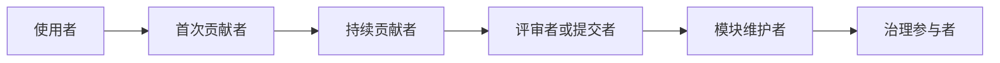

# 从一次贡献到持续参与

一次 Pull Request 被提交或合并，并不意味着开源旅程已经结束。持续贡献来自可靠的沟通、稳定的投入和对社区共同目标的理解。

## 正确看待评审

Code Review 的对象是具体修改，不是对贡献者个人能力的评价。收到反馈后：

1. 先确认自己理解了问题和期望结果。
2. 对不清楚的意见礼貌追问，不猜测维护者意图。
3. 修改后说明做了什么，并保持讨论可追踪。
4. 存在不同方案时，用事实、测试和项目目标解释取舍。
5. 即使方案没有被接受，也记录原因和学到的知识。

## 成为可靠的持续贡献者

持续贡献不等于不断提交大量代码。以下行为同样重要：

- 帮助复现和分类 Issue；
- 改进文档、测试和发布说明；
- 评审自己熟悉领域的修改；
- 回答新贡献者的问题；
- 维护自动化检查和社区基础设施；
- 在发现安全问题时遵守非公开报告流程。

可靠的贡献者会尊重任务边界、兑现公开承诺，并在无法继续时及时说明情况。

## 从贡献者到维护者

不同项目的角色名称和晋升机制并不相同，不存在通用的提交数量门槛。常见的发展过程是：

维护者不仅需要技术能力，还要承担评审、发布、沟通、风险控制和培养新人的责任。角色应当依据目标项目公开的治理文档和实际贡献获得，而不是套用固定称号。

## 健康与可持续性

- 控制同时承担的任务数量，避免长期透支。
- 把关键知识写入文档，减少项目对个人的依赖。
- 使用行为准则处理骚扰、歧视和破坏性沟通。
- 重大决策保留公开记录，让后来者理解背景。
- 为新贡献者提供范围清晰、反馈及时的入口。

## 课程复盘

完成首次贡献后，请回答：

1. 你解决了谁的什么问题？
2. 哪条项目规则最影响你的实现？
3. 评审反馈改变了哪些判断？
4. 如果重新开始，你会如何缩小范围或提前验证？
5. 未来一个月，你准备继续完成哪项具体行动？

!!! success "课程终点，也是参与起点"

    课程不要求你在 16 课时内成为社区领导者。能够完成真实贡献、理解反馈并找到下一步，就是进入开源社区的重要起点。
