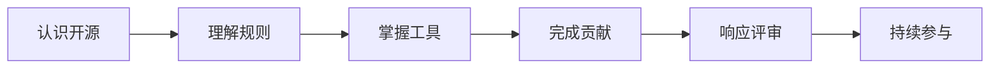

# 课程大纲

!!! note "课程定位"

    《开源软件通识》面向具备基础编程能力、但尚未系统参与开源的计算机类本科生。课程共 16 课时，按 8 次双课时组织，每次约 90 分钟。

## 课程目标

完成课程后，学生应当能够：

1. 从软件类型、开发方式、协作模式和产业生态四个维度解释开源。
2. 识别社区、企业、基金会等生态角色，理解常见治理与决策方式。
3. 根据使用和分发场景判断常见开源许可证的主要义务。
4. 使用 Markdown、Git 和代码托管平台完成一次规范的协作流程。
5. 向真实开源项目提交一项可评审的贡献，并根据反馈继续修改。
6. 复盘自己的贡献过程，规划从首次贡献者到持续贡献者的发展路径。

!!! warning "关于社区领导"

    从贡献者成长为维护者或社区领导者通常需要长期投入。课程将介绍这条发展路径，但不会把“成为社区领导者”作为 16 课时内的学习成果。

## 课程主线

## 课时安排

| 次数 | 主题 | 课堂重点 | 当次成果 |
|------|------|----------|----------|
| 第 1 次 | 认识开源与项目启动 | 开源的定义、价值、身边案例与课程项目池 | 一个开源项目画像 |
| 第 2 次 | 历史与生态 | GNU、Linux、OSI；社区、企业、基金会与商业模式 | 项目生态角色分析 |
| 第 3 次 | 许可证与合规 | 版权、专利、常见许可证及许可证选择 | 许可证判断练习 |
| 第 4 次 | 社区文化与治理 | 社区角色、行为准则、治理方式、沟通与 Issue | 贡献选题与实施提案 |
| 第 5 次 | 最小贡献工具链 | Markdown、Git 工作区、暂存区、提交与分支 | 本地 Git 实验 |
| 第 6 次 | 平台协作流程 | Fork、Issue、Pull Request、CI 与 Code Review | 可评审的贡献草稿 |
| 第 7 次 | 真实贡献工作坊 | 实现、测试、文档、同行评审和规范提交 | 向真实项目提交贡献 |
| 第 8 次 | 反馈响应与持续参与 | 修改提交、成果展示、维护者职责和个人复盘 | 贡献证据包与复盘报告 |

## 学习方式

每次课由概念讲授、案例讨论和实践活动组成。课程项目从第 1 次课启动，学生在课间持续推进，不把所有实践集中到最后一周。

- **课堂必修**：开源认知、生态与治理、许可证、Markdown、Git、平台协作和真实贡献。
- **按需学习**：完成项目所需的 Linux 命令、构建工具和测试方法。
- **课外拓展**：Git 底层原理、Docker、QEMU、邮件列表协作及其他效率工具。

## 结课成果

结课成果不是一张知识点清单，而是一段可核验的真实贡献过程。学生需要提交贡献链接、实际变更、验证结果、社区交流记录和个人复盘。外部维护者是否在课程结束前合并贡献，不影响成果认定。

具体要求见[真实贡献项目](project.md)，评分办法见[成绩评定](assessment.md)。
