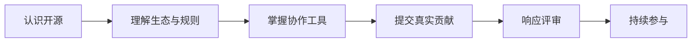

# 开源软件通识

欢迎来到华中科技大学开放原子开源俱乐部维护的《开源软件通识》课程。

这是一门面向计算机类本科生的 16 课时课程。我们不仅介绍开源的概念、历史和规则，还会带你走完一次真实的社区协作流程。

!!! success "课程结束时，你将完成"

    一项提交到真实开源项目、可以公开查看和评审的贡献。贡献可以是文档、翻译、测试、缺陷修复或范围明确的小型功能，不以最终合并作为结课前提。

## 从这里开始

1. 阅读[课程大纲](course/index.md)，了解 8 次课的主线和学习成果。
2. 查看[真实贡献项目](course/project.md)，从分层项目池中选择任务。
3. 阅读[成绩评定](course/assessment.md)，确认过程材料和结课证据。
4. 从[课程导入](ch0/index.md)开始认识开源。

## 学习路径

课堂必修内容聚焦完成首次贡献所需的知识与工具。Docker、QEMU、Git 底层原理和其他效率工具保留为拓展材料，供不同项目方向按需学习。

## 以开源方式建设课程

课程本身也是一个开源项目。发现事实错误、失效链接、讲解不清或缺失示例时，欢迎阅读[贡献指南](https://github.com/hust-open-atom-club/intro2oss/blob/main/CONTRIBUTING.md)，通过 Issue 或 Pull Request 改进课程。
